# 🐧 Linux Notes

### 25.04.2024 - Donnerstag <a href="#loitzl1nuwwi" id="loitzl1nuwwi"></a>

### Wiederholung <a href="#jqaca5mr7v29" id="jqaca5mr7v29"></a>

#### chgrp <a href="#z38k4yc1vq2n" id="z38k4yc1vq2n"></a>

`chgrp <Gruppe> <File||Dir>`

`chgrp verkauf /zugriff/vk`

#### chown <a href="#lfnwxw9wnw9k" id="lfnwxw9wnw9k"></a>

`chown <user> <File||Dir>`

`chown <user>`**`:`**`<group> <File||Dir>`

`chown`` `**`:`**`<group> <File||Dir>`

### Aufgabe 1 <a href="#l7hp3vmku6zv" id="l7hp3vmku6zv"></a>

Für die folgenden Punkte benutzen Sie bitte Debian Mate.

#### 1. Folgende User sind zu erzeugen: <a href="#mj5fyanh8riu" id="mj5fyanh8riu"></a>

carla

chenin

carlo

charles

celile

cagri

#### Lösung 1: <a href="#u9p8rpnh5318" id="u9p8rpnh5318"></a>

`useradd -m carla`

`useradd -m chenin`

`useradd -m carlo`

`useradd -m charles`

`useradd -m celile`

`useradd -m cagri`

`ls -l /home/` to prove that users with home directories were created successfully.

Alternatively:

`useradd -m -G team1 caro` <mark style="background-color:yellow;">The group must have been created before</mark>.

It is always best practice to create groups first.

#### 2. Bitte drei Gruppen anlegen: <a href="#z6utznim1cay" id="z6utznim1cay"></a>

`team1 ( carla,celile )`

`team2 ( cagri, chenin )`

`team3 ( carlo,charles )`

#### Lösung 2: <a href="#cua5cgi6huhj" id="cua5cgi6huhj"></a>

`groupadd team1`

`groupadd team2`

`groupadd team3`

**Expert Mode:** `echo team1 team2 team3 | xargs -n 1 groupadd -r`

`nano /etc/group`

`team1:x:1014:carla,celile`

`team2:x:1015:cagri,chenin`

`team3:x:1016:carlo,charles`

#### 3. Wir brauchen drei Verzeichnisse: <a href="#qq5nphxgtsjo" id="qq5nphxgtsjo"></a>

`/a-daten/pott1`

`/a-daten/pott2`

`/a-daten/pott3`

#### Lösung 3: <a href="#va4kb2yr70ch" id="va4kb2yr70ch"></a>

`mkdir -p /a-daten/pott1/`

`mkdir /a-daten/pott2/`

`mkdir /a-daten/pott3/`

`ls -l /a-daten/ to prove`

#### 4. Besitzrechte ändern : <a href="#id-9le29q8bskqc" id="id-9le29q8bskqc"></a>

team1 auf pott1

team2 auf pott2

team3 auf pott3

#### Lösung 4: <a href="#t7t6hkaxale6" id="t7t6hkaxale6"></a>

`chgrp team1 /a-daten/pott1`

`chgrp team2 /a-daten/pott2`

`chgrp team2 /a-daten/pott3`

OR

`cd /a-daten/`

`chown root:team1 pott1`

`chown root:team2 pott2`

`chown root:team3 pott3`

#### 5. Für alle pott-directories die Rechte ändern: <a href="#s6h3v3y2drd8" id="s6h3v3y2drd8"></a>

`rwx rwx --T`

#### Lösung 5: <a href="#id-4pp4cyedmgsp" id="id-4pp4cyedmgsp"></a>

`chmod 1770 /a-daten/*`

### usermod <a href="#p1oiczdsvq1l" id="p1oiczdsvq1l"></a>

`usermod carlo -G team1`

to add carlo into team1 group.

`usermod -a -G group1,group2 username`

to add a user into different groups.

**`usermod -aG sudo ozgur`** add the user **ozgur** to sudo group (= make him Admin)

`usermod -l user_newname user_oldname` to rename a user

`ls -l`

**`typ rights link owner group bytes date Name`**

`- rwxr-xr-x 2 root root 484 18.04 test.txt`

`d rwxr-xr-x 2 root root 4096 25.04 pool`

### Adding a New Disk <a href="#u2o9pmco5qoy" id="u2o9pmco5qoy"></a>

`/dev/sda` We have already and we would like to add a new one.


Let’s say we are adding a new disk to our system. We need to follow these steps:

1. partitionieren (partition)
2. formatieren (format)
3. montieren (mount)

In VirtualBox, Linux Mint, we added a 5 GB secondary disk.

#### `lsblk` <a href="#r01bq4eknf9p" id="r01bq4eknf9p"></a>

List block devices

`ozgur@frelin:~$`` `**`lsblk`**

`NAME MAJ:MIN RM SIZE RO TYPE MOUNTPOINTS`

`sda 8:0 0 15,5G 0 disk`\
`├─sda1 8:1 0 1M 0 part`\
`├─sda2 8:2 0 513M 0 part /boot/efi`\
`└─sda3 8:3 0 15G 0 part /`\
`sdb 8:16 0 5G 0 disk`\
`sr0 11:0 1 1024M 0 rom`

#### blkid <a href="#g00vu9qqjxyv" id="g00vu9qqjxyv"></a>

Zeigt formatierte Partitionen.

shows only the formatted partitions.

`sdb` is not visible because it is not formatted yet.

```console
ozgur@frelin:\~$ <b>blkid</b>

/dev/sda2: UUID="87FB-00E8" BLOCK\_SIZE="512" TYPE="vfat" PARTLABEL="EFI System Partition" PARTUUID="f737667d-1be9-4d2e-8be7-5f6c3aafd91a"

/dev/sda3: UUID="c282c0f1-ce03-406c-9f17-3e878c3402e9" BLOCK\_SIZE="4096" TYPE="ext4" PARTUUID="0213cc74-73d7-4098-a0e7-b6746304c282"

#### fdisk / gdisk <a href="#yevomv9ehjb5" id="yevomv9ehjb5"></a>

**fdisk** (old) => MBR (512 bytes, supports 4 partitions only. Not used any more.)

**gdisk** => GUID (Globally Unique Identifier, GPT (GUID Partition Table). Only this is used today. Supports 128 partitions.

root@frelin:\~# **ls -l /dev/sd\***

brw-rw---- 1 root disk 8, 0 Apr 25 11:01 /dev/sda

brw-rw---- 1 root disk 8, 1 Apr 25 11:01 /dev/sda1

brw-rw---- 1 root disk 8, 2 Apr 25 11:01 /dev/sda2

brw-rw---- 1 root disk 8, 3 Apr 25 11:01 /dev/sda3

brw-rw---- 1 root disk 8, 16 Apr 25 11:01 /dev/sdb

root@frelin:\~# **gdisk /dev/sdb**

GPT fdisk (gdisk) version 1.0.8

Partition table scan:

MBR: not present

BSD: not present

APM: not present

GPT: not present

Creating new GPT entries in memory.

Command (? for help): **?**

b back up GPT data to a file

c change a partition's name

d delete a partition

i show detailed information on a partition

l list known partition types

n add a new partition

o create a new empty GUID partition table (GPT)

p print the partition table

q quit without saving changes

r recovery and transformation options (experts only)

s sort partitions

t change a partition's type code

v verify disk

w write table to disk and exit

x extra functionality (experts only)

? print this menu

Command (? for help): **p**

Disk /dev/sdb: 10485760 sectors, 5.0 GiB

Model: VBOX HARDDISK

Sector size (logical/physical): 512/512 bytes

Disk identifier (GUID): 7A265ABA-9BE4-4E7D-A3F5-E4045514990E

Partition table holds up to 128 entries

Main partition table begins at sector 2 and ends at sector 33

First usable sector is 34, last usable sector is 10485726

Partitions will be aligned on 2048-sector boundaries

Total free space is 10485693 sectors (5.0 GiB)

Number Start (sector) End (sector) Size Code Name

Command (? for help): **n**

Partition number (1-128, default 1): **↲**

First sector (34-10485726, default = 2048) or {+-}size{KMGTP}: **↲**

Last sector (2048-10485726, default = 10485726) or {+-}size{KMGTP}: **+1G**

Current type is 8300 (Linux filesystem)

Hex code or GUID (L to show codes, Enter = 8300): **↲**

Changed type of partition to 'Linux filesystem'

Command (? for help): **p**

Disk /dev/sdb: 10485760 sectors, 5.0 GiB

Model: VBOX HARDDISK

Sector size (logical/physical): 512/512 bytes

Disk identifier (GUID): 7A265ABA-9BE4-4E7D-A3F5-E4045514990E

Partition table holds up to 128 entries

Main partition table begins at sector 2 and ends at sector 33

First usable sector is 34, last usable sector is 10485726

Partitions will be aligned on 2048-sector boundaries

Total free space is 8388541 sectors (4.0 GiB)

Number Start (sector) End (sector) Size Code Name

1 2048 2099199 1024.0 MiB 8300 Linux filesystem

Command (? for help): **l**

Type search string, or \<Enter> to show all codes:

0700 Microsoft basic data 0701 Microsoft Storage Replica

0702 ArcaOS Type 1 0c01 Microsoft reserved

2700 Windows RE 3000 ONIE boot

3001 ONIE config 3900 Plan 9

4100 PowerPC PReP boot 4200 Windows LDM data

4201 Windows LDM metadata 4202 Windows Storage Spaces

7501 IBM GPFS 7f00 ChromeOS kernel

7f01 ChromeOS root 7f02 ChromeOS reserved

8200 Linux swap 8300 Linux filesystem

8301 Linux reserved 8302 Linux /home

8303 Linux x86 root (/) 8304 Linux x86-64 root (/)

8305 Linux ARM64 root (/) 8306 Linux /srv

8307 Linux ARM32 root (/) 8308 Linux dm-crypt

8309 Linux LUKS 830a Linux IA-64 root (/)

830b Linux x86 root verity 830c Linux x86-64 root verity

830d Linux ARM32 root verity 830e Linux ARM64 root verity

830f Linux IA-64 root verity 8310 Linux /var

8311 Linux /var/tmp 8312 Linux user's home

8313 Linux x86 /usr 8314 Linux x86-64 /usr

8315 Linux ARM32 /usr 8316 Linux ARM64 /usr

8317 Linux IA-64 /usr 8318 Linux x86 /usr verity

Press the \<Enter> key to see more codes, q to quit:

8319 Linux x86-64 /usr verity 831a Linux ARM32 /usr verity

831b Linux ARM64 /usr verity 831c Linux IA-64 /usr verity

8400 Intel Rapid Start 8401 SPDK block device

8500 Container Linux /usr 8501 Container Linux resizable rootfs

8502 Container Linux /OEM customization 8503 Container Linux root on RAID

8e00 Linux LVM a000 Android bootloader

a001 Android bootloader 2 a002 Android boot 1

a003 Android recovery 1 a004 Android misc

a005 Android metadata a006 Android system 1

a007 Android cache a008 Android data

a009 Android persistent a00a Android factory

a00b Android fastboot/tertiary a00c Android OEM

a00d Android vendor a00e Android config

a00f Android factory (alt) a010 Android meta

a011 Android EXT a012 Android SBL1

a013 Android SBL2 a014 Android SBL3

a015 Android APPSBL a016 Android QSEE/tz

a017 Android QHEE/hyp a018 Android RPM

a019 Android WDOG debug/sdi a01a Android DDR

a01b Android CDT a01c Android RAM dump

a01d Android SEC a01e Android PMIC

Press the \<Enter> key to see more codes, q to quit:

a01f Android misc 1 a020 Android misc 2

a021 Android device info a022 Android APDP

a023 Android MSADP a024 Android DPO

a025 Android recovery 2 a026 Android persist

a027 Android modem ST1 a028 Android modem ST2

a029 Android FSC a02a Android FSG 1

a02b Android FSG 2 a02c Android SSD

a02d Android keystore a02e Android encrypt

a02f Android EKSST a030 Android RCT

a031 Android spare1 a032 Android spare2

a033 Android spare3 a034 Android spare4

a035 Android raw resources a036 Android boot 2

a037 Android FOTA a038 Android system 2

a039 Android cache a03a Android user data

a03b LG (Android) advanced flasher a03c Android PG1FS

a03d Android PG2FS a03e Android board info

a03f Android MFG a040 Android limits

a200 Atari TOS basic data a500 FreeBSD disklabel

a501 FreeBSD boot a502 FreeBSD swap

a503 FreeBSD UFS a504 FreeBSD ZFS

a505 FreeBSD Vinum/RAID a580 Midnight BSD data

Press the \<Enter> key to see more codes, q to quit:

a581 Midnight BSD boot a582 Midnight BSD swap

a583 Midnight BSD UFS a584 Midnight BSD ZFS

a585 Midnight BSD Vinum a600 OpenBSD disklabel

a800 Apple UFS a901 NetBSD swap

a902 NetBSD FFS a903 NetBSD LFS

a904 NetBSD concatenated a905 NetBSD encrypted

a906 NetBSD RAID ab00 Recovery HD

af00 Apple HFS/HFS+ af01 Apple RAID

af02 Apple RAID offline af03 Apple label

af04 AppleTV recovery af05 Apple Core Storage

af06 Apple SoftRAID Status af07 Apple SoftRAID Scratch

af08 Apple SoftRAID Volume af09 Apple SoftRAID Cache

af0a Apple APFS b300 QNX6 Power-Safe

bb00 Barebox boot loader bc00 Acronis Secure Zone

be00 Solaris boot bf00 Solaris root

bf01 Solaris /usr & Mac ZFS bf02 Solaris swap

bf03 Solaris backup bf04 Solaris /var

bf05 Solaris /home bf06 Solaris alternate sector

bf07 Solaris Reserved 1 bf08 Solaris Reserved 2

bf09 Solaris Reserved 3 bf0a Solaris Reserved 4

bf0b Solaris Reserved 5 c001 HP-UX data

Press the \<Enter> key to see more codes, q to quit:

c002 HP-UX service e100 ONIE boot

e101 ONIE config e900 Veracrypt data

ea00 XBOOTLDR partition eb00 Haiku BFS

ed00 Sony system partition ed01 Lenovo system partition

ef00 EFI system partition ef01 MBR partition scheme

ef02 BIOS boot partition f800 Ceph OSD

f801 Ceph dm-crypt OSD f802 Ceph journal

f803 Ceph dm-crypt journal f804 Ceph disk in creation

f805 Ceph dm-crypt disk in creation f806 Ceph block

f807 Ceph block DB f808 Ceph block write-ahead log

f809 Ceph lockbox for dm-crypt keys f80a Ceph multipath OSD

f80b Ceph multipath journal f80c Ceph multipath block 1

f80d Ceph multipath block 2 f80e Ceph multipath block DB

f80f Ceph multipath block write-ahead l f810 Ceph dm-crypt block

f811 Ceph dm-crypt block DB f812 Ceph dm-crypt block write-ahead lo

f813 Ceph dm-crypt LUKS journal f814 Ceph dm-crypt LUKS block

f815 Ceph dm-crypt LUKS block DB f816 Ceph dm-crypt LUKS block write-ahe

f817 Ceph dm-crypt LUKS OSD fb00 VMWare VMFS

fb01 VMWare reserved fc00 VMWare kcore crash protection

fd00 Linux RAID

Press the \<Enter> key to see more codes, q to quit: **w**

Likewise, we create 2 more partitions 2 GB each.
```

#### formatieren <a href="#o01d80s2ilhk" id="o01d80s2ilhk"></a>

**mkfs**

mkfs default: ext2

We have 2 options to use mkfs command:

1. mkfs.ext4 /dev/sdb1
2. mkfs -t ext3 /dev/sdb1

Since we have the disk formatted, now we can see it with the command blkid.

root@frelin:\~# **blkid**

/dev/sda2: UUID="87FB-00E8" BLOCK\_SIZE="512" TYPE="vfat" PARTLABEL="EFI System Partition" PARTUUID="f737667d-1be9-4d2e-8be7-5f6c3aafd91a"

/dev/sda3: UUID="c282c0f1-ce03-406c-9f17-3e878c3402e9" BLOCK\_SIZE="4096" TYPE="ext4" PARTUUID="0213cc74-73d7-4098-a0e7-b6746304c282"

/dev/sdb1: UUID="8be56ad9-d654-4241-86b6-6c3815f787e1" BLOCK\_SIZE="4096" TYPE="ext4" PARTLABEL="Linux filesystem" PARTUUID="885acaff-bcff-48fa-bc65-d3200eee23f0"

/dev/sdb2: UUID="c5c38143-d738-404b-aaf1-7062400b100a" BLOCK\_SIZE="4096" TYPE="ext4" PARTLABEL="Linux filesystem" PARTUUID="488abce1-e18d-416c-a3cd-b00912451f9f"

/dev/sdb3: UUID="9fc9a7e9-27c7-4bc3-8f87-68c8329b7b7a" BLOCK\_SIZE="4096" TYPE="ext4" PARTLABEL="Linux filesystem" PARTUUID="ec571ace-e9c0-44e5-8dca-8c2fb3eda5a8"

/dev/sda1: PARTUUID="48784f8f-7b4e-4976-8113-a777b40e4e4b"

root@frelin:\~#

root@frelin:\~# mkdir /platte-b/part1 -p

root@frelin:\~# mkdir /platte-b/part2

root@frelin:\~# mkdir /platte-b/part3

root@frelin:\~# ls -l /platte-b/

total 12

drwxr-xr-x 2 root root 4096 Apr 25 12:06 part1

drwxr-xr-x 2 root root 4096 Apr 25 12:06 part2

drwxr-xr-x 2 root root 4096 Apr 25 12:06 part3

### montieren <a href="#id-3ynto7plf0ph" id="id-3ynto7plf0ph"></a>

**mount**

mount \<device> \<mount-point>(directory)

mount /dev/sdb1 /platte-b/part1

Temporary. The mount disappears when the computer boots.

root@frelin:\~# **mount /dev/sdb1 /platte-b/part1**

root@frelin:\~# **lsblk**

NAME MAJ:MIN RM SIZE RO TYPE MOUNTPOINTS

sda 8:0 0 15,5G 0 disk

├─sda1 8:1 0 1M 0 part

├─sda2 8:2 0 513M 0 part /boot/efi

└─sda3 8:3 0 15G 0 part /

sdb 8:16 0 5G 0 disk

├─sdb1 8:17 0 1G 0 part /platte-b/part1

├─sdb2 8:18 0 2G 0 part

└─sdb3 8:19 0 2G 0 part

sr0 11:0 1 1024M 0 rom

To make it permanent we need to write it into the config file.

nano /etc/fstab

\<file system> \<mount point> \<type> \<options> \<dump> \<pass>

/dev/sdb1 /platte-b/part1 ext4 defaults 0 0

/dev/sdb2 /platte-b/part2 ext4 defaults 0 0

/dev/sdb3 /platte-b/part3 ext4 defaults 0 0

ext4 defaults (rw,auto,async,nouser,suid,exec,dev) 0 0

defaults,noauto,noexec,user (If there are things we don't want to add, we can remove them this way.)

We now save the file.

**mount -a**

Mounts all

root@frelin:\~# **mount -a**

root@frelin:\~# **lsblk**

NAME MAJ:MIN RM SIZE RO TYPE MOUNTPOINTS

sda 8:0 0 15,5G 0 disk

├─sda1 8:1 0 1M 0 part

├─sda2 8:2 0 513M 0 part /boot/efi

└─sda3 8:3 0 15G 0 part /

sdb 8:16 0 5G 0 disk

├─sdb1 8:17 0 1G 0 part /platte-b/part1

├─sdb2 8:18 0 2G 0 part /platte-b/part2

└─sdb3 8:19 0 2G 0 part /platte-b/part3

sr0 11:0 1 1024M 0 rom

Since we have saved the relevant settings in /etc/fstab, we can now see the partitions of the sdb device under /platte-b/ every time the computer is turned on. we don't need to use the mount -a command.

**umount**

Unmount command

umount /mnt

### Übung 2 <a href="#j3w7m4n0ro13" id="j3w7m4n0ro13"></a>

#### 1. Sie brauchen zwei Platten in ihrem Ubuntu Server System. (6GB) <a href="#c0vwhiq705ta" id="c0vwhiq705ta"></a>

**Lösung:**

#### 2. Beide Platten werden mit 2 Partitionen a 3 GB eingerichtet. <a href="#s60ug3npdju8" id="s60ug3npdju8"></a>

**Lösung:**

gdisk /dev/sdb

n

↲

↲

\+3G

↲

p

n

↲

↲

\+3G

↲

W

gdisk /dev/sdc

n

↲

↲

\+3G

↲

p

n

↲

↲

\+3G

↲

w

#### 3. Alle Partitionen der beiden Platten werden formatiert mit ext4. <a href="#th9uap6ep29c" id="th9uap6ep29c"></a>


**Lösung:**

mkfs.ext4 /dev/sdb1

mkfs.ext4 /dev/sdb2

mkfs.ext4 /dev/sdc1

mkfs.ext4 /dev/sdc2

mount -a

#### 4. Sie erzeugen die Verzeichnisse /data/einkauf, /data/verkauf, /data/buchhaltung, /data/management. <a href="#nffl0egrgiaw" id="nffl0egrgiaw"></a>

**Lösung:**

mkdir /data/einkauf -p

mkdir /data/verkauf

mkdir /data/buchhaltung

mkdir /data/management

#### 5. Erstellen Sie die User: <a href="#xdvjtzp559qq" id="xdvjtzp559qq"></a>

dora, didi, durham, dani, dilek, doram, dassi, dana

**Lösung:**

Before adding new users, be sure that /etc/default/useradd has SHELL=/bin/bash for users. Otherwise users can not use bash shell.

cat /etc/shells shows us which shells are available on our system.

If we forget, to change later, we may use the command chsh (change shell).

sudo chsh -s /bin/bash \<username>

useradd -m dora

useradd -m didi

useradd -m durham

useradd -m dani

useradd -m dilek

useradd -m doram

useradd -m dassi

useradd -m dana

passwd dora

..

..

passwd dana

#### 6. Erstellen Sie die Gruppen: <a href="#ja0vevufvw" id="ja0vevufvw"></a>

bh, ek, vk und mgmt.

**Lösung:**

groupadd bh

groupadd vk

groupadd ek

groupadd mgmt

#### 7. Die User didi, dana, doram kommen in ek; dora, durham in vk; dani, dilek in bh und dassi, dana in mgmt. <a href="#u0d76ikcmaxz" id="u0d76ikcmaxz"></a>

**Lösung:**

nano /etc/group

bh:x:1001:dani,dilek

vk:x:1002:dora,durham

ek:x:1003:didi,dana,duram

mgmt:x:1004:dassi.dana

#### 8. Die Partition /dev/sdb1 wird auf /data/einkauf, /dev/sdb2 auf /data/verkauf, /dev/sdc1 auf /data/buchhaltung und /dev/sdc2 auf /data/management montiert. ( in der fstab) <a href="#j5m80n1no9e" id="j5m80n1no9e"></a>

**Lösung:**

nano /etc/fstab

/dev/sdb1 /data/einkauf ext4 defaults 0 0

/dev/sdb2 /data/verkauf ext4 defaults 0 0

/dev/sdc1 /data/buchhaltung ext4 defaults 0 0

/dev/sdc2 /data/management ext4 defaults 0 0

#### &#x20;<a href="#id-6f0myjmulp29" id="id-6f0myjmulp29"></a>

#### 9. Ändern Sie das Gruppeneigentum auf die jeweilige Gruppe und geben Sie diese exklusive Zugriffsrechte. <a href="#ajxq25p4uv72" id="ajxq25p4uv72"></a>

**Lösung:**

chgrp bh /data/buchhaltung

chgrp ek /data/einkauf

chgrp vk /data/verkauf

chgrp mgmt /data/management

Or alternatively

chown :bh /data/buchhaltung

chown :ek /data/einkauf

chown :vk /data/verkauf

chown :mgmt /data/management

chmod 1770 /data/\*

### 26.04.2024 - Freitag <a href="#id-2wrs0ijt47jz" id="id-2wrs0ijt47jz"></a>

#### /etc/sudoers <a href="#id-5bjl9qp26v1" id="id-5bjl9qp26v1"></a>

nano /etc/sudoers Users with admin privileges appear here.

nano /etc/group we see that: sudo:x:27:ozgur this means ozgur can use sudo.

#### date <a href="#id-4wilqbui9fcj" id="id-4wilqbui9fcj"></a>

date to see date and time.

date +%V Calendar Week

date +%Y 4 digit actual year

alias date=”date;date +%V” We are adding the week number at the end of the date command.

#### /etc/localtime <a href="#p0ymhffhzfph" id="p0ymhffhzfph"></a>

ls -l /etc/localtime to see local time details.

rm /etc/localtime local time is deleted.

#### ln <a href="#ddek7yliqfqp" id="ddek7yliqfqp"></a>

to create a link.

ln -s /usr/share/zoneinfo/Europe/Berlin /etc/localtime

With this command we create a symbolic link and date command shows the date and time correctly again.

#### chage <a href="#nnpsyifiia3m" id="nnpsyifiia3m"></a>

chage \<user> to set the min. \[0] and max. \[99999] password age.

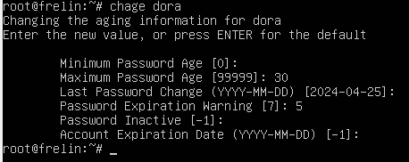

We can see these changes in /etc/shadow file.

username:password:last\_change:min\_age:max\_age:warn\_days:inactive\_days:expire\_date:reserved

username: username for the account.

password: This field stores the encrypted password or a placeholder indicating that the password is locked or not set.

last\_change: It indicates the number of days since January 1, 1970 (UNIX epoch) when the password was last changed.

min\_age: Minimum number of days required between password changes.

max\_age: Maximum number of days the password is valid before it must be changed.

warn\_days: Number of days before the password expires when the user is warned about it.

inactive\_days: Number of days after the password expires before the account is disabled.

expire\_date: This field is reserved for the expiration date of the account.

reserved: This field is usually reserved for future use and is typically empty.

The actual password is stored in the second field, but it's encrypted using a one-way hashing algorithm (like MD5, SHA-256, or SHA-512) to protect it from being easily deciphered. The other fields control various aspects of password management, such as age, expiration, and warnings.

This file is typically readable only by the root user to prevent unauthorized access to sensitive password information.

[chage command in Linux with examples - GeeksforGeeks](https://www.geeksforgeeks.org/chage-command-in-linux-with-examples/)

chage -l root to view the account aging information.

chage -d 2024-12-01 root to set the last password change date to your specified date

#### history <a href="#p6jg3lhe25kq" id="p6jg3lhe25kq"></a>

Shows the command history

#### .bash\_history <a href="#kqkbr5rixyp2" id="kqkbr5rixyp2"></a>

commands are stored in this file in the home directory when we exit/logout.

#### /etc/inputrc <a href="#il7ot3v60act" id="il7ot3v60act"></a>

We may set history search for example.

### **Aufgabe 3** <a href="#px41k5mjx935" id="px41k5mjx935"></a>

1.Benutzen Sie Ubuntu 24.04 Desktop.

2\. Sie brauchen 2 Festplatten a 8 GB.

3\. Sie erzeugen die User: erin, esther, elsa, elise, elmar, edwin, edin und eddy.

4\. Dann brauchen Sie die Gruppen: flight, train, ship und truck.

5\. erin und eddy werden Mitglieder von flight, esther und edin von train, elsa und edwin von ship und elise und elmar von truck.

6\. Die Festplatten werden partitioniert in jeweils zwei Teile a 4 GB.

7\. Alle Partitionen werden mit ext4 formatiert.

8\. Sie brauchen die Verzeichnisse /dispo/flug, /dispo/schiff, /dispo/bahn und /dispo/lkw.

9\. Jeweils eine Partition wird auf jeweils ein Directory montiert. (bitte fstab benutzen)

10\. Zum Schluss setzen Sie die Gruppeneigentümer wie folgt: flight auf flug, train auf bahn, ship auf schiff und truck auf lkw, sowie exklusive Berechtigungen für die einzelnen Gruppen.

### Printing in Linux <a href="#qsfy17yi2864" id="qsfy17yi2864"></a>

#### cups <a href="#fz9e6helaza3" id="fz9e6helaza3"></a>

**C**ommon **U**nix **P**rinting **S**ervice

[https://www.cups.org/](https://www.cups.org/)

#### ss <a href="#ircbl27h57kw" id="ircbl27h57kw"></a>

Socket statistics command is used to retrieve information about sockets.

\-t: This option is used to see TCP connections

\-n: This option specifies that numerical output should be used instead of resolving service names.

\-a: This option stands for "all" and instructs ss to display both listening and non-listening sockets.

**ss -tna**

IPP (Internet Printing Protocol) port:631

Open Firefox

[http://localhost:631](http://localhost:631/)

If you don’t see the printer add as a new one.

socket://10.30.76.230:9100

Give a name: **A** (the shorter the better)

lp -d A /etc/passwd we are printing the passwd file

### 29.04.2024 - Montag <a href="#co556zm68a99" id="co556zm68a99"></a>

### Package Management in Linux <a href="#id-154aldn1ya5v" id="id-154aldn1ya5v"></a>

| **debian**               | <p><strong>apt</strong></p><p>apt-get</p> | **redhat**                                 |            |
| ------------------------ | ----------------------------------------- | ------------------------------------------ | ---------- |
| ubuntu                   |                                           | fedora                                     |            |
| mint                     |                                           | centos                                     | **yum**    |
| knoppix                  |                                           | manjaro                                    |            |
|                          |                                           | suse                                       | **zypper** |
| **dpkg** debian packager |                                           | **rpm** **r**edhat **p**ackage **m**anager |            |

**apt**: advanced package tool

**yum**: yellowdog update manager

| **apt**                                                                                                                                                                                                    | **yum**                                                                                                         | **zypper**                                                                                                                   |
| ---------------------------------------------------------------------------------------------------------------------------------------------------------------------------------------------------------- | --------------------------------------------------------------------------------------------------------------- | ---------------------------------------------------------------------------------------------------------------------------- |
| <p>apt [Optionen] befehl</p><p>apt <strong>search</strong> postfix</p><p>apt <strong>install</strong> ccal</p><p>apt remove/purge</p><p>apt <strong>update</strong></p><p>apt <strong>upgrade</strong></p> | <p>yum search …</p><p>yum install ccal</p><p>yum remove ccal</p><p>yum <strong>makecache</strong></p><p>yum</p> | <p>zypper search …</p><p>zypper install ccal</p><p>zypper remove ccal</p><p>zypper <strong>refresh</strong></p><p>zypper</p> |

**search**: we can search the software.

**install**: we can install new software.

**remove**: Removes the software only.

**purge**: Removes the software and the active config files also.

**update**: to refresh the available software list.

**upgrade**: to update the installed softwares.

### RAID <a href="#vykcfyy9r31k" id="vykcfyy9r31k"></a>

**R**edundant **A**rray of **I**ndependent **D**iscs

[RAID - Wikipedia](https://en.wikipedia.org/wiki/RAID)

RAID level: 0, 1, 5, 6

#### RAID 0 <a href="#id-7j09kqwo5f80" id="id-7j09kqwo5f80"></a>

Min. 2 discs.

Read speed is increased

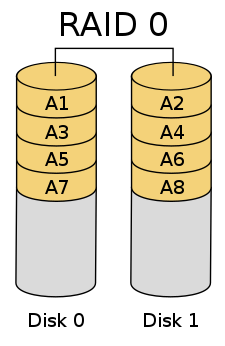

#### RAID 1 <a href="#ruu4ffx85u37" id="ruu4ffx85u37"></a>

Min. 2 discs

The same data is on another disc copied.

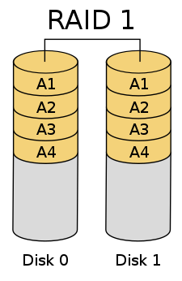

#### RAID 10 <a href="#h3f3p4utu9px" id="h3f3p4utu9px"></a>

Min. 4 discs


#### RAID 5 <a href="#rpqnbtsntgpa" id="rpqnbtsntgpa"></a>

Min. 3 discs

How does redundancy work?

(79) O:

| 0 | 1 | 0 | 0 | 1 | 1 | 1 | 1 |
| - | - | - | - | - | - | - | - |

(76) L:

| 0 | 1 | 0 | 0 | 1 | 1 | 0 | 0 |
| - | - | - | - | - | - | - | - |

XOR:

| 0 | 0 | 0 | 0 | 0 | 0 | 1 | 1 |
| - | - | - | - | - | - | - | - |

Assume that the disk holding the data L was broken. Then we can calculate it backward easily.

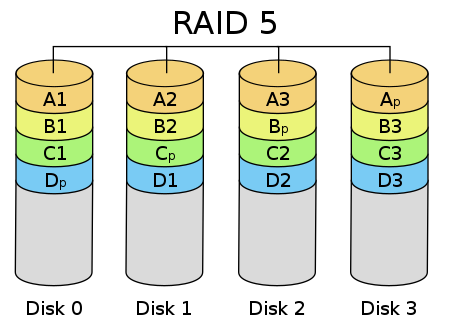

We are adding 7x 2 GB disk on VirtualBox

To check whether we added successfully:

ozgur@frelin:\~$ **lsblk**

NAME MAJ:MIN RM SIZE RO TYPE MOUNTPOINTS

sda 8:0 0 20G 0 disk

├─sda1 8:1 0 19G 0 part /

├─sda2 8:2 0 1K 0 part

└─sda5 8:5 0 975M 0 part \[SWAP]

sdb 8:16 0 2G 0 disk

sdc 8:32 0 2G 0 disk

sdd 8:48 0 2G 0 disk

sde 8:64 0 2G 0 disk

sdf 8:80 0 2G 0 disk

sdg 8:96 0 2G 0 disk

sdh 8:112 0 2G 0 disk

sr0 11:0 1 1024M 0 rom

#### mdadm <a href="#id-4zlelt8idtu9" id="id-4zlelt8idtu9"></a>

multiple drive administration

This command is not installed by default in Debian.

We install it with the command: **apt install mdadm**

**Example for RAID 1:**

mdadm -C md127 -l1 -n2 /dev/sd\[bc] -x1 /dev/sdd

root@frelin:\~# **mdadm -C md127 -l1 -n2 /dev/sd\[bc] -x1 /dev/sdd**

mdadm: Note: this array has metadata at the start and

may not be suitable as a boot device. If you plan to

store '/boot' on this device please ensure that

your boot-loader understands md/v1.x metadata, or use

\--metadata=0.90

Continue creating array? **y**

mdadm: Defaulting to version 1.2 metadata

mdadm: array /dev/md/md127 started.

To see the actual status of md:

**/proc/mdstat**

root@frelin:\~# **cat /proc/mdstat**

Personalities : \[raid1]

md127 : active raid1 sdd\[2]\(S) sdc\[1] sdb\[0]

2094080 blocks super 1.2 \[2/2] \[UU]

unused devices: \<none>

root@frelin:\~# **lsblk**

NAME MAJ:MIN RM SIZE RO TYPE MOUNTPOINTS

sda 8:0 0 20G 0 disk

├─sda1 8:1 0 19G 0 part /

├─sda2 8:2 0 1K 0 part

└─sda5 8:5 0 975M 0 part \[SWAP]

sdb 8:16 0 2G 0 disk

└─md127 9:127 0 2G 0 raid1

sdc 8:32 0 2G 0 disk

└─md127 9:127 0 2G 0 raid1

sdd 8:48 0 2G 0 disk

└─md127 9:127 0 2G 0 raid1

sde 8:64 0 2G 0 disk

sdf 8:80 0 2G 0 disk

sdg 8:96 0 2G 0 disk

sdh 8:112 0 2G 0 disk

sr0 11:0 1 1024M 0 rom

To see the details of mdadm:

**mdadm -D**

mdadm -D

Print details of one or more md devices.

root@frelin:\~# **mdadm -D /dev/md127**

/dev/md127:

Version : 1.2

Creation Time : Mon Apr 29 11:03:30 2024

Raid Level : raid1

Array Size : 2094080 (2045.00 MiB 2144.34 MB)

Used Dev Size : 2094080 (2045.00 MiB 2144.34 MB)

Raid Devices : 2

Total Devices : 3

Persistence : Superblock is persistent

Update Time : Mon Apr 29 11:03:43 2024

State : clean

Active Devices : 2

Working Devices : 3

Failed Devices : 0

Spare Devices : 1

Consistency Policy : resync

Name : frelin:md127 (local to host frelin)

UUID : 5959f6b8:355c3532:ae806b34:0ea61651

Events : 17

Number Major Minor RaidDevice State

0 8 16 0 active sync /dev/sdb

1 8 32 1 active sync /dev/sdc

2 8 48 - spare /dev/sdd

Now we format the RAID we created (**md127**).

#### Formatting <a href="#id-4rw86f81x2es" id="id-4rw86f81x2es"></a>

root@frelin:\~# **mkfs.ext4 /dev/md127**

mke2fs 1.47.0 (5-Feb-2023)

Creating filesystem with 523520 4k blocks and 131072 inodes

Filesystem UUID: 104a714b-d78d-4a5a-9e09-2674028dd3e6

Superblock backups stored on blocks:

32768, 98304, 163840, 229376, 294912

Allocating group tables: done

Writing inode tables: done

Creating journal (8192 blocks): done

Writing superblocks and filesystem accounting information: done

To check if the format was successful:

root@frelin:\~# **blkid**

/dev/sdd: UUID="5959f6b8-355c-3532-ae80-6b340ea61651" UUID\_SUB="ee967f0c-14f9-ac0c-b1b1-149a0746917b" LABEL="frelin:md127" TYPE="linux\_raid\_member"

/dev/md127: UUID="104a714b-d78d-4a5a-9e09-2674028dd3e6" BLOCK\_SIZE="4096" TYPE="ext4"

/dev/sdb: UUID="5959f6b8-355c-3532-ae80-6b340ea61651" UUID\_SUB="444b5d48-0ab6-e972-ee52-ca3dd0a09541" LABEL="frelin:md127" TYPE="linux\_raid\_member"

/dev/sdc: UUID="5959f6b8-355c-3532-ae80-6b340ea61651" UUID\_SUB="32de2ce4-cf94-596e-53e3-df216e15fd82" LABEL="frelin:md127" TYPE="linux\_raid\_member"

/dev/sda5: UUID="85ff5dd7-2728-4aee-bcfd-6170430c3b2a" TYPE="swap" PARTUUID="a9b6181f-05"

/dev/sda1: UUID="a6f10548-dd50-4b98-ba3b-224876d4288f" BLOCK\_SIZE="4096" TYPE="ext4" PARTUUID="a9b6181f-01"

#### &#x20;<a href="#id-2i3aom8nfsod" id="id-2i3aom8nfsod"></a>

#### Mounting <a href="#z4wjrxwhcksb" id="z4wjrxwhcksb"></a>

Now we are ready to mount this drive to our system.

mkdir /Raid1 We create a folder for RAID.

nano /etc/fstab We allocate this partition by adding the below line.

/dev/md127 /Raid1 ext4 defaults 0 0

#### &#x20;<a href="#nopvs88pj9z3" id="nopvs88pj9z3"></a>

Now we mount this folder to the system:

mount -a

Now we can see it with the lsblk command.

root@frelin:\~# **lsblk**

NAME MAJ:MIN RM SIZE RO TYPE MOUNTPOINTS

sda 8:0 0 20G 0 disk

├─sda1 8:1 0 19G 0 part /

├─sda2 8:2 0 1K 0 part

└─sda5 8:5 0 975M 0 part \[SWAP]

sdb 8:16 0 2G 0 disk

└─md127 9:127 0 2G 0 raid1 /Raid1

sdc 8:32 0 2G 0 disk

└─md127 9:127 0 2G 0 raid1 /Raid1

sdd 8:48 0 2G 0 disk

└─md127 9:127 0 2G 0 raid1 /Raid1

sde 8:64 0 2G 0 disk

sdf 8:80 0 2G 0 disk

sdg 8:96 0 2G 0 disk

sdh 8:112 0 2G 0 disk

sr0 11:0 1 1024M 0 rom

**Example for RAID 5:**

mdadm -C md126 -l5 -n3 /dev/sd\[efg] -x1 /dev/sdh

root@frelin:\~# **mdadm -C md126 -l5 -n3 /dev/sd\[efg] -x1 /dev/sdh**

mdadm: Defaulting to version 1.2 metadata

mdadm: array /dev/md/md126 started.

mkfs.ext4 /dev/md126 Formatting

nano /etc/fstab /dev/md126 /Raid5 ext4 defaults 0 0

mount -a

root@frelin:\~# **lsblk**

NAME MAJ:MIN RM SIZE RO TYPE MOUNTPOINTS

sda 8:0 0 20G 0 disk

├─sda1 8:1 0 19G 0 part /

├─sda2 8:2 0 1K 0 part

└─sda5 8:5 0 975M 0 part \[SWAP]

sdb 8:16 0 2G 0 disk

└─md127 9:127 0 2G 0 raid1 /Raid1

sdc 8:32 0 2G 0 disk

└─md127 9:127 0 2G 0 raid1 /Raid1

sdd 8:48 0 2G 0 disk

└─md127 9:127 0 2G 0 raid1 /Raid1

sde 8:64 0 2G 0 disk

└─md126 9:126 0 4G 0 raid5 /Raid5

sdf 8:80 0 2G 0 disk

└─md126 9:126 0 4G 0 raid5 /Raid5

sdg 8:96 0 2G 0 disk

└─md126 9:126 0 4G 0 raid5 /Raid5

sdh 8:112 0 2G 0 disk

└─md126 9:126 0 4G 0 raid5 /Raid5

sr0 11:0 1 1024M 0 rom

Oluşturduğumuz diskleri veri ile doldurup daha sonra bu disklerden birini arızalanmış gibi yapacağız. Bunun icin **mdadm -f** opsiyonunu kullanabiliriz.

**mdadm -f**

To mark a disk as faulty.

mdadm /dev/md126 -f /dev/sde sde disk is marked as faulty

cat/proc/mdstat komutunu birkac defa arka arkaya calistirarak recovery’nin yapildigini görebiliriz.

mdadm -D /dev/md126 komutu ile detay bakalim. Arızalı olan disk görünür.

**mdadm -r**

mdadm /dev/md126 -r /dev/sdf to remove the faulty disk

**mdadm -a**

mdadm /dev/md126 -a /dev/sdf ile otomatik olarak spare drive eklenir.

Yapilan islemleri sirasiyla görelim:

root@frelin:\~# **mdadm /dev/md126 -f /dev/sde**

mdadm: set /dev/sde faulty in /dev/md126

root@frelin:\~# **cat /proc/mdstat**

Personalities : \[raid1] \[raid6] \[raid5] \[raid4]

md126 : active raid5 sdg\[4] sdh\[3] sdf\[1] sde\[0]\(F)

4188160 blocks super 1.2 level 5, 512k chunk, algorithm 2 \[3/2] \[\_UU]

\[=>...................] recovery = 6.8% (144024/2094080) finish=0.4min speed=72012K/sec

md127 : active raid1 sdd\[2]\(S) sdc\[1] sdb\[0]

2094080 blocks super 1.2 \[2/2] \[UU]

unused devices: \<none>

sde diskini arızalı olarak işaretlediğimiz icin RAID, XOR islemiyle recovery yapmaya calisiyor.

Aradan biraz zaman gecmesini bekleyelim ve tekrar bakalim.

root@frelin:\~# **cat /proc/mdstat**

Personalities : \[raid1] \[raid6] \[raid5] \[raid4]

md126 : active raid5 sdg\[4] sdh\[3] sdf\[1] sde\[0]\(F)

4188160 blocks super 1.2 level 5, 512k chunk, algorithm 2 \[3/2] \[\_UU]

\[===================>.] recovery = 95.8% (2007228/2094080) finish=0.0min speed=69214K/sec

md127 : active raid1 sdd\[2]\(S) sdc\[1] sdb\[0]

2094080 blocks super 1.2 \[2/2] \[UU]

unused devices: \<none>

Recovery neredeyse tamamlanmak üzere.

root@frelin:\~# cat /proc/mdstat

Personalities : \[raid1] \[raid6] \[raid5] \[raid4]

md126 : active raid5 sdg\[4] sdh\[3] sdf\[1] sde\[0]\(F)

4188160 blocks super 1.2 level 5, 512k chunk, algorithm 2 \[3/3] \[UUU]

md127 : active raid1 sdd\[2]\(S) sdc\[1] sdb\[0]

2094080 blocks super 1.2 \[2/2] \[UU]

unused devices: \<none>

Recovery tamamlanmış ve sde diski F ile işaretlenmiş.

Simdi sira geldi bu diski çıkarıp yerine yenisini takmaya.

root@frelin:\~# **mdadm /dev/md126 -r /dev/sde**

ile arizali olan diski cikaralim ve yerine yenisini takalim.

Yenisini taktiktan sonra bunu RAID’e tekrar tanitmak yani eklemek gerekiyor.

Bunun icin de:

root@frelin:\~# **mdadm /dev/md126 -a /dev/sde**

[How To Rebuild and Resync From Failed Hard Drive Raid 5 on mdadm](https://www.youtube.com/watch?v=orIXvgS1M-8)

**df**

disk free. To see free disk space.

**df -h**

human readable version

#### RAID 6 <a href="#fh62zij6qzav" id="fh62zij6qzav"></a>

Min. 4 discs

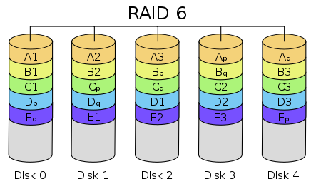

### Aufgabe 4 <a href="#ch1bnqnk8o5" id="ch1bnqnk8o5"></a>

1\. Auf Debian Gnome installieren Sie ein **RAID 10** mit 5 Festplatten (a 5 GB). Eine davon ist ein Spare.

1. Add 5 disks of 5 GB each on VirtualBox (sdb, sdc, sdd, sde, sdf)
2. apt install mdadm
3. mdadm -C md127 -l10 -n4 /dev/sd\[bcde] -x1 /dev/sdf

2\. Formatieren Sie das RAID mit **ext4**.

mkfs.ext4 /dev/md127

3\. Montieren Sie den device auf das Directory **/sail**.

1. mkdir /sail
2. nano /etc/fstab -> add /dev/md127 /sail ext4 defaults 0 0
3. mount -a

4\. Dieses wird **exklusiv** für die Gruppe **sailing** zur Verfügung gestellt.

1. groupadd sailing
2. nano /etc/group -> add users to the group sailing
3. chgrp sailing /sail **or** chown :sailing /sail
4. chmod 1770 /sail

5\. Die Gruppe **sailing** hat 5 Mitglieder: **isa**, **imo**, **ilja**, **inu** und **ira**.

1. nano /etc/default/useradd -> Make Shell: **bash**
2. useradd -m isa
3. useradd -m imo
4. useradd -m ilja
5. useradd -m inu
6. useradd -m ira
7. passwd isa
8. passwd imo
9. passwd ilja
10. passwd inu
11. passwd ira

### 30.04.2024 - Dienstag <a href="#hlin26tjrc5h" id="hlin26tjrc5h"></a>

initramfs

initrd

lsmod command

### Some Commands <a href="#skuv6meijeqj" id="skuv6meijeqj"></a>

#### nl <a href="#d9z9fwac27i7" id="d9z9fwac27i7"></a>

The nl command reads the File parameter (standard input by default), numbers the lines in the input, and writes the numbered lines to standard output.

#### wc <a href="#p0ribvkg3s83" id="p0ribvkg3s83"></a>

displays the number of bytes and words in each file that begins with chap.

#### type <a href="#cuhrjz7ryr5p" id="cuhrjz7ryr5p"></a>

a built-in shell command used to identify the kind of command you are dealing with.

#### file <a href="#e22ha7pw85jj" id="e22ha7pw85jj"></a>

a utility that determines the type of a file.

file /etc/passwd

#### head <a href="#hz5zniutwf6s" id="hz5zniutwf6s"></a>

prints the first lines of one or more files (or piped data) to standard output.

head /etc/passwd by default displays 10 lines.

head -n20 /etc/passwd displays the first 20 lines.

#### tail <a href="#dl8u6e9gczm8" id="dl8u6e9gczm8"></a>

a command-line utility that prints data from the end of a specified file or files to standard output.

tail is the opposite of the head.

tail -f /var/log/syslog **-f ile** kullandigimizda, dosyanin sonuna bir bilgi eklendiğinde onu aninda görüyoruz.

#### touch <a href="#klvopgtk2qdo" id="klvopgtk2qdo"></a>

used to create a new empty file and to change the timestamps of existing files.

touch file.txt

touch -t 202401011200 file.txt to set the date of a file.

touch -c file.txt if the file doesn’t exist it is created, if not, it is untouched (date remains the same).

#### df <a href="#cohah2gbup0t" id="cohah2gbup0t"></a>

displays information about total space and available space on a file system.

df -h displays in human readable format.

#### free <a href="#vn0c9alflh7r" id="vn0c9alflh7r"></a>

allows you to check for memory RAM on your system or to check the memory statics of the Linux operating system.

free -l

free -l -h

#### alias <a href="#pderc0oo04fb" id="pderc0oo04fb"></a>

a shortcut that leads to a command.

alias ll=”ls -laF”

unalias ll removes the alias ll.

To make it permanent we write it in .bashrc file under the home folder.

/etc/bash.bashrc will be effective to all users.

If the user has the same alias, the user's alias will overwrite it.

#### locate <a href="#ufnd5pj353q0" id="ufnd5pj353q0"></a>

is a powerful tool used to find files by their name.

#### updatedb <a href="#id-38o6mzsl5oor" id="id-38o6mzsl5oor"></a>

creates and updates the database of file names used by locate.

So that we can find the files fast.

If we create a new file newfile.txt, it will not be displayed by locate newfile.txt.

After running the updatedb command, we can see the file with locate newfile.txt

#### grep <a href="#k2908dbayvp7" id="k2908dbayvp7"></a>

perform text searches for a defined criteria of words or strings. grep stands for Globally search for a Regular Expression and Print it out.

grep -i \<string> \<file> ignore case, makes incasesensitive search.

\-n number line

\-v invert the match

#### /etc/login.defs <a href="#id-1v38gp4f7iyn" id="id-1v38gp4f7iyn"></a>

The file that defines the site-specific configuration for the shadow password suite.

\# Password aging controls:

\#

\# PASS\_MAX\_DAYS Maximum number of days a password may be used.

\# PASS\_MIN\_DAYS Minimum number of days allowed between password changes.

\# PASS\_WARN\_AGE Number of days warning given before a password expires.

\#

PASS\_MAX\_DAYS 99999

PASS\_MIN\_DAYS 0

PASS\_WARN\_AGE 7

\# Min/max values for automatic uid selection in useradd

\#

UID\_MIN 1000

UID\_MAX 60000

\# Min/max values for automatic gid selection in groupadd

\#

GID\_MIN 1000

GID\_MAX 60000

LOGIN\_RETRIES 5

\#

\# Max time in seconds for login

\#

LOGIN\_TIMEOUT 60

#### hostname <a href="#nnugca1sc50x" id="nnugca1sc50x"></a>

displays the name of the current host system.

#### cut <a href="#id-70b35hic3829" id="id-70b35hic3829"></a>

for cutting out the sections from each line of files and writing the result to standard output.

cut -d: -f1,7 /etc/passwd

#### tr <a href="#eo1l2atcmpmr" id="eo1l2atcmpmr"></a>

utility for translating or deleting characters. It supports a range of transformations including uppercase to lowercase, squeezing repeating characters, deleting specific characters, and basic find and replace. It can be used with UNIX pipes to support more complex translation. tr stands for translate.

echo Maus | **tr** M H → Haus

#### info <a href="#id-5k9giyg4wtn6" id="id-5k9giyg4wtn6"></a>

#### which <a href="#id-99qwxxagos6a" id="id-99qwxxagos6a"></a>

Shows the path of an executable file.

#### whereis <a href="#pppotn4deo0d" id="pppotn4deo0d"></a>

#### apropos <a href="#v990rgwpauid" id="v990rgwpauid"></a>

used to search the man page descriptions for a specified keyword.

#### crontab <a href="#y9kbbe17mnfx" id="y9kbbe17mnfx"></a>

Used for automated tasks.

/var/log/cron

#### find <a href="#lrb1d0wrv8hv" id="lrb1d0wrv8hv"></a>

It is an **important** command to search files.

find / -name “pa\*”

find / -name “\*.txt”

find / -uid 1003

find / -user emma

find /path/to/search -type f -mtime -7 displays the modified files in the last 7 days.

sudo find / \\( -path /proc -o -path /run \\) -prune -o -perm 755 -type f -exec ls -ld {} + | wc -l how many files do we have with 755 permission in all folders except /proc and /run.

#### [How to Find a File in Linux | Find Command - GeeksforGeeks](https://www.geeksforgeeks.org/find-command-in-linux-with-examples) <a href="#qap12u68ruiz" id="qap12u68ruiz"></a>

#### w <a href="#hu2k4h71v674" id="hu2k4h71v674"></a>

zeigt w Informationen über Benutzer an, die aktuell angemeldet sind.

displays information about the users currently logged in to the system, what they are doing, and system load averages.

#### who <a href="#arp7yq3cj5xt" id="arp7yq3cj5xt"></a>

Mit dem Befehl who ist es möglich, eine Vielzahl an Informationen über sowohl lokal als auch remote angemeldete Benutzer zu erhalten.

displays information about users who are currently logged in.

#### last <a href="#id-2s0i4e1eprof" id="id-2s0i4e1eprof"></a>

listet die Anmeldungen von Benutzern an dem System auf.

#### lastlog <a href="#id-5mijstgp42no" id="id-5mijstgp42no"></a>

Mit dem Befehl lastlog ist es möglich den Zeitpunkt des letzten Einloggens eines Benutzer oder alle Benutzer zu bestimmen.

#### env <a href="#id-9vfdw17pghr4" id="id-9vfdw17pghr4"></a>

allows you to display your current environment or run a specified command in a changed environment.

#### set <a href="#id-6k47mzi71735" id="id-6k47mzi71735"></a>

displays and sets the names and values of shell and Linux environment variables.

#### zip <a href="#mnx79rxl106s" id="mnx79rxl106s"></a>

zip archive.zip file1.txt file2.xls file3.doc

zip -r archive.zip

zip -m archive.zip file3.txt to add a new file.

zip -sf archive.zip to see the details.

#### unzip <a href="#o4udx9mtykj" id="o4udx9mtykj"></a>

unzip -d archive.zip

unzip -l archive.zip

### Aufgabe5 <a href="#gdb2hrq1un" id="gdb2hrq1un"></a>

1\. Bauen Sie bitte 4 zusätzliche Festplatten in „elementaryOS“ ein. (a 5 GB)

2\. Richten Sie mit 4 dieser Platten ein RAID 5 ein. Die 4. Platte soll ein Spare-Laufwerk sein.

(als md127)

3\. Formatieren Sie das Gerät mit ext4.

4\. Erzeugen Sie die Benutzer: **celia**, **chris**, **carmen**, **carlo**, **cora**, **corny**.

5\. Legen Sie die Gruppen **technik**, **entwicklung**, **bau** und **leitung** an.

6\. In leitung kommen cora,carmen, in bau cora,corny,carlo, in technik cora,celia,carlo und in entwicklung chris und carmen.

7\. Mounten Sie das RAID unter /DasEi.

8\. Unter /DasEi erzeugen Sie die Verzeichnisse tk, ew, bau und ltg.

9\. bau bekommt als Gruppe **bau**, tk technik, ew entwicklung und ltg leitung.

10\. Setzen Sie exklusive Berechtigungen (inklusive sticky bit) für die Gruppen.

### 01.05.2024 - Mittwoch (Ferien) <a href="#id-5ixcgfvbeil9" id="id-5ixcgfvbeil9"></a>

### 02.05.2024 - Donnerstag <a href="#id-8olhif3w1kej" id="id-8olhif3w1kej"></a>

### Logical Volumes <a href="#ulr72mwx45em" id="ulr72mwx45em"></a>

While the disk is in use, we can change the size of it.


**lvm(2)**: logical volume management (paket)

If it is not installed on your Linux Distribution you may need to manually install it.

apt install lvm2

In Fedora lvm is already installed.

First we created 3 disks (4G, 6G, 5G) with the following partitions:

root@fedora:\~# **lsblk**

NAME MAJ:MIN RM SIZE RO TYPE MOUNTPOINTS

sda 8:0 0 10.2G 0 disk

├─sda1 8:1 0 1M 0 part

├─sda2 8:2 0 1G 0 part /boot

└─sda3 8:3 0 9.2G 0 part /home

/

sdb 8:16 0 4G 0 disk

├─sdb1 8:17 0 2G 0 part

└─sdb2 8:18 0 2G 0 part

sdc 8:32 0 6G 0 disk

├─sdc1 8:33 0 3G 0 part

└─sdc2 8:34 0 3G 0 part

sdd 8:48 0 5G 0 disk

├─sdd1 8:49 0 2G 0 part

├─sdd2 8:50 0 2G 0 part

└─sdd3 8:51 0 1022M 0 part

sr0 11:0 1 1024M 0 rom

zram0 252:0 0 3.8G 0 disk \[SWAP]

#### pvcreate <a href="#srhty1exvx8i" id="srhty1exvx8i"></a>

Physical Volume Create

pvcreate /dev/sd\[bcd]1 (2+3+2 GB)

root@fedora:\~# **pvcreate /dev/sd\[bcd]1**

Physical volume "/dev/sdb1" successfully created.

Physical volume "/dev/sdc1" successfully created.

Physical volume "/dev/sdd1" successfully created.

Creating devices file /etc/lvm/devices/system.devices

#### pvdisplay <a href="#id-927mo453dnj6" id="id-927mo453dnj6"></a>

root@fedora:\~# **pvdisplay**

"/dev/sdb1" is a new physical volume of "2.00 GiB"

\--- NEW Physical volume ---

PV Name /dev/sdb1

VG Name

PV Size 2.00 GiB

Allocatable NO

PE Size 0

Total PE 0

Free PE 0

Allocated PE 0

PV UUID LmFq0A-O001-c4nv-voLY-sdqE-jfnn-Oz3wib

"/dev/sdc1" is a new physical volume of "3.00 GiB"

\--- NEW Physical volume ---

PV Name /dev/sdc1

VG Name

PV Size 3.00 GiB

Allocatable NO

PE Size 0

Total PE 0

Free PE 0

Allocated PE 0

PV UUID phEyA8-gRX4-oYRy-50fk-pLxm-8uOL-iYUuUn

"/dev/sdd1" is a new physical volume of "2.00 GiB"

\--- NEW Physical volume ---

PV Name /dev/sdd1

VG Name

PV Size 2.00 GiB

Allocatable NO

PE Size 0

Total PE 0

Free PE 0

Allocated PE 0

PV UUID ckmOK4-CscP-c74g-ZUmf-1nfo-osfT-5hMISu

#### vgcreate <a href="#id-9mu4d043k9c6" id="id-9mu4d043k9c6"></a>

Volume Group Create

We merge 3 disks as 1 disk.

vgcreate VG /dev/sdb1 /dev/sdc1 /dev/sdd1

**or**

vgcreate VG /dev/sd\[bcd]1

root@fedora:\~# **vgcreate VG /dev/sd\[bcd]1**

Volume group "VG" successfully created

#### vgdisplay <a href="#id-84aqc1vo2ef" id="id-84aqc1vo2ef"></a>

root@fedora:\~# **vgdisplay**

\--- Volume group ---

VG Name VG

System ID

Format lvm2

Metadata Areas 3

Metadata Sequence No 1

VG Access read/write

VG Status resizable

MAX LV 0

Cur LV 0

Open LV 0

Max PV 0

Cur PV 3

Act PV 3

VG Size <6.99 GiB

PE Size 4.00 MiB

Total PE 1789

Alloc PE / Size 0 / 0

Free PE / Size 1789 / <6.99 GiB

VG UUID 0JJqmh-AyDQ-ncWL-Tcmx-1sgD-iNZI-nCW3fd

#### lvcreate <a href="#szyee6n4o4tn" id="szyee6n4o4tn"></a>

Logical Volume Create

We need 3 things:

lvcreate -n lv1 -L6G VG _after -n or -L there might be space or not. Both are possible._

root@fedora:\~# **lvcreate -n lv1 -L 6G VG**

Logical volume "lv1" created.

root@fedora:\~# **lsblk**

NAME MAJ:MIN RM SIZE RO TYPE MOUNTPOINTS

sda 8:0 0 10.2G 0 disk

├─sda1 8:1 0 1M 0 part

├─sda2 8:2 0 1G 0 part /boot

└─sda3 8:3 0 9.2G 0 part /home

/

sdb 8:16 0 4G 0 disk

├─sdb1 8:17 0 2G 0 part

│ └─**VG-lv1** 253:0 0 6G 0 **lvm**

└─sdb2 8:18 0 2G 0 part

sdc 8:32 0 6G 0 disk

├─sdc1 8:33 0 3G 0 part

│ └─**VG-lv1** 253:0 0 6G 0 **lvm**

└─sdc2 8:34 0 3G 0 part

sdd 8:48 0 5G 0 disk

├─sdd1 8:49 0 2G 0 part

│ └─**VG-lv1** 253:0 0 6G 0 **lvm**

├─sdd2 8:50 0 2G 0 part

└─sdd3 8:51 0 1022M 0 part

sr0 11:0 1 1024M 0 rom

zram0 252:0 0 3.8G 0 disk \[SWAP]

root@fedora:\~# **lvdisplay**

\--- Logical volume ---

LV Path /dev/VG/lv1

LV Name lv1

VG Name VG

LV UUID GiaseA-sQ05-nKhL-2K21-3HmS-Ely8-rhx8tq

LV Write Access read/write

LV Creation host, time fedora, 2024-05-02 09:19:15 +0200

LV Status available

\# open 0

LV Size 6.00 GiB

Current LE 1536

Segments 3

Allocation inherit

Read ahead sectors auto

\- currently set to 256

Block device 253:0

Now is the time to format our Logical Volume

#### mkfs.ext4 /dev/VG/lv1 <a href="#jbz9w9fwfbwb" id="jbz9w9fwfbwb"></a>

root@fedora:\~# **mkfs.ext4 /dev/VG/lv1**

mke2fs 1.47.0 (5-Feb-2023)

Creating filesystem with 1572864 4k blocks and 393216 inodes

Filesystem UUID: 4b024508-795a-43e8-9fa0-2a5adf27c627

Superblock backups stored on blocks:

32768, 98304, 163840, 229376, 294912, 819200, 884736

Allocating group tables: done

Writing inode tables: done

Creating journal (16384 blocks): done

Writing superblocks and filesystem accounting information: done

root@fedora:\~# **ls -l /dev/VG**

total 0

lrwxrwxrwx. 1 root root 7 May 2 09:19 lv1 -> ../dm-0

root@fedora:\~# **ls -l /dev/dm\***

brw-rw----. 1 root disk 253, 0 May 2 10:05 /dev/dm-0

/dev/dma\_heap:

total 0

crw-------. 1 root root 251, 0 May 2 08:29 system

#### less /proc/devices <a href="#id-7oa469jdefhq" id="id-7oa469jdefhq"></a>

Shows the devices

root@fedora:\~# **mkdir /log-vol**

root@fedora:\~# **nano /etc/fstab**

/dev/VG/lv1 /log-vol ext4 defaults 0 0 **SAVE**

root@fedora:\~# **mount -a**

root@fedora:\~# **lsblk**

NAME MAJ:MIN RM SIZE RO TYPE MOUNTPOINTS

sda 8:0 0 10.2G 0 disk

├─sda1 8:1 0 1M 0 part

├─sda2 8:2 0 1G 0 part /boot

└─sda3 8:3 0 9.2G 0 part /home

/

sdb 8:16 0 4G 0 disk

├─sdb1 8:17 0 2G 0 part

│ └─VG-lv1 253:0 0 6G 0 lvm /log-vol

└─sdb2 8:18 0 2G 0 part

sdc 8:32 0 6G 0 disk

├─sdc1 8:33 0 3G 0 part

│ └─VG-lv1 253:0 0 6G 0 lvm /log-vol

└─sdc2 8:34 0 3G 0 part

sdd 8:48 0 5G 0 disk

├─sdd1 8:49 0 2G 0 part

│ └─VG-lv1 253:0 0 6G 0 lvm /log-vol

├─sdd2 8:50 0 2G 0 part

└─sdd3 8:51 0 1022M 0 part

sr0 11:0 1 1024M 0 rom

zram0 252:0 0 3.8G 0 disk \[SWAP]

root@fedora:\~# **df -h**

Filesystem Size Used Avail Use% Mounted on

/dev/sda3 9.3G 4.0G 4.6G 47% /

devtmpfs 4.0M 0 4.0M 0% /dev

tmpfs 2.0G 0 2.0G 0% /dev/shm

tmpfs 783M 1.5M 781M 1% /run

tmpfs 2.0G 16K 2.0G 1% /tmp

/dev/sda3 9.3G 4.0G 4.6G 47% /home

/dev/sda2 974M 316M 591M 35% /boot

tmpfs 392M 168K 391M 1% /run/user/1000

/dev/mapper/VG-lv1 5.9G 1.6M 5.6G 1% /log-vol

Assume that the capacity of lv1 is not enough anymore. We need to enlarge the volume:

root@fedora:\~# **pvcreate /dev/sd\[bc]2**

Physical volume "/dev/sdb2" successfully created.

Physical volume "/dev/sdc2" successfully created.

root@fedora:\~# **pvdisplay**

\--- Physical volume ---

PV Name /dev/sdb1

VG Name VG

PV Size 2.00 GiB / not usable 4.00 MiB

Allocatable yes (but full)

PE Size 4.00 MiB

Total PE 511

Free PE 0

Allocated PE 511

PV UUID LmFq0A-O001-c4nv-voLY-sdqE-jfnn-Oz3wib

\--- Physical volume ---

PV Name /dev/sdc1

VG Name VG

PV Size 3.00 GiB / not usable 4.00 MiB

Allocatable yes (but full)

PE Size 4.00 MiB

Total PE 767

Free PE 0

Allocated PE 767

PV UUID phEyA8-gRX4-oYRy-50fk-pLxm-8uOL-iYUuUn

\--- Physical volume ---

PV Name /dev/sdd1

VG Name VG

PV Size 2.00 GiB / not usable 4.00 MiB

Allocatable yes

PE Size 4.00 MiB

Total PE 511

Free PE 253

Allocated PE 258

PV UUID ckmOK4-CscP-c74g-ZUmf-1nfo-osfT-5hMISu

"/dev/sdb2" is a new physical volume of "<2.00 GiB"

\--- NEW Physical volume ---

PV Name /dev/sdb2

VG Name

PV Size <2.00 GiB

Allocatable NO

PE Size 0

Total PE 0

Free PE 0

Allocated PE 0

PV UUID eLJuS5-UTXa-JZnf-t7n1-2P7W-F5jF-ebbMye

"/dev/sdc2" is a new physical volume of "<3.00 GiB"

\--- NEW Physical volume ---

PV Name /dev/sdc2

VG Name

PV Size <3.00 GiB

Allocatable NO

PE Size 0

Total PE 0

Free PE 0

Allocated PE 0

PV UUID jTC8YD-es7N-ue4i-AVba-rEmn-gXWF-mxLaig

#### vgextend <a href="#wgkriarptwd5" id="wgkriarptwd5"></a>

To extend the volume

root@fedora:\~# **vgextend VG /dev/sd\[bc]2**

Volume group "VG" successfully extended

root@fedora:\~# **vgdisplay**

\--- Volume group ---

VG Name VG

System ID

Format lvm2

Metadata Areas 5

Metadata Sequence No 3

VG Access read/write

VG Status resizable

MAX LV 0

Cur LV 1

Open LV 1

Max PV 0

Cur PV 5

Act PV 5

VG Size 11.98 GiB

PE Size 4.00 MiB

Total PE 3067

Alloc PE / Size 1536 / 6.00 GiB

Free PE / Size 1531 / 5.98 GiB

VG UUID 0JJqmh-AyDQ-ncWL-Tcmx-1sgD-iNZI-nCW3fd

#### lvextend <a href="#lvgupc8w8w0j" id="lvgupc8w8w0j"></a>

lvextend /dev/VG/lv1 -L+4G

root@fedora:\~# **lvextend /dev/VG/lv1 -L+4G**

Size of logical volume VG/lv1 changed from 6.00 GiB (1536 extents) to 10.00 GiB (2560 extents).

Logical volume VG/lv1 successfully resized.

root@fedora:\~# **df -h**

Filesystem Size Used Avail Use% Mounted on

/dev/sda3 9.3G 4.0G 4.6G 47% /

devtmpfs 4.0M 0 4.0M 0% /dev

tmpfs 2.0G 0 2.0G 0% /dev/shm

tmpfs 783M 1.5M 781M 1% /run

tmpfs 2.0G 16K 2.0G 1% /tmp

/dev/sda3 9.3G 4.0G 4.6G 47% /home

/dev/sda2 974M 316M 591M 35% /boot

tmpfs 392M 172K 391M 1% /run/user/1000

/dev/mapper/VG-lv1 5.9G 1.6M 5.6G 1% /log-vol

We have 10 GB available but **df -h** shows 6 GB because the newly added part was not formatted.

#### resize2fs <a href="#gryjldq47r1h" id="gryjldq47r1h"></a>

resize2fs /dev/VG/lv1 to grow the File System

root@fedora:\~# **resize2fs /dev/VG/lv1**

resize2fs 1.47.0 (5-Feb-2023)

Filesystem at /dev/VG/lv1 is mounted on /log-vol; on-line resizing required

old\_desc\_blocks = 1, new\_desc\_blocks = 2

The filesystem on /dev/VG/lv1 is now 2621440 (4k) blocks long.

root@fedora:\~# **df -h**

Filesystem Size Used Avail Use% Mounted on

/dev/sda3 9.3G 4.0G 4.6G 47% /

devtmpfs 4.0M 0 4.0M 0% /dev

tmpfs 2.0G 0 2.0G 0% /dev/shm

tmpfs 783M 1.5M 781M 1% /run

tmpfs 2.0G 16K 2.0G 1% /tmp

/dev/sda3 9.3G 4.0G 4.6G 47% /home

/dev/sda2 974M 316M 591M 35% /boot

tmpfs 392M 172K 391M 1% /run/user/1000

/dev/mapper/VG-lv1 9.8G 1.6M 9.3G 1% /log-vol

### RAID + LVM <a href="#m6bbsram2xk6" id="m6bbsram2xk6"></a>

RAID5(3x20TB) (40 TB capacity)

VG: 40 TB -> 4 lv each 5 TB

We created 4 x 8 GB disk on Suse.

localhost:\~ # **lsblk**

NAME MAJ:MIN RM SIZE RO TYPE MOUNTPOINTS

sda 8:0 0 8G 0 disk

├─sda1 8:1 0 8M 0 part

└─sda2 8:2 0 8G 0 part /usr/local

/home

/var

/tmp

/srv

/opt

/root

/boot/grub2/x86\_64-efi

/boot/grub2/i386-pc

/

sdb 8:16 0 8G 0 disk

sdc 8:32 0 8G 0 disk

sdd 8:48 0 8G 0 disk

sde 8:64 0 8G 0 disk

sr0 11:0 1 1024M 0 rom

#### Creating RAID (mdadm -C) <a href="#fp64i8xk7qk7" id="fp64i8xk7qk7"></a>

localhost:\~ # **mdadm -C md127 -l5 -n3 /dev/sd\[bcd] -x1 /dev/sde**

mdadm: Defaulting to version 1.2 metadata

mdadm: array /dev/md/md127 started.

localhost:\~ # **cat /proc/mdstat**

Personalities : \[raid6] \[raid5] \[raid4]

md127 : active raid5 sdd\[4] sde\[3]\(S) sdc\[1] sdb\[0]

16758784 blocks super 1.2 level 5, 512k chunk, algorithm 2 \[3/2] \[UU\_]

\[===>.................] recovery = 16.5% (1383900/8379392) finish=2.3min speed=49425K/sec

unused devices: \<none>

localhost:\~ # **lsblk**

NAME MAJ:MIN RM SIZE RO TYPE MOUNTPOINTS

sda 8:0 0 8G 0 disk

├─sda1 8:1 0 8M 0 part

└─sda2 8:2 0 8G 0 part /usr/local

/home

/var

/tmp

/srv

/opt

/root

/boot/grub2/x86\_64-efi

/boot/grub2/i386-pc

/

sdb 8:16 0 8G 0 disk

└─md127 9:127 0 16G 0 raid5

sdc 8:32 0 8G 0 disk

└─md127 9:127 0 16G 0 raid5

sdd 8:48 0 8G 0 disk

└─md127 9:127 0 16G 0 raid5

sde 8:64 0 8G 0 disk

└─md127 9:127 0 16G 0 raid5

sr0 11:0 1 1024M 0 rom

You have mail in /var/spool/mail/root

#### Creating Physical Volume (pvcreate) <a href="#id-4ulhxeqrhpm7" id="id-4ulhxeqrhpm7"></a>

localhost:\~ # **pvcreate /dev/md127**

Physical volume "/dev/md127" successfully created.

#### Creating Volume Group (vgcreate) <a href="#dkoie3hs92m1" id="dkoie3hs92m1"></a>

localhost:\~ # **vgcreate VG /dev/md127**

Volume group "VG" successfully created

localhost:\~ # **vgdisplay**

\--- Volume group ---

VG Name VG

System ID

Format lvm2

Metadata Areas 1

Metadata Sequence No 1

VG Access read/write

VG Status resizable

MAX LV 0

Cur LV 0

Open LV 0

Max PV 0

Cur PV 1

Act PV 1

VG Size 15.98 GiB

PE Size 4.00 MiB

Total PE 4091

Alloc PE / Size 0 / 0

Free PE / Size 4091 / 15.98 GiB

VG UUID Vr0RYc-pmTY-5nPu-mKC3-B62g-3PVv-NPWMGe

#### Creating Logical Volume (lvcreate) <a href="#lcd3jkpza0ow" id="lcd3jkpza0ow"></a>

localhost:\~ # **lvcreate VG -nlva -L3G**

Logical volume "lva" created.

localhost:\~ # **lvdisplay**

\--- Logical volume ---

LV Path /dev/VG/lva

LV Name lva

VG Name VG

LV UUID ptoxuM-QKpD-ewX0-lt8V-IPrW-RM3p-uhm0u3

LV Write Access read/write

LV Creation host, time localhost.localdomain, 2024-05-02 11:44:30 +0200

LV Status available

\# open 0

LV Size 3.00 GiB

Current LE 768

Segments 1

Allocation inherit

Read ahead sectors auto

\- currently set to 4096

Block device 254:0

localhost:\~ # **lvcreate VG -n lvb -L 3G**

Logical volume "lvb" created.

localhost:\~ # **lvdisplay**

\--- Logical volume ---

LV Path /dev/VG/lva

LV Name lva

VG Name VG

LV UUID ptoxuM-QKpD-ewX0-lt8V-IPrW-RM3p-uhm0u3

LV Write Access read/write

LV Creation host, time localhost.localdomain, 2024-05-02 11:44:30 +0200

LV Status available

\# open 0

LV Size 3.00 GiB

Current LE 768

Segments 1

Allocation inherit

Read ahead sectors auto

\- currently set to 4096

Block device 254:0

\--- Logical volume ---

LV Path /dev/VG/lvb

LV Name **lvb**

VG Name VG

LV UUID edQh9z-xZv3-LHZC-eyhV-rnKb-LLGs-W4yiYe

LV Write Access read/write

LV Creation host, time localhost.localdomain, 2024-05-02 11:46:10 +0200

LV Status available

\# open 0

LV Size 3.00 GiB

Current LE 768

Segments 1

Allocation inherit

Read ahead sectors auto

\- currently set to 4096

Block device 254:1

#### Creating the Folders <a href="#vc0ker6w9twr" id="vc0ker6w9twr"></a>

localhost:\~ # **mkdir /data/einkauf -p**

localhost:\~ # **mkdir /data/verkauf**

localhost:\~ # **ls -l /data/**

total 0

drwxr-xr-x 1 root root 0 May 2 11:48 einkauf

drwxr-xr-x 1 root root 0 May 2 11:48 verkauf

#### Formatting the Logical Volumes <a href="#tjpkj5e8rezv" id="tjpkj5e8rezv"></a>

localhost:\~ # **mkfs.ext4 /dev/VG/lva**

mke2fs 1.46.4 (18-Aug-2021)

Creating filesystem with 786432 4k blocks and 196608 inodes

Filesystem UUID: cd14503f-9303-4b7c-a23d-8e61876829b7

Superblock backups stored on blocks:

32768, 98304, 163840, 229376, 294912

Allocating group tables: done

Writing inode tables: done

Creating journal (16384 blocks): done

Writing superblocks and filesystem accounting information: done

localhost:\~ # **mkfs.ext4 /dev/VG/lvb**

mke2fs 1.46.4 (18-Aug-2021)

Creating filesystem with 786432 4k blocks and 196608 inodes

Filesystem UUID: 5a604177-399f-4f69-a96c-33c2af392f90

Superblock backups stored on blocks:

32768, 98304, 163840, 229376, 294912

Allocating group tables: done

Writing inode tables: done

Creating journal (16384 blocks): done

Writing superblocks and filesystem accounting information: done

#### Setting the /etc/fstab <a href="#p5obprqvwsjy" id="p5obprqvwsjy"></a>

localhost:\~ # **nano /etc/fstab**

/dev/VG/lva /data/einkauf ext4 defaults 0 0

/dev/VG/lvb /data/verkauf ext4 defaults 0 0

#### Mounting <a href="#b4sgzqvrbpz1" id="b4sgzqvrbpz1"></a>

localhost:\~ # **mount -a**

localhost:\~ # **lsblk**

NAME MAJ:MIN RM SIZE RO TYPE MOUNTPOINTS

sda 8:0 0 8G 0 disk

├─sda1 8:1 0 8M 0 part

└─sda2 8:2 0 8G 0 part /usr/local

/home

/var

/tmp

/srv

/opt

/root

/boot/grub2/x86\_64-efi

/boot/grub2/i386-pc

/

sdb 8:16 0 8G 0 disk

└─**md127** 9:127 0 16G 0 raid5

├─**VG-lva** 254:0 0 3G 0 lvm /data/einkauf

└─**VG-lvb** 254:1 0 3G 0 lvm /data/verkauf

sdc 8:32 0 8G 0 disk

└─**md127** 9:127 0 16G 0 raid5

├─**VG-lva** 254:0 0 3G 0 lvm /data/einkauf

└─**VG-lvb** 254:1 0 3G 0 lvm /data/verkauf

sdd 8:48 0 8G 0 disk

└─**md127** 9:127 0 16G 0 raid5

├─**VG-lva** 254:0 0 3G 0 lvm /data/einkauf

└─**VG-lvb** 254:1 0 3G 0 lvm /data/verkauf

sde 8:64 0 8G 0 disk

└─**md127** 9:127 0 16G 0 raid5

├─**VG-lva** 254:0 0 3G 0 lvm /data/einkauf

└─**VG-lvb** 254:1 0 3G 0 lvm /data/verkauf

sr0 11:0 1 1024M 0 rom

### Aufgabe 6 (lvm & zip) <a href="#afb53mbi8rjp" id="afb53mbi8rjp"></a>

1\. Erzeugen Sie auf einem SuSe Server ein LVM Group mit drei Platten á 5 GB.

pvcreate /dev/sd\[bcd]

pvdisplay

vgcreate VG /dev/sd\[bcd]

vgdisplay

lvcreate -n lva -L 8G VG

lvdisplay

lsblk

mkdir -p /var/backup/local

2\. Stellen Sie sicher, dass Sie mindestens 7 User in Ihrem Home Directory haben.

nano /etc/default/useradd

SHELL -> bash

useradd -m user1

useradd -m user2

useradd -m user3

useradd -m user4

useradd -m user5

useradd -m user6

useradd -m user7

3\. Formatieren Sie ein LV mit 8 GB (ext4).

mkfs.ext4 /dev/VG/lva

4\. Binden Sie das unter dem Directory **/var/backup/local** ein.

nano /etc/fstab

/dev/VG/lva /var/backup/local ext4 defaults 0 0

mount -a

5\. Erzeugen Sie ein zip-file **home.zip**

unter dem o.g. Verzeichnis mit dem Home Directory als Inhalt.

apt/zypper install zip (Debian/openSuse)

cd /var/backup/local

zip -r home.zip /home

unzip -l home.zip to see the files inside the zip.

rm /home/franz/.profile The user franz deleted its file accidentally.

ls -la /home/franz

cd /↵

unzip /var/backup/local/home.zip home/franz/.profile We are restoring the data.

### Scripts <a href="#r3mohcpcr28i" id="r3mohcpcr28i"></a>

JavaScript, Perl, Python, **Shell**

\#! (she bang) scripts start with she-bang

\#!/usr/bin/perl

\#!/usr/bin/python

\#!/bin/bash Bash Script

\#!/bin/sh Shell Script


### 03.05.2024 - Freitag <a href="#s1qm4updftlq" id="s1qm4updftlq"></a>

### Standard IO Streams <a href="#l25ydrltaeho" id="l25ydrltaeho"></a>

Operating system works with channels. **Input**, **output** and **error** channels.

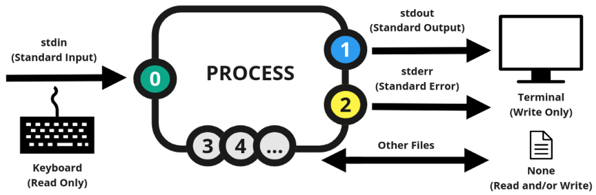

| **Channel** | **#** | **Examples**       | **Umlenkung**                |
| ----------- | ----- | ------------------ | ---------------------------- |
| Input       | 0     | Keyboard, mouse, … | <, <<                        |
| Output      | 1     | Monitor, …         | > (overwrites), >> (appends) |
| Error       | 2     | Monitor, …         |                              |

### Umlenkung <a href="#id-52plwai2trbi" id="id-52plwai2trbi"></a>

#### > <a href="#jwsdxnfgr8cx" id="jwsdxnfgr8cx"></a>

overwrites to the existing file.

ls -la /usr/bin > bin-ls.txt

less bin-ls.txt

echo Hello World > hw.txt

cat hw.txt

echo Good Morning > hw.txt

cat >my.txt

Hallo Oma,

Gruss an Opa

Dein Enkel..**↵**

Ctrl + C

The file my.txt is saved.

cat my.txt

Hallo Oma,

Gruss an Opa

Dein Enkel..

#### >> <a href="#s2xr7ot32zlh" id="s2xr7ot32zlh"></a>

Appends to the file.

echo Guten Morgen >> hw.txt

cat hw.txt

Good Morning

Guten Morgen

#### 1> <a href="#ehwt0sknlb8w" id="ehwt0sknlb8w"></a>

**1>** and **>** are the same.

root@fedora:\~# echo Himmel die Berge 1> hdb.txt

root@fedora:\~# echo Himmel die Berge > hdb.txt

#### 2> <a href="#w8y0vu85duiu" id="w8y0vu85duiu"></a>

Stderr

root@fedora:\~# lalalalalala 2> error.txt

root@fedora:\~# cat error.txt

bash: lalalalalala: command not found...

#### < > <a href="#y19dtbz6e4jl" id="y19dtbz6e4jl"></a>

root@fedora:\~# tr a-z A-Z **<** /etc/passwd **>** pwd.gross

Creates (or overwrites) the file pwd.gross with the same content from /etc/passwd but with the capital letters.

#### << (hereDoc) <a href="#jmo6ukbm4y32" id="jmo6ukbm4y32"></a>

****root@fedora:\~# cat >my1.txt <<**FERTIG**

Der String "FERTIG"

bildet die Anweisung zum Schliessen der Datei my1.txt.

Dabei muss FERTIG allein am Anfang einer Zeile stehen.

**FERTIG**

****

root@fedora:\~# cat my1.txt

Der String "FERTIG"

bildet die Anweisung zum Schliessen der Datei my1.txt.

Dabei muss FERTIG allein am Anfang einer Zeile stehen.

root@fedora:\~# cat >ttt.txt <\<EOF

\> test

\> test 2

\> EOF



root@fedora:\~# cat ttt.txt

test

test 2

she = #

bang = !

### &#x20;<a href="#p7md9f2o5nxr" id="p7md9f2o5nxr"></a>

### Sample Script for Partitioning <a href="#spvl5ma8pn9i" id="spvl5ma8pn9i"></a>

#### &#x20;<a href="#imh61tu3g6dc" id="imh61tu3g6dc"></a>

#### Writing the Script <a href="#rmcp7g498jl8" id="rmcp7g498jl8"></a>

nano sdd.sh

#!/bin/bash

\# we are creating our first script

gdisk /dev/sdd >/dev/null 2>/dev/null <\<END

n

\+2G

w

Y

END



#### Making the Script Executable <a href="#i9cljl5akr88" id="i9cljl5akr88"></a>

chmod a+x sdd.sh = give the privilege to all users to execute this script.

#### Running the Script <a href="#hy866kr1mo4f" id="hy866kr1mo4f"></a>

./sdd.sh **or** bash sdd.sh

We can make the Script such that it selects the Drive and size from the user input.

For that reason we need variables.

### Variables <a href="#tv9hewi7otnj" id="tv9hewi7otnj"></a>

#### Setting a Value to a Variable <a href="#tc384029zk1p" id="tc384029zk1p"></a>

root@fedora:\~# A=1000

root@fedora:\~# echo $A

1000

#### Environment Variables <a href="#tmezdcvgg8c0" id="tmezdcvgg8c0"></a>

root@fedora:\~# echo $HOME

/root

root@fedora:\~# echo $PATH

/root/.local/bin:/root/bin:/usr/local/sbin:/usr/local/bin:/usr/sbin:/usr/bin

mv sdd.sh /user/local/sbin

Now we can execute the script directly as sdd.sh

set | less to see the environment variables

### The 2nd Version of the Script: <a href="#bhpmtlm5jaye" id="bhpmtlm5jaye"></a>

#!/bin/bash

\# we are creating our first script

clear

echo -en "\n\n\n\n\tGroesseneingabe: "

\# -n do not output the trailing newline

\# -e enable interpretation of backslash escapes

\# \n new line

\# \t tab

read GR

\# reads text from standard input and stores in the variable GR.

gdisk /dev/sdd >/dev/null 2>/dev/null <\<END

n

\+$GR

w

Y

END



#### Reading a Value from Input <a href="#d3iywkfiam4z" id="d3iywkfiam4z"></a>

read \<variable>



read GR

Scripts can also be used to observe the system.

With the df -h command we can see how much free space is left, but we can write a script to alert System Admin when the disk reaches 95%.

\<variable>=$(command)



root@fedora:\~# df -h | grep sda2|tr -s " "|cut -d " " -f5|cut -d% -f1

35

root@fedora:\~# VFB=$(df -h | grep sda2|tr -s " "|cut -d " " -f5|cut -d% -f1)

### IF Anweisung <a href="#id-59061l5q2lzv" id="id-59061l5q2lzv"></a>

if \<Bedingung>

then

\<commands>

fi

OR

if \<Bedingung>

then

\<commands>

else

\<commands>

fi



root@fedora:\~# if \[ $VFB -gt 85 ]

\> then

\> echo OK

\> fi

root@fedora:\~# if \[ $VFB -gt 10 ]; then echo OK; fi

OK

Now it is time to send an email to the Administrator.

Mail Server (postfix, exim4)

Mail Client

mail

apt install postfix (Local Only)

After installing postfix

root@fedora:\~# **ss -tna**

State Recv-Q Send-Q Local Address:Port Peer Address:Port

LISTEN 0 4096 127.0.0.53%lo:53 0.0.0.0:\*

LISTEN 0 4096 0.0.0.0:5355 0.0.0.0:\*

LISTEN 0 4096 127.0.0.54:53 0.0.0.0:\*

LISTEN 0 10 0.0.0.0:27500 0.0.0.0:\*

LISTEN 0 100 127.0.0.1:25 0.0.0.0:\*

LISTEN 0 4096 127.0.0.1:631 0.0.0.0:\*

LISTEN 0 4096 \[::]:5355 \[::]:\*

LISTEN 0 100 \[::1]:25 \[::]:\*

LISTEN 0 4096 \[::1]:631 \[::]:\*

apt install mailutils

nano system.sh

#!/bin/bash

VFB=$(df -h|grep sda2|tr -s " "|cut -d " " -f5|cut -d% -f1)

if \[ $VFB -ge 15 ]

then

echo "Die Platte ist voll!!"|mail -s Harddisk ozgur

fi

chmod 755 system.sh

./system.sh

### Automation of the Script <a href="#fq0420f8ec8j" id="fq0420f8ec8j"></a>

#### crontab <a href="#c3ngr3jwn9y9" id="c3ngr3jwn9y9"></a>

crontab -e

# min Hour Day Month DayofWeek \<command>



30 3 \* \* \* /root/system.sh



root@fedora:\~# ls -l /var/spool/cron/root **(Fedora)**

root@fedora:\~# ls -l /var/spool/cron/crontabs/root **(Debian)**

\-rw-------. 1 root root 27 May 3 14:15 /var/spool/cron/root

root@fedora:\~# ps ax|grep cron

3591 pts/0 S+ 0:00 grep --color=auto cron

### Adding New Users with Script <a href="#bimj4t85soq3" id="bimj4t85soq3"></a>

#### Schleife <a href="#pzauuvt87epv" id="pzauuvt87epv"></a>

**for**

for \<var> in \<list>

do

\<command>

done



root@fedora:\~# **cat >user.liste**

ilsa

illo

ina

ira

ingo

ino

igo

**^C**



root@fedora:\~# cat user.liste

ilsa

illo

ina

ira

ingo

ino

igo



nano user.sh

#!/bin/bash

for USR in $(cat /root/user.liste)

do

useradd -m $USR

done

chmod a+x user.sh give the execution permission.

root@fedora:\~# ./user.sh run the script.

root@fedora:\~# ls -l /home to prove that users were added.

total 0

drwx------. 1 ahab ahab 80 Apr 24 11:44 ahab

drwx------. 1 albert albert 118 Apr 24 14:15 albert

drwx------. 1 ali ali 118 Apr 24 13:59 ali

drwx------. 1 anna anna 80 Apr 24 11:44 anna

drwx------. 1 cagri cagri 80 Apr 25 08:42 cagri

drwx------. 1 carla carla 80 Apr 25 08:41 carla

drwx------. 1 carlo carlo 80 Apr 25 08:42 carlo

drwx------. 1 celile celile 80 Apr 25 08:42 celile

drwx------. 1 charles charles 80 Apr 25 08:42 charles

drwx------. 1 chenin chenin 80 Apr 25 08:42 chenin

drwx------. 1 gaga gaga 80 Apr 24 11:49 gaga

drwx------. 1 igo igo 80 May 3 14:50 igo

drwx------. 1 illo illo 80 May 3 14:50 illo

drwx------. 1 ilsa ilsa 80 May 3 14:50 ilsa

drwx------. 1 ina ina 80 May 3 14:50 ina

drwx------. 1 ingo ingo 80 May 3 14:50 ingo

drwx------. 1 ino ino 80 May 3 14:50 ino

drwx------. 1 ira ira 80 May 3 14:50 ira

drwx------. 1 ozgur ozgur 866 May 3 13:42 ozgur

### Changing the Password Validity Time <a href="#vnv4w38ovy3z" id="vnv4w38ovy3z"></a>

chage -M -W

nano chage.sh

#!/bin/bash

for USR in $(cat /root/user.liste)

do

chage -M 30 -W 5 $USR

done



chmod 755 chage.sh

./chage.sh

for USR in $(ls /home)

### 06.05.2024 - Montag <a href="#jrvc6vnfypgo" id="jrvc6vnfypgo"></a>

### zip || unzip <a href="#lij5skt3s7de" id="lij5skt3s7de"></a>

to compress and uncompress data.

#### Zipping a single file <a href="#id-55g9go4akomr" id="id-55g9go4akomr"></a>

**zip** file1.zip file1.txt compresses file1.txt and creates file1.zip

#### Zipping multiple files <a href="#n4hsnllpkaim" id="n4hsnllpkaim"></a>

**zip** files.zip file1.txt file2.txt file3.txt

#### Add a File to an existing Zip Archive <a href="#mktask1rvz9h" id="mktask1rvz9h"></a>

**zip** **-u** files.zip file4.txt

#### View the Content of the Zip File <a href="#cp2752rh9rk2" id="cp2752rh9rk2"></a>

**zipinfo** files.zip

#### Remove a File From an Existing Zip Archive <a href="#id-57ww5s2fhas7" id="id-57ww5s2fhas7"></a>

**zip** **-d** files.zip file2.txt removes file2.txt from the files.zip archive

#### Delete Original Files After Zipping <a href="#id-9m37alkntkvg" id="id-9m37alkntkvg"></a>

**zip** **-m** newfiles.zip file1.txt file2.txt file3.txt file4.txt

#### Zip a Directory with zip Command <a href="#id-7fracgoh3e07" id="id-7fracgoh3e07"></a>

**zip** **-r** directory.zip directory -r option to zip the directory recursively.

zip -r directory.zip directory1 directory2 directory3 to zip multiple directories

#### Password Protected Zip File <a href="#x0b0dwz1zen7" id="x0b0dwz1zen7"></a>

**zip** -r **-e** folders.zip folders

### unzip <a href="#i78c9tdwyhtx" id="i78c9tdwyhtx"></a>

#### Unzip a Zipped File <a href="#ys8th6t777qp" id="ys8th6t777qp"></a>

**unzip** files.zip

#### Unzip to a Different Folder <a href="#iz5xkw79nctw" id="iz5xkw79nctw"></a>

**unzip** files.zip **-d** new\_folder -d: different directory

#### Extracting a single file <a href="#af1535evh0b2" id="af1535evh0b2"></a>

**unzip** files.zip file1.txt it extracts only the file1.txt

#### Overwrite the existing files <a href="#id-2hsgktzb0h3q" id="id-2hsgktzb0h3q"></a>

**unzip** **-o** files.zip overwrites the existing files.

#### View the Content <a href="#fk7cuc20ilw" id="fk7cuc20ilw"></a>

**unzip** **-l** files.zip

#### Split a Zip Archives into Multiple Files <a href="#id-42gou04usevy" id="id-42gou04usevy"></a>

**zip** **-r** **-s** **3m** file.zip directory -s: split, 3m: 3 MB file size

### tar <a href="#rmm3ggfzhllq" id="rmm3ggfzhllq"></a>

**t**ape **ar**chiver (for backups)

DAT Streamer


#### tar Options <a href="#oqis153q7ek5" id="oqis153q7ek5"></a>

tar \[-] **c** create

**f** file name (Archive Name)

**z** zip (gzip) (.gz)

**j** bzip2 (.bz2) takes longer but compresses more.

**J** xz (.xz) the most compression

**t** table (to see the Archive content)

**x\[j|J|z]f \<Archive Name>** to extract

#### Creating a gzip File <a href="#id-4wsx15sz9sp5" id="id-4wsx15sz9sp5"></a>

**tar czf**

**tar** c**z**f home.tar.**gz** /home **c**reates a g**z**ip **f**ile in “/home” folder with the name “home.tar.gz”

#### Creating a bzip2 File <a href="#njchmh9r46i6" id="njchmh9r46i6"></a>

**tar cjf**

tar c**j**f home.tar.**bz2** /home

#### Creating a xz File <a href="#kzcj38qtj6p9" id="kzcj38qtj6p9"></a>

**tar cJf**

tar c**J**f home.tar.**xz** /home

#### Extracting a tar File <a href="#n6d3m5c4f4o3" id="n6d3m5c4f4o3"></a>

**tar xf**

#### Use Case: <a href="#xbmtykvzb6n7" id="xbmtykvzb6n7"></a>

Assume that the user ira has deleted its DOCs folder but the System Admin was so clever that he backups the /home folder regularly.

With the command tar xf /root/home.tar home/ira/DOCs we can restore the data.

### &#x20;<a href="#mefjijb8sydo" id="mefjijb8sydo"></a>

### Networking <a href="#id-15liws9jt4hj" id="id-15liws9jt4hj"></a>

Ethernet

IEEE 802.x

Every OS uses DHCP clients

In VirtualBox all the PCs receive the IP address 10.0.2.15/24

$ ip a a: addr = address to list the IP addresses.

ip addr show long form

ip addr add \<ip>/\<CIDR> dev \<device name>



#### ip addr add <a href="#id-2vnxzoq6iho4" id="id-2vnxzoq6iho4"></a>

ip addr add 192.168.33.31/24 dev enp0s3 (to add a new IP)

Now we can ping this IP.

#### Devices: <a href="#m9t6zx79fosw" id="m9t6zx79fosw"></a>

Device names vary according to the Distributions.

enp0s3 en = Ethernet, p = PCI Bus, s = Slot

eno0 eno = Ethernet on Board

eth0

lo loopback


ipconfig (in Windows)


#### init <a href="#os6ryvq5l0po" id="os6ryvq5l0po"></a>

init 0 = shutdown -h now

init 6 = shutdown -r

**Network Types in Virtual Box**

| Network Type     | Access to Other VMs | Access to the Host | Access to Other Physical Machines | Internet Access |
| ---------------- | ------------------- | ------------------ | --------------------------------- | --------------- |
| NAT              | ✖                   | One way            | ✖                                 | ✅               |
| NAT Network      | ✅                   | One way            | ✖                                 | ✅               |
| Bridged Network  | ✅                   | ✅                  | ✅                                 | ✅               |
| Internal Network | ✅                   | ✖                  | ✖                                 | ✖               |

#### Adding a New Network Card <a href="#d0tpajlc382" id="d0tpajlc382"></a>

On Debian Mate:

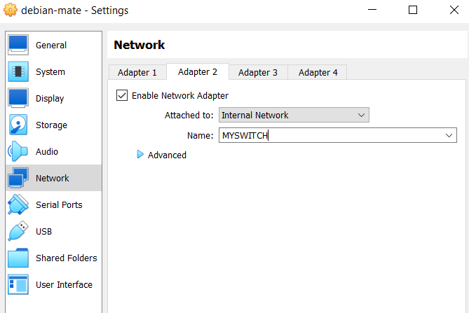

On Debian Server:

We can see the newly added Network Card (MYSWITCH)

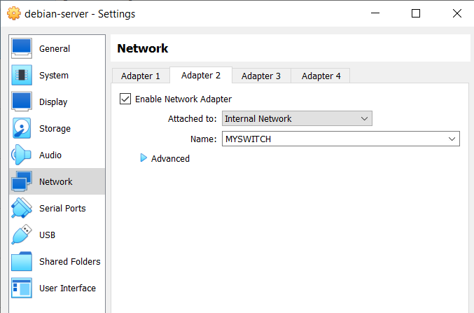

Now we open Debian Mate again.

We don’t have an internet connection because we added a new network card but we didn’t introduce it to Linux and we didn’t assign an IP address to it.

If we use the command ip a, we see that we don’t have an IP Address yet. And we see the second network card as enp0s8.

systemctl to list the running programs

NetworkManager-wait-online.service Network Manager gives an error.

#### nmcli <a href="#id-7nu0hpplpk0g" id="id-7nu0hpplpk0g"></a>

**N**etwork **M**anager **Cli**ent

man nmcli to see the usage details.

**Adding a Connection**

nmcli connection add type ethernet ifname enp0s8

type: specifies the type of connection we want to create (ethernet, wifi, vpn, bridge, bond, team)

ifname: interface name

enp0s8: interface name for the Ethernet connection

ls -l /etc/NetworkManager/system-connections we see that it was added.

**Editing the Connection**

nmcli connection edit ethernet-enp0s8

nmcli > **print**

Long list with details.

**Setting an IP Address**

nmcli > **goto ipv4**

nmcli ipv4> **set method**

**manual**

nmcli ipv4> **print ipv4.method**

We see the details.

nmcli ipv4> **set addresses**

192.168.33.11/24

nmcli ipv4> **print ipv4.addresses**

We see the details.

**Saving the Settings**

nmcli ipv4> **save**

**Quitting**

nmcli ipv4> **quit**

Now we are connected to the new Network Card and we have the IP address.

ip a we can see our internet details. Or we can ping now.

**Example:**

ozgur@fedora:\~$ **ip a**

1: lo: \<LOOPBACK,UP,LOWER\_UP> mtu 65536 qdisc noqueue state UNKNOWN group default qlen 1000

link/loopback 00:00:00:00:00:00 brd 00:00:00:00:00:00

inet 127.0.0.1/8 scope host lo

valid\_lft forever preferred\_lft forever

inet6 ::1/128 scope host noprefixroute

valid\_lft forever preferred\_lft forever

2: enp0s3: \<BROADCAST,MULTICAST,UP,LOWER\_UP> mtu 1500 qdisc fq\_codel state UP group default qlen 1000

link/ether 08:00:27:86:2b:ce brd ff:ff:ff:ff:ff:ff

inet 10.0.2.15/24 brd 10.0.2.255 scope global dynamic noprefixroute enp0s3

valid\_lft 86257sec preferred\_lft 86257sec

inet6 fe80::c53d:6174:87f4:7ef2/64 scope link noprefixroute

valid\_lft forever preferred\_lft forever

3: enp0s8: \<BROADCAST,MULTICAST,UP,LOWER\_UP> mtu 1500 qdisc fq\_codel state UP group default qlen 1000

link/ether 08:00:27:79:2c:95 brd ff:ff:ff:ff:ff:ff

inet6 fe80::703:20c8:63fb:8e98/64 scope link noprefixroute

valid\_lft forever preferred\_lft forever

ozgur@fedora:\~$ **nmcli connection add type ethernet ifname enp0s8**

Connection 'ethernet-enp0s8' (dc313573-b498-4fa5-ab22-547f667f1538) successfully added.

ozgur@fedora:\~$ **nmcli connection edit ethernet-enp0s8**

\===| nmcli interactive connection editor |===

Editing existing '802-3-ethernet' connection: 'ethernet-enp0s8'

Type 'help' or '?' for available commands.

Type 'print' to show all the connection properties.

Type 'describe \[\<setting>.\<prop>]' for detailed property description.

You may edit the following settings: connection, 802-3-ethernet (ethernet), 802-1x, dcb, sriov, ethtool, match, ipv4, ipv6, hostname, link, tc, proxy

nmcli> **goto ipv4**

You may edit the following properties: method, dns, dns-search, dns-options, dns-priority, addresses, gateway, routes, route-metric, route-table, routing-rules, replace-local-rule, ignore-auto-routes, ignore-auto-dns, dhcp-client-id, dhcp-iaid, dhcp-dscp, dhcp-timeout, dhcp-send-hostname, dhcp-hostname, dhcp-fqdn, dhcp-hostname-flags, never-default, may-fail, required-timeout, dad-timeout, dhcp-vendor-class-identifier, link-local, dhcp-reject-servers, auto-route-ext-gw

nmcli ipv4> **set method**

Allowed values for 'method' property: auto, link-local, manual, shared, disabled

Enter 'method' value: **manual**

nmcli ipv4> **set addresses**

Enter 'addresses' value: **192.168.33.10/24**

nmcli ipv4> **print method**

ipv4.method: manual

nmcli ipv4> **print addresses**

ipv4.addresses: 192.168.33.10/24

nmcli ipv4> **save**

Connection 'ethernet-enp0s8' (dc313573-b498-4fa5-ab22-547f667f1538) successfully updated.

nmcli ipv4> **quit**

ozgur@fedora:\~$ **ip a**

1: lo: \<LOOPBACK,UP,LOWER\_UP> mtu 65536 qdisc noqueue state UNKNOWN group default qlen 1000

link/loopback 00:00:00:00:00:00 brd 00:00:00:00:00:00

inet 127.0.0.1/8 scope host lo

valid\_lft forever preferred\_lft forever

inet6 ::1/128 scope host noprefixroute

valid\_lft forever preferred\_lft forever

2: enp0s3: \<BROADCAST,MULTICAST,UP,LOWER\_UP> mtu 1500 qdisc fq\_codel state UP group default qlen 1000

link/ether 08:00:27:86:2b:ce brd ff:ff:ff:ff:ff:ff

inet 10.0.2.15/24 brd 10.0.2.255 scope global dynamic noprefixroute enp0s3

valid\_lft 85710sec preferred\_lft 85710sec

inet6 fe80::c53d:6174:87f4:7ef2/64 scope link noprefixroute

valid\_lft forever preferred\_lft forever

3: **enp0s8**: \<BROADCAST,MULTICAST,UP,LOWER\_UP> mtu 1500 qdisc fq\_codel state UP group default qlen 1000

link/ether 08:00:27:79:2c:95 brd ff:ff:ff:ff:ff:ff

inet **192.168.33.10/24** brd 192.168.33.255 scope global noprefixroute enp0s8

valid\_lft forever preferred\_lft forever

inet6 fe80::4d28:ec:c875:7fcd/64 scope link noprefixroute

valid\_lft forever preferred\_lft forever

Bu sekilde farkli Linux dagitimlarina network karti ekleyerek 192.168.33.10/24, 192.168.33.11/24, 192.168.33.12/24 IP adreslerini atadik. Bu IP adresleri birbirlerini ping’leyebilir.

On Ubuntu, after all settings, we should run nmcli connection **up** ethernet-enp0s8

#### Network Settings on Debian Server <a href="#r9w4eqtb2ycm" id="r9w4eqtb2ycm"></a>

Debian (and Ubuntu) uses different settings.

ifupdown

apt install ifupdown

**nano /etc/network/interfaces** Debian uses a single file for all Network Cards.

auto lo

iface lo inet loopback

auto enp0s3

iface enp0s3 inet dhcp

\# Let's add the new Network Card

auto enp0s8

iface enp0s8 inet static

address 192.168.33.15/24



ip a komutu ile degisikligi göremiyoruz

ifup enps08 komutu ile degisikligi görmesini sağlıyoruz.

ip a ile simdi görebiliriz.

### ssh <a href="#f1w92r4hs5gz" id="f1w92r4hs5gz"></a>

Secure Shell

Client and Server

Key Pairs (Async):

Public Key

Private Key

### pgp (Pretty Good Privacy) <a href="#lyewe79v7c8k" id="lyewe79v7c8k"></a>

#### gnupg <a href="#id-257gaskfepd1" id="id-257gaskfepd1"></a>

GNU Privacy Guard

To encrypt files.

gpg command

#### Step 1 <a href="#x6jdqwbydldk" id="x6jdqwbydldk"></a>

**gpg --full-generate-key**

In this step, public and private keys are created.

ozgur@fedora:\~$ **gpg --full-generate-key**

gpg (GnuPG) 2.4.4; Copyright (C) 2024 g10 Code GmbH

This is free software: you are free to change and redistribute it.

There is NO WARRANTY, to the extent permitted by law.

Please select what kind of key you want:

(1) RSA and RSA

(2) DSA and Elgamal

(3) DSA (sign only)

(4) RSA (sign only)

(9) ECC (sign and encrypt) \*default\*

(10) ECC (sign only)

(14) Existing key from card

Your selection? **1**

RSA keys may be between 1024 and 4096 bits long.

What keysize do you want? (3072) **↵**

Requested keysize is 3072 bits

Please specify how long the key should be valid.

0 = key does not expire

\<n> = key expires in n days

\<n>w = key expires in n weeks

\<n>m = key expires in n months

\<n>y = key expires in n years

Key is valid for? (0) **2w**

Key expires at Mon 20 May 2024 02:12:43 PM CEST

Is this correct? (y/N) **y**

GnuPG needs to construct a user ID to identify your key.

Real name: **ozgur**

Email address: **↵**

Comment: **↵**

You selected this USER-ID:

"ozgur"

Change (N)ame, (C)omment, (E)mail or (O)kay/(Q)uit? **O**

**GUI asks a password twice.**

We need to generate a lot of random bytes. It is a good idea to perform

some other action (type on the keyboard, move the mouse, utilize the

disks) during the prime generation; this gives the random number

generator a better chance to gain enough entropy.

We need to generate a lot of random bytes. It is a good idea to perform

some other action (type on the keyboard, move the mouse, utilize the

disks) during the prime generation; this gives the random number

generator a better chance to gain enough entropy.

gpg: /home/ozgur/.gnupg/trustdb.gpg: trustdb created

gpg: directory '/home/ozgur/.gnupg/openpgp-revocs.d' created

gpg: revocation certificate stored as '/home/ozgur/.gnupg/openpgp-revocs.d/E0BEC6A0580C7EFFC734737B627615D0FB4ECBF2.rev'

public and secret key created and signed.

pub rsa3072 2024-05-06 \[SC] \[expires: 2024-05-20]

E0BEC6A0580C7EFFC734737B627615D0FB4ECBF2

uid ozgur

sub rsa3072 2024-05-06 \[E] \[expires: 2024-05-20]

#### Step 2 <a href="#fw7h71n41va2" id="fw7h71n41va2"></a>

**gpg -k**

List public keys

**gpg -K**

List private keys

#### Step 3 <a href="#dkjoy0mrgw74" id="dkjoy0mrgw74"></a>

**gpg --export**

We are exporting the Public Key

gpg --export -a ozgur > ozgur.public.key

#### Step 4 <a href="#dmhbd875wmg5" id="dmhbd875wmg5"></a>

Send the Public Key to the recipient or copy it into /tmp

cp ozgur.key /tmp/

~~cp ozgur.odt.gpg /tmp/~~

#### Step 5 <a href="#tn4p2e587ggb" id="tn4p2e587ggb"></a>

Another user copies this file to its home directory.

cp /tmp/ozgur.public.key .

~~cp /tmp/ozgur.odt.gpg .~~

#### Step 6 <a href="#id-7uoudokuwfmi" id="id-7uoudokuwfmi"></a>

**gpg --import**

Second user imports the Public Key generated by the First user.

gpg --import ozgur.public.key

The Receiver writes an email.

nano a.txt

Hallo Ozgur,

Blabla

LG

Ali

#### Step 7 <a href="#fqf1zz5syaeu" id="fqf1zz5syaeu"></a>

Encrypting the Data

**gpg -e**

gpg -e -r “ozgur” a.txt or gpg -e a.txt

gpg -e update.sh

You did not specify a user ID. (you may use "-r")

Current recipients:

Enter the user ID. End with an empty line: **ozgur**

Current recipients:

cv25519/191A87A1DEC2662E 2024-05-06 "ozgur"

Enter the user ID. End with an empty line: **(space)**

ls -l

a.txt.gpg

Now we copy the encrypted file to the Temp folder.

cp a.txt.gpg /tmp/

#### Step 8 <a href="#p1obk1ibk64u" id="p1obk1ibk64u"></a>

Now Özgür logs in and copies the encrypted file into his home folder and **decrypts** it.

cp /tmp/a.txt.gpg .

gpg a.txt.gpg

GUI opens and we enter the password.

Now we can see the reply.

gpg -d a.txt.gpg

ozgur@fedora:\~$ **ls -la .gnupg/**

total 8

drwx------. 1 ozgur ozgur 136 May 6 14:14 .

drwx------. 1 ozgur ozgur 906 May 6 14:05 ..

\-rw-r-----. 1 ozgur ozgur 12 May 6 14:05 common.conf

drwx------. 1 ozgur ozgur 88 May 6 14:14 openpgp-revocs.d

drwx------. 1 ozgur ozgur 176 May 6 14:14 private-keys-v1.d

drwxr-x---. 1 ozgur ozgur 118 May 6 14:14 public-keys.d

\-rw-------. 1 ozgur ozgur 1240 May 6 14:14 trustdb.gpg

#### gpg --list-key <a href="#ldk8k3rmq297" id="ldk8k3rmq297"></a>

ozgur@fedora:\~$ **gpg --list-key**

gpg: checking the trustdb

gpg: marginals needed: 3 completes needed: 1 trust model: pgp

gpg: depth: 0 valid: 1 signed: 0 trust: 0-, 0q, 0n, 0m, 0f, 1u

gpg: next trustdb check due at 2024-05-20

\[keyboxd]

\---------

pub rsa3072 2024-05-06 \[SC] \[expires: 2024-05-20]

E0BEC6A0580C7EFFC734737B627615D0FB4ECBF2

uid \[ultimate] ozgur

sub rsa3072 2024-05-06 \[E] \[expires: 2024-05-20]

#### gpg -k <a href="#id-33aatooivfvm" id="id-33aatooivfvm"></a>

ozgur@fedora:\~$ **gpg -k**

\[keyboxd]

\---------

pub rsa3072 2024-05-06 \[SC] \[expires: 2024-05-20]

E0BEC6A0580C7EFFC734737B627615D0FB4ECBF2

uid \[ultimate] ozgur

sub rsa3072 2024-05-06 \[E] \[expires: 2024-05-20]

#### gpg -K <a href="#dppan28c77v1" id="dppan28c77v1"></a>

ozgur@fedora:\~$ **gpg -K**

\[keyboxd]

\---------

sec rsa3072 2024-05-06 \[SC] \[expires: 2024-05-20]

E0BEC6A0580C7EFFC734737B627615D0FB4ECBF2

uid \[ultimate] ozgur

ssb rsa3072 2024-05-06 \[E] \[expires: 2024-05-20]

#### gpg --export -a <a href="#db3i5l22nau5" id="db3i5l22nau5"></a>

ozgur@fedora:\~$ **gpg --export -a > ozgur.key**

ozgur@fedora:\~$ less ozgur.key

We created our public key and we sent this key to our friend.

#### gpg --import <a href="#j982e0kq41vd" id="j982e0kq41vd"></a>

gpg --import /home/ozgur/sven.key

gpg --encrypt oder gpg -e ozgur.odt

Enter the user ID

cp /tmp/ozgur.odt.gpg .

gpg ozgur.odt.gpg

Enter the password. Then it is decrypted.

### 07.05.2024 - Dienstag <a href="#ligvbrthxcj5" id="ligvbrthxcj5"></a>

### Wiederholung: gpg <a href="#h30vtz3mr9ht" id="h30vtz3mr9ht"></a>

| <p><strong>carlo</strong></p><ol><li>gpg --full-generate-key</li><li><strong>carlo kater</strong> (uid)</li><li>Enter Password (key generated)</li><li>gpg -k (to list the public key)</li><li>gpg --export -a > carlo.key</li><li>Carlo sends the key to Anna via Email.</li><li>gpg --import Downloads/anna.key</li><li>Carlo writes a.txt</li><li>gpg -e c.txt</li><li>anna nas</li><li>(space)</li><li>Now we have c.txt.gpg</li><li>Carlo sends this file to Anna by email.</li><li>Carlo receives the reply from Anna and downloads the file a.txt.gpg</li><li>gpg Downloads/a.txt.gpg</li><li>Enters password</li><li>Now he has the decrypted file a.txt. He can read the file.</li></ol> | <p><strong>anna</strong></p><ol><li>gpg --full-generate-key</li><li>anna nas</li><li>Enter Password (key generated)</li><li>gpg -k (to list the public key)</li><li>gpg --export -a -o anna.key or gpg --export -a > anna.key If we don’t use > the key is displayed on the screen.</li><li>Anna sends this key to Carlo by email.</li><li>gpg --import Downloads/carlo.key</li><li>Anna receives the email from Carlo</li><li>gpg Downloads/c.txt.gpg</li><li>Enters password</li><li>Now she has the file c.txt</li><li>She writes a reply as a file a.txt</li><li>gpg -e a.txt</li><li>carlo kater</li><li>(space)</li><li>Now she has a.txt.gpg</li><li>Sends the file a.txt.gpg to Carlo by email.</li></ol> |
| ------------------------------------------------------------------------------------------------------------------------------------------------------------------------------------------------------------------------------------------------------------------------------------------------------------------------------------------------------------------------------------------------------------------------------------------------------------------------------------------------------------------------------------------------------------------------------------------------------------------------------------------------------------------------------------------------- | ----------------------------------------------------------------------------------------------------------------------------------------------------------------------------------------------------------------------------------------------------------------------------------------------------------------------------------------------------------------------------------------------------------------------------------------------------------------------------------------------------------------------------------------------------------------------------------------------------------------------------------------------------------------------------------------------------------------- |

### SSH <a href="#cd3315gq64x" id="cd3315gq64x"></a>

ssh (ssh client)

scp (secure copy)

sshd (ssh Daemon) - ssh Server, tcp 22

openssh-server should be installed.

#### Installing ssh server on Linux <a href="#ceo1elf1wrr5" id="ceo1elf1wrr5"></a>

apt install openssh-server (Debian)

dnf install openssh-server (Fedora)

If we can not see that ssh is running by checking with ss -tna then we may need to activate it.

systemctl start sshd.service to start the ssh server.

systemctl enable sshd.service to let it start on every boot.

systemctl stop sshd.service to stop ssh server.

We check again after the systemctl start sshd.service command.

root@fedora:\~# **ss -tna**

State Recv-Q Send-Q Local Address:Port Peer Address:Port

LISTEN 0 10 0.0.0.0:27500 0.0.0.0:\*

LISTEN 0 4096 127.0.0.53%lo:53 0.0.0.0:\*

LISTEN 0 128 0.0.0.0:22 0.0.0.0:\*

LISTEN 0 4096 127.0.0.54:53 0.0.0.0:\*

LISTEN 0 4096 127.0.0.1:631 0.0.0.0:\*

LISTEN 0 4096 0.0.0.0:5355 0.0.0.0:\*

LISTEN 0 128 \[::]:22 \[::]:\*

LISTEN 0 4096 \[::1]:631 \[::]:\*

LISTEN 0 4096 \[::]:5355 \[::]:\*

#### Connecting to a Remote Server <a href="#id-67b6yrdfs8jo" id="id-67b6yrdfs8jo"></a>

ssh \<user>@\<hostname>

**or**

ssh \<user>@\<IP Address> \[**-p** \<port number>]

root@fedora:\~# **ssh ozgur@192.168.33.15**

The authenticity of host '192.168.33.15 (192.168.33.15)' can't be established.

ED25519 key fingerprint is SHA256:qN9HHbosKnL8OEOHXWc+ZzNhBRHhm7GAwJwh7RUt/vU.

This key is not known by any other names.

Are you sure you want to continue connecting (yes/no/\[fingerprint])? **yes**

Warning: Permanently added '192.168.33.15' (ED25519) to the list of known hosts.

Connection closed by 192.168.33.15 port 22

When we say **yes** a public key is created under \~/.ssh

\~/.ssh/known\_hosts folder is created.

root@fedora:\~# **ls -l .ssh/**

total 8

\-rw-------. 1 root root 837 May 7 09:37 known\_hosts

\-rw-r--r--. 1 root root 95 May 7 09:28 known\_hosts.old

Now we execute the same command again to connect to the server.

root@fedora:\~# **ssh ozgur@192.168.33.15**

ozgur@192.168.33.15's password: **\<Password for ozgur>**

Linux debian-server 6.1.0-20-amd64 #1 SMP PREEMPT\_DYNAMIC Debian 6.1.85-1 (2024-04-11) x86\_64

The programs included with the Debian GNU/Linux system are free software;

the exact distribution terms for each program are described in the

individual files in /usr/share/doc/\*/copyright.

Debian GNU/Linux comes with ABSOLUTELY NO WARRANTY, to the extent

permitted by applicable law.

Last login: Tue May 7 09:37:27 2024

ozgur@debian-server:\~$

We were on Fedora and now we are connected to Debian Server.

root@fedora:\~# **ls -l /etc/ssh/**

total 640

\-rw-r--r--. 1 root root 620105 Jan 25 01:00 moduli

\-rw-r--r--. 1 root root 1916 Jan 25 01:00 ssh\_config

drwxr-xr-x. 1 root root 28 Apr 15 00:58 ssh\_config.d

\-rw-------. 1 root root 3670 Jan 25 01:00 sshd\_config

drwx------. 1 root root 88 Apr 15 00:59 sshd\_config.d

\-rw-------. 1 root root 480 May 7 09:13 ssh\_host\_ecdsa\_key

\-rw-r--r--. 1 root root 162 May 7 09:13 ssh\_host\_ecdsa\_key.pub

\-rw-------. 1 root root 387 May 7 09:13 ssh\_host\_ed25519\_key

\-rw-r--r--. 1 root root 82 May 7 09:13 ssh\_host\_ed25519\_key.pub

\-rw-------. 1 root root 2578 May 7 09:13 ssh\_host\_rsa\_key

\-rw-r--r--. 1 root root 554 May 7 09:13 ssh\_host\_rsa\_key.pub

#### ssh Config <a href="#id-6klnmvgg5jkg" id="id-6klnmvgg5jkg"></a>

root@fedora:\~# **nano /etc/ssh/sshd\_config**

In this config file we have:

\#Port 22

if we want to change the port number (after port change, ssh server should be restarted)

\#PermitRootLogin prohibit-password

This line prohibits root access with a password. This means, we can’t use the **ssh root@hostname** command to connect to this server.

\#LoginGraceTime 2m

ssh login duration. Here 2m means, after 2 minutes of inactive login, connection will be closed automatically.

\#PubkeyAuthentication yes

This allows us to connect to a server with Public key (without a password)

#### ssh Connection with Keys <a href="#o8d21oi0pn8p" id="o8d21oi0pn8p"></a>

Now let’s create key pairs so that without a password we can create an ssh connection.

**ssh-keygen**

root@fedora:\~# **ssh-keygen**

Generating public/private ed25519 key pair.

Enter file in which to save the key (/root/.ssh/id\_ed25519): **/root/.ssh/debian-server**

Enter passphrase (empty for no passphrase): **↵**

Enter same passphrase again: **↵**

Your identification has been saved in /root/.ssh/debian-server

Your public key has been saved in /root/.ssh/debian-server.pub

The key fingerprint is:

SHA256:M1TtThnX0jHeGzo0MdYL34pq9jIdfbQLDQ+3qVatQZ0 root@fedora

The key's randomart image is:

\+--\[ED25519 256]--+

\| .. +.=.|

\| . +.\*.=|

\| . . \*o==|

\| . =o+E\*|

\| S o \*\*+=|

\| o +.=Bo|

\| o .++.|

\| \* .o.. |

\| o +o |

\+----\[SHA256]-----+

root@fedora:\~# **ls -l .ssh/**

total 16

\-rw-------. 1 root root 399 May 7 11:17 debian-server

\-rw-r--r--. 1 root root 93 May 7 11:17 debian-server.pub

\-rw-------. 1 root root 837 May 7 09:37 known\_hosts

\-rw-r--r--. 1 root root 95 May 7 09:28 known\_hosts.old

**ssh-copy-id**

ssh-copy-id

root@fedora:\~# **ssh-copy-id -i .ssh/debian-server.pub ozgur@192.168.33.15**

/usr/bin/ssh-copy-id: INFO: Source of key(s) to be installed: ".ssh/debian-server.pub"

/usr/bin/ssh-copy-id: INFO: attempting to log in with the new key(s), to filter out any that are already installed

/usr/bin/ssh-copy-id: INFO: 1 key(s) remain to be installed -- if you are prompted now it is to install the new keys

ozgur@192.168.33.15's password: **\<enter Password>**

Number of key(s) added: 1

Now try logging into the machine, with: "ssh 'ozgur@192.168.33.15'"

and check to make sure that only the key(s) you wanted were added.

root@fedora:\~# **ssh ozgur@192.168.33.15**

ozgur@192.168.33.15's password: ???

Linux debian-server 6.1.0-20-amd64 #1 SMP PREEMPT\_DYNAMIC Debian 6.1.85-1 (2024-04-11) x86\_64

The programs included with the Debian GNU/Linux system are free software;

the exact distribution terms for each program are described in the

individual files in /usr/share/doc/\*/copyright.

Debian GNU/Linux comes with ABSOLUTELY NO WARRANTY, to the extent

permitted by applicable law.

Last login: Tue May 7 11:27:11 2024 from 192.168.33.10

\-

ozgur@debian-server:\~$ cd .ssh

ozgur@debian-server:\~/.ssh$ ls -l

total 4

\-rw------- 1 ozgur ozgur 93 May 7 11:25 authorized\_keys

ozgur@debian-server:\~/.ssh$ cat authorized\_keys

ssh-ed25519 AAAAC3NzaC1lZDI1NTE5AAAAIF6LrkNyYOUH78uj+yfxU9/oBe9Dn5xiXtqbmKteGeAN root@fedora

### Setting a Router <a href="#qeb9ne593itu" id="qeb9ne593itu"></a>


#### ifdown <a href="#o5i743v6nwpd" id="o5i743v6nwpd"></a>

ifdown enp0s8 to shutdown the NIC.

**nano /etc/network/interfaces** Now we can make changes

auto lo

iface lo inet loopback

auto enp0s3

iface enp0s3 inet dhcp

\# Let's add the new Network Card

auto enp0s8

iface enp0s8 inet static

address 192.168.33.1/24



#### ifup <a href="#tv7i8x9xqxgo" id="tv7i8x9xqxgo"></a>

ifup enp0s8 to run the NIC again.

Now we can see the new IP address with **ip a** command.

### DHCP Server <a href="#fq7i2f8zyh1h" id="fq7i2f8zyh1h"></a>

#### Installation <a href="#e7rlds3lizd7" id="e7rlds3lizd7"></a>

root@debian-server:\~# **apt install isc-dhcp-server**

#### &#x20;<a href="#s63wifjz5e84" id="s63wifjz5e84"></a>

#### Configurations <a href="#hkq2h258cypa" id="hkq2h258cypa"></a>

**Configuration 1**

root@debian-server:\~# **nano /etc/dhcp/dhcpd.conf**

We erased all lines and now starting with an empty file to configure our DHCP Server.

default-lease-time 600; # in seconds

max-lease-time 720;

subnet 192.168.33.0 netmask 255.255.255.0 {

range 192.168.33.20 192.168.33.100;

option routers 192.168.33.1;

option domain-name-servers 192.168.33.1, 1.1.1.1; # max 4 Address

}

**\*** When half of the lease time is reached, client requests from server lease time to be extended.

**Configuration 2**

root@debian-server:\~# **nano /etc/default/isc-dhcp-server**

INTERFACESv4="**enp0s8**"

**#**INTERFACESv6="" we are deactivating IPv6 (but not necessarily)

We deactivated IPv6 and added enp0s8 as IPv4 interface.

#### Restarting the DHCP Server <a href="#lmlpfuomemqo" id="lmlpfuomemqo"></a>

root@debian-server:\~# **systemctl restart isc-dhcp-server.service**

#### Checking with ss -u <a href="#id-8kunqq28wxqa" id="id-8kunqq28wxqa"></a>

root@debian-server:\~# **ss -uan**

State Recv-Q Send-Q Local Address:Port Peer Address:Port Process

UNCONN 0 0 0.0.0.0:67 0.0.0.0:\*

UNCONN 0 0 0.0.0.0:68 0.0.0.0:\*

root@debian-server:\~# **ss -ua**

State Recv-Q Send-Q Local Address:Port Peer Address:Port Process

UNCONN 0 0 0.0.0.0:bootps 0.0.0.0:\*

UNCONN 0 0 0.0.0.0:bootpc 0.0.0.0:\*

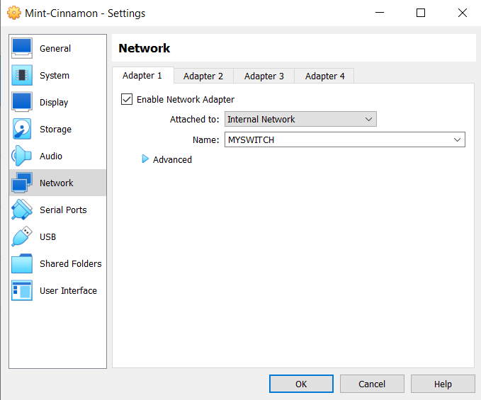

Adapter 1 was selected as MYSWITCH

Adapter 2 was deleted.

Now if we run Mint it should receive the IP address from the DHCP Server.

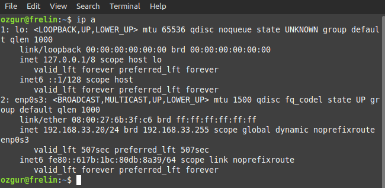

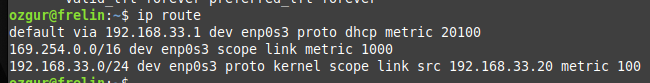

Debian-Mate:

less /etc/resolv.conf

nameserver 192.168.33.1

nameserver 1.1.1.1

If we make it in other Distributions nameserver IP’s can be different.

After DHCP Server installation let’s try to ping google.de


We receive an error.

### Name Server <a href="#id-6htb0wxjgi5l" id="id-6htb0wxjgi5l"></a>

#### Installation <a href="#id-3hqy1mg073d" id="id-3hqy1mg073d"></a>

apt install bind9

After we install the Name Server:


Domain can be now translated into IP Address by Name Server but we still can not reach google.de. Why? Because we don’t have a routing feature in our server.

We need a Router!

### 08.05.2024 - Mittwoch <a href="#zbaq3fs0uzed" id="zbaq3fs0uzed"></a>

### Routing <a href="#mt1usyi3h4eq" id="mt1usyi3h4eq"></a>

From Fedora we are connecting to Debian Server.

ssh ozgur@192.168.33.1

systemctl for managing system services.

sysctl primarily for configuring kernel parameters (/proc/sys)

root@debian-server:\~# **sysctl net.ipv4.ip\_forward**

net.ipv4.ip\_forward = 0

root@debian-server:\~# ls -l /proc/sys

total 0

dr-xr-xr-x. 1 root root 0 May 8 09:53 abi

dr-xr-xr-x. 1 root root 0 May 8 09:17 crypto

dr-xr-xr-x. 1 root root 0 May 8 09:53 debug

dr-xr-xr-x. 1 root root 0 May 8 09:53 dev

dr-xr-xr-x. 1 root root 0 May 8 09:17 fs

dr-xr-xr-x. 1 root root 0 May 8 09:17 kernel

dr-xr-xr-x. 1 root root 0 May 8 09:17 net

dr-xr-xr-x. 1 root root 0 May 8 09:53 sunrpc

dr-xr-xr-x. 1 root root 0 May 8 09:53 user

dr-xr-xr-x. 1 root root 0 May 8 09:17 vm

root@debian-server:\~# ls -l /proc/sys/net/

total 0

dr-xr-xr-x. 1 root root 0 May 8 09:17 core

dr-xr-xr-x. 1 root root 0 May 8 09:17 ipv4

dr-xr-xr-x. 1 root root 0 May 8 09:18 ipv6

dr-xr-xr-x. 1 root root 0 May 8 09:18 mptcp

dr-xr-xr-x. 1 root root 0 May 8 09:53 netfilter

\-rw-r--r--. 1 root root 0 May 8 09:53 nf\_conntrack\_max

dr-xr-xr-x. 1 root root 0 May 8 09:17 unix

#### Enabling the IPv4 Forwarding <a href="#yymi99so7a5x" id="yymi99so7a5x"></a>

root@debian-server:\~# ls -l /proc/sys/net/ipv4/ip\_forward

\-rw-r--r--. 1 root root 0 May 8 09:53 /proc/sys/net/ipv4/ip\_forward

root@fedora:\~# **sysctl net.ipv4.ip\_forward**

net.ipv4.ip\_forward = 0

root@fedora:\~# **sysctl net.ipv4.ip\_forward=1**

net.ipv4.ip\_forward = 1 this is temporary

or

echo 1 > /proc/sys/net/ipv4/ip\_forward this is temporary

#### /etc/sysctl.conf Configuration <a href="#kliiqtdz9h1t" id="kliiqtdz9h1t"></a>

root@debian-server:\~# **nano /etc/sysctl.conf**

\# Uncomment the next line to enable packet forwarding for IPv4

net.ipv4.ip\_forward=1

It will be activated at the next boot. (Permanent)

#### iptables <a href="#hp0w5xz72v86" id="hp0w5xz72v86"></a>

root@debian-server:\~# **iptables**

\-bash: iptables: command not found We will install

**Installation**

root@debian-server:\~# **apt install iptables**

**Listing**

root@debian-server:\~# **iptables -t nat -L**

Chain PREROUTING (policy ACCEPT)

target prot opt source destination

Chain INPUT (policy ACCEPT)

target prot opt source destination

Chain OUTPUT (policy ACCEPT)

target prot opt source destination

Chain POSTROUTING (policy ACCEPT)

target prot opt source destination

**Adding a Rule**

root@debian-server:\~# **iptables -t nat -A POSTROUTING -o enp0s3 -j MASQUERADE**

| **-t**          | table                                                                                                                                                                                                                                                                                                                                                             |
| --------------- | ----------------------------------------------------------------------------------------------------------------------------------------------------------------------------------------------------------------------------------------------------------------------------------------------------------------------------------------------------------------- |
| **nat**         | NAT table is used                                                                                                                                                                                                                                                                                                                                                 |
| **-A**          | Append (to add a new rule)                                                                                                                                                                                                                                                                                                                                        |
| **POSTROUTING** | POSTROUTING is used for packets after they have been routed.                                                                                                                                                                                                                                                                                                      |
| **-o**          | outgoing                                                                                                                                                                                                                                                                                                                                                          |
| **enp0s3**      | Network Interface                                                                                                                                                                                                                                                                                                                                                 |
| **-j**          | jump (specifies the target). Determines what happens to packets that match the rule.                                                                                                                                                                                                                                                                              |
| **MASQUERADE**  | MASQUERADE is the target, which is used to dynamically modify the source IP address and port number of outgoing packets to match the address of the outgoing interface. This is commonly used for network address translation (NAT) in scenarios such as internet connection sharing, where multiple devices on a local network share a single public IP address. |

root@debian-server:\~# **iptables -t nat -L**

Chain PREROUTING (policy ACCEPT)

target prot opt source destination

Chain INPUT (policy ACCEPT)

target prot opt source destination

Chain OUTPUT (policy ACCEPT)

target prot opt source destination

Chain POSTROUTING (policy ACCEPT)

target prot opt source destination

MASQUERADE all -- anywhere anywhere

**(policy ACCEPT)**: the default policy for the chain. In this case, the default policy is set to **ACCEPT**, which means that if a packet does not match any rule in the chain, it will be accepted and allowed to proceed further in the network stack.

**target**: the target of the rule. The target specifies what action should be taken if a packet matches the rule.

**prot**: protocol (TCP, UDP, ICMP)

**opt**: may contain additional options or specifications for the rule.

**source**: specifies the source of the packet that the rule applies to. It can be an IP address, a network range, or other specifications.

**destination**: specifies the destination of the packet that the rule applies to. Similar to the source, it can be an IP address, a network range, or other specifications.

#### Creating a /etc/rc.local File <a href="#id-6q1ddxcixf98" id="id-6q1ddxcixf98"></a>

root@debian-server:\~# **nano /etc/rc.local**

#!/bin/bash

iptables -t nat -A POSTROUTING -o enp0s3 -j MASQUERADE



#### Setting the Permissions <a href="#bpauz96sc0sm" id="bpauz96sc0sm"></a>

root@debian-server:\~# **chmod a+x /etc/rc.local**

#### Restarting the Debian Server <a href="#gri83n8y8qu0" id="gri83n8y8qu0"></a>

We restart Debian Server.

root@debian-server:\~# **init 6**

Now we switch to Fedora again and check whether ping works.

root@**fedora**:\~# **ping google.com**

PING google.com (142.250.147.138) 56(84) bytes of data.

64 bytes from rd-in-f138.1e100.net (142.250.147.138): icmp\_seq=1 ttl=104 time=25.4 ms

64 bytes from rd-in-f138.1e100.net (142.250.147.138): icmp\_seq=2 ttl=104 time=25.0 ms

64 bytes from rd-in-f138.1e100.net (142.250.147.138): icmp\_seq=3 ttl=104 time=24.7 ms

64 bytes from rd-in-f138.1e100.net (142.250.147.138): icmp\_seq=4 ttl=104 time=49.7 ms

^C

\--- google.com ping statistics ---

4 packets transmitted, 4 received, 0% packet loss, time 3008ms

rtt min/avg/max/mdev = 24.657/31.178/49.710/10.702 ms

**IT WORKS!**

**Routing is successful!!!!**

### Aufgabe 42 (!!!) <a href="#l7oa579vv5gs" id="l7oa579vv5gs"></a>

1\. Installieren Sie einen Debian Server (router42) mit zwei Netzwerk-Karten, fünf 6-GB Harddisks und SSH-Server.

2\. Die erste NIC ist "**bridged**", die zweite ist im Switch **ALLUP**.

3\. ALLUP hat die Net-ID 192.168.110.0/24 und die zweite NIC die Adresse 192.168.110.1/24.

4\. Sie erzeugen die User : **nora**, **nobby**, **nele**, **nina**, **nick**, **nanni**, **norma**.

5\. Sie brauchen die Gruppen : **secure1**, **secure2** und **secure3**.

Die User **nick**, **nanni** kommen in die Gruppe **secure3**, **nora**, **nobby** und **nina** in **secure2** und **nina**, **norma**, **nele** in **secure1**.

6\. Auf den Festplatten machen Sie ein RAID 5 und darauf erzeugen Sie drei logische Volumes a 3 GB.

7\. Die drei Directories **/sicher/s1**, **/sicher/s2** und **/sicher/s3** werden den drei Volumes nach der Formatierung zugeordnet.

8\. Setzen Sie für die o.g. Directories das jeweilige Gruppeneigentum und die exklusiven Berechtigungen für die einzelnen Gruppen incl „sticky bit“.

9\. Der Host soll auch als Router agieren, incl. DHCP Server, DNS Server und NAT.

10\. Alle User sollen in der Lage sein, sich über ssh einzuloggen. Und zwar ohne Passwort. Dazu brauchen Sie eine GUI Linux Version Ihrer Wahl.

### &#x20;<a href="#iz426b97d8vz" id="iz426b97d8vz"></a>

### 09.05 & 10.05 FERIEN <a href="#z7vre7iup8ff" id="z7vre7iup8ff"></a>

### &#x20;<a href="#id-1w90dvglj1hs" id="id-1w90dvglj1hs"></a>

### 13.05.2024 - Montag <a href="#m7d6zi1hmlga" id="m7d6zi1hmlga"></a>

### Die Lösung zur Aufgabe 42 <a href="#q8w1x9khcclk" id="q8w1x9khcclk"></a>

Difference between NAT and bridged device.

**NAT**: **10.0.2.15 (**default IP address from VirtualBox)

**Bridge**: It receives the IP address from BBQ DHCP server. **10.30.76.X/24**

We add network cards and disks in Virtual Box

ip a we list the devices.

enp0s3 has 10.30.76132/24 (bridged)

enp0s8 does not have an IP address yet.

For Ubuntu we need to install ifupdown

nano /etc/network/interfaces

Add the followings:

auto enp0s8

iface enp0s8 inet static

address 192.168.110.1/24

^X Yes

ifup enp0s8

ip a now we see it

lsblk we see 5 disks sdb, sdc, sdd, sde, sdf

mdadm command not found

apt install mdadm

lsmod we see which driver kernel uses.

madadm -C md127 -l5 -n4 /dev/sd\[bcde] -x1 /dev/sdf

lsblk now we see the raids

pvcreate command not found

apt install lvm2

pvcreate /dev/md127

vgcreate VG /dev/md127

lvcreate -n lv1 -L 3G VG

lvcreate -n lv2 -L 3G VG

lvcreate -n lv3 -L 3G VG

lsblk we see that lvm’s are created

mkfs.ext4 /devVG/lv1

mkfs.ext4 /devVG/lv2

mkfs.ext4 /devVG/lv3

mkdir /sicher/s1 -p

mkdir /sicher/s2

mkdir /sicher/s3

ls -l /sicher we see the folders

nano /etc/fstab

/dev/VG/lv1 /sicher/s1 ext4 defaults 0 0

Alt + 6 → copy

/dev/VG/lv2 /sicher/s2 ext4 defaults 0 0

/dev/VG/lv3 /sicher/s3 ext4 defaults 0 0

^X Yes

mount -a

df we see the details

lsblk we see the details

useradd -m nora

useradd -m nobby

…

groupadd secure1

groupadd secure2

groupadd secure3

nano /etc/group

Add the users to the groups

^X Yes

id nina to test user groups

chgrp secure1 /sicher1/s1

chgrp secure2 /sicher1/s2

chgrp secure3 /sicher1/s3

ls -l /sicher/ to see the details

chmod 1770 /sicher/\*

ls -l /sicher/ to see the details

\-------

ip a to check the internet details

apt install isc-dhcp-server it must be configured

apt install bind9

nano /etc/dhcp/dhcpd.conf

default-lease-time 600;

max-lease-time 7200;

subnet 192.168.110.0 netmask 255.255.255.0 {

range 192.168.110.5 192.168.110.110;

option routers 192.168.110.1;

option domain-name-servers 192.168.110.1;

}

^X Yes

nano /etc/default/isc-dhcp-server

INTERFACES4=”enp0s8”

^X Yes

systemctl restart isc-dhcp-server.service

ss -una we see that ports are active

**Routing and NAT**

**NAT**

iptables command not found

apt install iptables

iptables -t nat -A POSTROUTING -o enp0s3 -j MASQUERADE this is temporary

iptables -t nat -L to see the details

To make it permanent:

echo “iptables -t nat -A POSTROUTING -o enp0s3 -j MASQUERADE” > /etc/rc.local

nano /etc/rc.local

\#!/bin/bash

iptables -t nat -A POSTROUTING -o enp0s3 -j MASQUERADE

^X Yes

chmod 755 /etc/rc.local or chmod a+x /etc/rc.local

ls -l /etc/rc.local to check the permissions

**Routing**

sysctl net.ipv4.ip\_forward=1 to activate (temporary)

nano /etc/sysctl.conf

Uncomment net.ipv4.ip\`forward=1

Switch to another Linux.

Now we can start any Linux with the network card ALLUP.

ping google.de

Works!

ssh-keygen

ssh-copy-id nanni@192.168.110.1

yes

Enter password

ssh nanni@192.168.110.1

Without password we are connected

For all users individually:

ssh-copy-id nele@192.168.110.1

### Aufgabe 10 <a href="#a5llqa8gnfoo" id="a5llqa8gnfoo"></a>

1\. Auf einem Debian Server namens debinall richten Sie eine neue Netzwerkkarte ein, im Switch MAY.

2\. Die IP ist 172.30.40.1/24.

3\. Sie installieren einen DHCP-SERVER mit der range 172.30.40.10 bis 172.30.40.55.

4\. Router ist der Server selbst. Der DNS Server ist er auch.

### 14.05.2024 - Dienstag <a href="#pd5xsn1l4wn0" id="pd5xsn1l4wn0"></a>

### DNS <a href="#id-85hc3699b2p1" id="id-85hc3699b2p1"></a>

bind9

| **/etc/bind/**… | <p><strong>/var/cache/bind/</strong>managed-keys.bind</p><p>/var/cache/bind/managed-keys.bind.jnl</p> |
| --------------- | ----------------------------------------------------------------------------------------------------- |

#### DNS Zones <a href="#id-46u72p3wwc9f" id="id-46u72p3wwc9f"></a>

google.de**.**

ROOT Server

Top Level Domains

Sublevel Domains

Domains

| <p>Forward resolution</p><p>www.google.de</p><p>IP: 142.76.11.113</p> | <p>Reverse resolution</p><p>113.11.76.142.in-addr.arpa</p> |
| --------------------------------------------------------------------- | ---------------------------------------------------------- |

root@fedora:\~# **host www.google.de**

www.google.de has address 142.250.185.195

www.google.de has IPv6 address 2a00:1450:4001:812::2003

To learn the reverse domain:

root@fedora:\~# **host 142.250.185.195**

195.185.250.142.in-addr.arpa domain name pointer fra16s52-in-f3.1e100.net.

We will create a domain : **erster.mai**

#### DNS-Datensatz <a href="#cpzau3ak0usy" id="cpzau3ak0usy"></a>

\<Deklaration> \<TTL> \<Klasse> \<Typ> \<Definition>

Beispiel:

www 86400 IN A 143.76.13.111

www 86400 IN AAAA 2001:fe80::1

MX\<no> Mail Exchanger

NS Name Server

PTR Point to Return (pointer)

CNAME Canonical Name

SOA start of authority

#### Zone File (forward) <a href="#shgnnqbl66g0" id="shgnnqbl66g0"></a>

It always starts with SOA.

sankt.pauli**.** 86400 IN SOA

**or**

$TTL 86400

sankt.pauli. IN SOA dns1.sankt.pauli**.** root (

42 ; serial number

1d ; refresh rate

7200 ; retry rate

4w ; expire rate

3600 ; negative TTL

)

sankt.pauli. IN NS dns1.sankt.pauli

dns1 IN A 172.30.40.1

www IN A 172.30.40.5

ozgur@fedora:\~$ **dig t-online.de soa**

; <<>> DiG 9.18.26 <<>> t-online.de soa

;; global options: +cmd

;; Got answer:

;; ->>HEADER<<- opcode: QUERY, status: NOERROR, id: 20920

;; flags: qr rd ra; QUERY: 1, ANSWER: 1, AUTHORITY: 0, ADDITIONAL: 3

;; OPT PSEUDOSECTION:

; EDNS: version: 0, flags:; udp: 65494

;; QUESTION SECTION:

;t-online.de. IN SOA

;; ANSWER SECTION:

t-online.de. 81635 IN SOA dns00.dns.t-ipnet.de. dns.telekom.de. 2024050700 10800 1800 3024000 3600

;; ADDITIONAL SECTION:

dns00.dns.t-ipnet.de. 80018 IN A 194.25.2.170

dns00.dns.t-ipnet.de. 80018 IN AAAA 2003:180:4:a::53

;; Query time: 23 msec

;; SERVER: 127.0.0.53#53(127.0.0.53) (UDP)

;; WHEN: Tue May 14 10:44:22 CEST 2024

;; MSG SIZE rcvd: 150

ozgur@fedora:\~$ **dig t-online.de ns**

; <<>> DiG 9.18.26 <<>> t-online.de ns

;; global options: +cmd

;; Got answer:

;; ->>HEADER<<- opcode: QUERY, status: NOERROR, id: 16577

;; flags: qr rd ra; QUERY: 1, ANSWER: 5, AUTHORITY: 0, ADDITIONAL: 11

;; OPT PSEUDOSECTION:

; EDNS: version: 0, flags:; udp: 65494

;; QUESTION SECTION:

;t-online.de. IN NS

;; ANSWER SECTION:

t-online.de. 80013 IN NS dns00.dns.t-ipnet.de.

t-online.de. 80013 IN NS dns02.dns.t-ipnet.de.

t-online.de. 80013 IN NS dns20.dns.t-ipnet.de.

t-online.de. 80013 IN NS dns50.dns.t-ipnet.de.

t-online.de. 80013 IN NS pns.dtag.de.

;; ADDITIONAL SECTION:

dns00.dns.t-ipnet.de. 80013 IN A 194.25.2.170

dns00.dns.t-ipnet.de. 80013 IN AAAA 2003:180:4:a::53

dns02.dns.t-ipnet.de. 80013 IN A 194.25.2.172

dns02.dns.t-ipnet.de. 80013 IN AAAA 2003:180:4:a::1:53

dns20.dns.t-ipnet.de. 80013 IN A 212.185.24.129

dns20.dns.t-ipnet.de. 80013 IN AAAA 2003:180:a:2000::53

dns50.dns.t-ipnet.de. 80013 IN A 217.5.100.183

dns50.dns.t-ipnet.de. 80013 IN AAAA 2003:180:4:10a::2:53

pns.dtag.de. 80013 IN A 194.25.0.125

pns.dtag.de. 80013 IN AAAA 2003:40:8000::100

;; Query time: 9 msec

;; SERVER: 127.0.0.53#53(127.0.0.53) (UDP)

;; WHEN: Tue May 14 10:44:27 CEST 2024

;; MSG SIZE rcvd: 375

#### Zone File (reverse) <a href="#id-80njiub3874d" id="id-80njiub3874d"></a>

$TTL 86400

40.30.172.in-addr.arpa. IN SOA dns1.sankt.pauli. root (

2024051400

1d

7200

1w

3200

)

IN NS dns1.sankt.pauli.

1 IN PTR dns1.sankt.pauli.

5 IN PTR www.sankt.pauli.

nano /etc/bind/named.conf

nano /etc/bind/named.conf.options

options {

directory “**/var/cache/bind**”; database for domains

};

nano /etc/bind/named.conf.default-zones

**nano /etc/bind/named.conf.local**

**Add:**

zone “sankt.pauli” {

type master;

file “pauli.forward”;

};

zone “40.30.172.in-addr.arpa” {

type master;

file “pauli.reverse”;

};

**Save the file**

nano /var/cache/bind/pauli.forward

nano /etc/bind/db.empty to use as a template

cp /etc/bind/db.empty /var/cache/bind/pauli.forward

**nano /var/cache/bind/pauli.forward**

Comments can be removed.

$TTL 86400

@ IN SOA debianall.sankt.pauli**.** root (

1 ; Serial

604800 ; Refresh

86400 ; Retry

2413200 ; Expire

86400 ) ; Negative Cache TTL

NS debianall.sankt.pauli**.**

debianall A 172.30.40.1

cp /var/cache/bind/pauli.forward /var/cache/bind/pauli.reverse

We created the exact copy from /var/cache/bind/pauli.forward to use as a template.

**nano /var/cache/bind/pauli.reverse**

$TTL 86400

@ IN SOA debianall.sankt.pauli**.** root (

1 ; Serial

604800 ; Refresh

86400 ; Retry

2413200 ; Expire

86400 ) ; Negative Cache TTL

NS debianall.sankt.pauli**.**

1 PTR debianall.sankt.pauli**.**

**Restart the Name Server**

systemctl reload named.service

#### TSIG (Transaction Signature) <a href="#ocjm2au34bum" id="ocjm2au34bum"></a>

secures DNS (Domain Name System) transactions

DNS (named) DHCP

**Create a KEY for DNS**

**tsig-keygen -a hmac-md5 DDNS-KEY > /etc/bind/DDNS**

ls -l /etc/bind/DDNS

**Configure DNS**

**nano /etc/bind/named.conf.local**

~~include “/etc/bind/DDNS”;~~ since we changed the file path

include “/etc/dhcp/DDNS”; it should be updated like this.

zone “sankt.pauli” {

type master;

file “pauli.forward”;

allow-update { key DDNS-KEY; };

};

zone “40.30.172.in-addr.arpa” {

type master;

file “pauli.reverse”;

allow-update { key DDNS-KEY; };

};

systemctl restart named.service Restart the Name Server (BIND9)

ss -una to check

**Configure DHCP**

**nano /etc/dhcp/dhcpd.conf**

default-lease-time 600;

max-lease-time 7200;

\# ddns-update-style interim;

**ddns-update-style standard;**

subnet 172.30.40.0 netmask 255.255.255.0 {

**include “/etc/dhcp/DDNS”;**

range 172.30.40.10 172.30.40.55;

option routers 172.30.40.1;

option domain-name-servers 172.30.40.1;

**option domain-name "sankt.pauli";**

**zone sankt.pauli. {**

**primary 127.0.0.1;**

**key DDNS-KEY;**

**}**

**zone 40.30.172.in-addr.arpa. {**

**primary 127.0.0.1;**

**key DDNS-KEY;**

**}**

}

cp /etc/bind/DDNS /etc/dhcp

We are copying the file from /etc/bind folder into /etc/dhcp folder because we had a permission problem.

**Restart the server:**

systemctl restart isc-dhcp-server.service

**Testing**

To test whether the DDNS is working, we open Fedora (or any Linux Distro) with **MAY Switch only**.

ozgur@fedora:\~$ **ping debianall.sankt.pauli**

PING debianall.sankt.pauli (172.30.40.1) 56(84) bytes of data.

64 bytes from debianall.sankt.pauli (172.30.40.1): icmp\_seq=1 ttl=64 time=9.73 ms

64 bytes from debianall.sankt.pauli (172.30.40.1): icmp\_seq=2 ttl=64 time=1.99 ms

64 bytes from debianall.sankt.pauli (172.30.40.1): icmp\_seq=3 ttl=64 time=1.28 ms

64 bytes from debianall.sankt.pauli (172.30.40.1): icmp\_seq=4 ttl=64 time=0.992 ms

^C

\--- debianall.sankt.pauli ping statistics ---

4 packets transmitted, 4 received, 0% packet loss, time 3003ms

rtt min/avg/max/mdev = 0.992/3.499/9.733/3.617 ms

**Domain works!**

root@fedora:\~# **dig debianall.sankt.pauli soa**

; <<>> DiG 9.18.26 <<>> debianall.sankt.pauli soa

;; global options: +cmd

;; Got answer:

;; ->>HEADER<<- opcode: QUERY, status: NOERROR, id: 29690

;; flags: qr rd ra; QUERY: 1, ANSWER: 0, AUTHORITY: 1, ADDITIONAL: 1

;; OPT PSEUDOSECTION:

; EDNS: version: 0, flags:; udp: 65494

;; QUESTION SECTION:

;debianall.sankt.pauli. IN SOA

;; AUTHORITY SECTION:

sankt.pauli. 86400 IN SOA debianall.sankt.pauli. root.sankt.pauli. 4 604800 86400 2419200 86400

;; Query time: 4 msec

;; SERVER: 127.0.0.53#53(127.0.0.53) (UDP)

;; WHEN: Wed May 15 08:59:46 CEST 2024

;; MSG SIZE rcvd: 91

root@fedora:\~# **dig debianall.sankt.pauli ns**

; <<>> DiG 9.18.26 <<>> debianall.sankt.pauli ns

;; global options: +cmd

;; Got answer:

;; ->>HEADER<<- opcode: QUERY, status: NOERROR, id: 41338

;; flags: qr rd ra; QUERY: 1, ANSWER: 0, AUTHORITY: 1, ADDITIONAL: 1

;; OPT PSEUDOSECTION:

; EDNS: version: 0, flags:; udp: 65494

;; QUESTION SECTION:

;debianall.sankt.pauli. IN NS

;; AUTHORITY SECTION:

sankt.pauli. 86400 IN SOA debianall.sankt.pauli. root.sankt.pauli. 4 604800 86400 2419200 86400

;; Query time: 4 msec

;; SERVER: 127.0.0.53#53(127.0.0.53) (UDP)

;; WHEN: Wed May 15 09:04:49 CEST 2024

;; MSG SIZE rcvd: 91

### 15.05.2024 - Mittwoch <a href="#aokgma928ngb" id="aokgma928ngb"></a>

ozgur@debianall:\~$ **ls -l /var/lib/dhcp/**

total 16

\-rw-r--r-- 1 root root 978 May 15 08:20 dhclient.enp0s3.leases

\-rw-r--r-- 1 root root 4448 May 15 11:19 dhcpd.leases

\-rw-r--r-- 1 root root 811 May 15 10:42 dhcpd.leases\~

**less /var/lib/dhcp/dhcpd.leases**

**End of the file:**

lease 172.30.40.10 {

starts 3 2024/05/15 09:19:24;

ends 3 2024/05/15 09:29:24;

cltt 3 2024/05/15 09:19:24;

binding state active;

next binding state free;

rewind binding state free;

hardware ethernet 08:00:27:86:2b:ce;

uid "\001\010\000'\206+\316";

set ddns-rev-name = "10.40.30.172.in-addr.arpa.";

set ddns-dhcid = "\000\001\001}\336\356\311\216\264\335\305\276\331}\257J-\2402\213=\`7n<\235V=\307\304\302:\316{\316";

set ddns-fwd-name = "fedora.sankt.pauli";

client-hostname "fedora";

}

ozgur@fedora:\~$ **ping fedora**

PING **fedora.sankt.pauli** (172.30.40.10) 56(84) bytes of data.

64 bytes from fedora.sankt.pauli (172.30.40.10): icmp\_seq=1 ttl=64 time=0.077 ms

64 bytes from fedora.sankt.pauli (172.30.40.10): icmp\_seq=2 ttl=64 time=0.048 ms

^C

\--- fedora.sankt.pauli ping statistics ---

2 packets transmitted, 2 received, 0% packet loss, time 1008ms

rtt min/avg/max/mdev = 0.048/0.062/0.077/0.014 ms

At first I had a problem because /etc/hostname file was empty

Then I added fedora into that file.

Then ping worked!

/etc/hosts/ Computer uses this file first as a DNS server.

127.0.0.1 localhost

127.0.1.1 fedora

127.30.30.20 www.google.de

### Aufgabe 13 (DNS) <a href="#iu3m1yaafe58" id="iu3m1yaafe58"></a>

1\. Auf einem Ubuntu Server brauchen Sie zwei Netzwerkkarten, eine bridged und die andere im Switch WHITSUN.

2\. IP in WHITSUN ist 10.10.99.1/24.

3\. Sie aktivieren Routing und NAT.

BREAK & WAIT

4\. Sie installieren einen DHCP-SERVER und bind9.

5\. Sie konfigurieren DHCP mit der range .5 bis .100.

6\. Sie konfigurieren bind mit der Domain "heiliger.geist" samt der reverse Domain.

7\. Ermöglichen Sie DDNS.

### Howto DDNS mit bind9 und isc-dhcp-server (Lösung) <a href="#ry5ah857dw0o" id="ry5ah857dw0o"></a>

(Gilt für Ubuntu- und Debian-Server)

#### Installation von isc-dhcp-server, sowie bind9. <a href="#zaewnzdvygzd" id="zaewnzdvygzd"></a>

**apt install bind9 isc-dhcp-server**

#### TSIG Key erzeugen <a href="#d6is50mlooo3" id="d6is50mlooo3"></a>

**tsig-keygen DDNS > /etc/bind/ddns.key**

Nun den Key kopieren nach /etc/dhcp/

**cp /etc/bind/ddns.key /etc/dhcp/**

#### Konfiguration des DHCP-Servers <a href="#kl6a3aviomvi" id="kl6a3aviomvi"></a>

**/etc/dhcp/dhcpd.conf**

default-lease-time 1200;

max-lease-time 2400;

ddns-update-style standard;

subnet 10.10.99.0 netmask 255.255.255.0 {

range 10.10.99.5 10.10.99.100;

option routers 10.10.99.1;

option domain-name-servers 10.10.99.1;

option domain-name “heiliger.geist”;

include “/etc/dhcp/ddns.key”

zone heiliger.geist. {

primary 10.10.99.1;

key DDNS;

}

zone 99.10.10.in-addr.arpa. {

primary 10.10.99.1;

key DDNS;

}

}

**/etc/default/isc-dhcp-server**

INTERFACESv4=”enp0s8”

#### Konfiguration des DNS-Servers <a href="#yd32m1t449ib" id="yd32m1t449ib"></a>

**/etc/bind/named.conf.local**

include “/etc/bind/ddns.key”;

zone “heiliger.geist” {

type master;

file “heiliger.forward”;

allow-update { key DDNS; }

};

zone “99.10.10.in-addr.arpa” {

type master;

file “heiliger.reverse”;

allow-update { key DDNS; }

};

**cp /etc/bind/db.empty /var/cache/bind/heiliger.forward**

**/var/cache/bind/heiliger.forward**

$TTL 86400

@ IN SOA dns1.heiliger.geist. root (

1 ; serial no

12000 ; refresh time

600 ; retry time

3200000 ; expire time

3600 ) ; min. ttl

IN NS dns1.heiliger.geist.

dns1 IN A 10.10.99.1

**cp /var/cache/bind/heiliger.forward /var/cache/bind/heiliger.reverse**

**/var/cache/bind/heiliger.reverse**

$TTL 86400

@ IN SOA dns1.heiliger.geist. root (

1 ; serial no

12000 ; refresh time

600 ; retry time

3200000 ; expire time

3600 ) ; min. ttl

IN NS dns1.heiliger.geist.

1 IN PTR dns1.heiliger.geist.

### 16.05.2024 - Donnerstag <a href="#r42vh0h1z1my" id="r42vh0h1z1my"></a>

### Aufgabe 12 (dom-spring) <a href="#fq8869wfzmx0" id="fq8869wfzmx0"></a>

1\. Auf einem Debian Server brauchen Sie zwei Netzwerkkarten.

2\. Die erste ist **NAT** und die zweite im Switch "**OPEN**".

3\. Die zweite Karte bekommt die IP Adresse 10.200.200.1/24.

**ifdown enp0s8**

**nano /etc/network/interfaces**

auto enp0s8

iface enp0s8 inet static

Address 10.200.200.1/24

**ifup enp0s8**

4\. Sie richten ein DDNS System ein :

domain "**spring.hot**" - IP Range .10 - .200 .

5\. Die TSIG Datei soll "first.key" heißen und der Key "shk" .

**tsig-keygen shk > /etc/bind/first.key**

6\. Aktivieren Sie Routing und NAT.

**nano /etc/rc.local**

\#!/bin/bash

iptables -t nat -A POSTROUTING -o enp0s3 -j MASQUERADE

7\. Testen Sie mit einer grafischen Distribution.

root@fedora:\~# **ping fedora**

PING fedora.spring.hot (10.200.200.10) 56(84) bytes of data.

64 bytes from fedora.spring.hot (10.200.200.10): icmp\_seq=1 ttl=64 time=0.094 ms

64 bytes from fedora.spring.hot (10.200.200.10): icmp\_seq=2 ttl=64 time=0.048 ms

64 bytes from fedora.spring.hot (10.200.200.10): icmp\_seq=3 ttl=64 time=0.036 ms

64 bytes from fedora.spring.hot (10.200.200.10): icmp\_seq=4 ttl=64 time=0.057 ms

64 bytes from fedora.spring.hot (10.200.200.10): icmp\_seq=5 ttl=64 time=0.047 ms

64 bytes from fedora.spring.hot (10.200.200.10): icmp\_seq=6 ttl=64 time=0.037 ms

^C

\--- fedora.spring.hot ping statistics ---

6 packets transmitted, 6 received, 0% packet loss, time 5089ms

rtt min/avg/max/mdev = 0.036/0.053/0.094/0.019 ms

root@fedora:\~# **ping dns1**

PING dns1.spring.hot (10.200.200.1) 56(84) bytes of data.

64 bytes from dns1.spring.hot (10.200.200.1): icmp\_seq=1 ttl=64 time=23.1 ms

64 bytes from dns1.spring.hot (10.200.200.1): icmp\_seq=2 ttl=64 time=1.67 ms

64 bytes from dns1.spring.hot (10.200.200.1): icmp\_seq=3 ttl=64 time=1.05 ms

64 bytes from dns1.spring.hot (10.200.200.1): icmp\_seq=4 ttl=64 time=0.777 ms

64 bytes from dns1.spring.hot (10.200.200.1): icmp\_seq=5 ttl=64 time=0.990 ms

64 bytes from dns1.spring.hot (10.200.200.1): icmp\_seq=6 ttl=64 time=1.02 ms

^C

\--- dns1.spring.hot ping statistics ---

6 packets transmitted, 6 received, 0% packet loss, time 5011ms

rtt min/avg/max/mdev = 0.777/4.759/23.055/8.186 ms

ozgur@fedora:\~$ **cat /etc/resolv.conf**

nameserver 127.0.0.53

options edns0 trust-ad

search **spring.hot**

root@fedora:\~# **dig spring.hot soa**

; <<>> DiG 9.18.26 <<>> spring.hot soa

;; global options: +cmd

;; Got answer:

;; ->>HEADER<<- opcode: QUERY, status: NOERROR, id: 52135

;; flags: qr rd ra; QUERY: 1, ANSWER: 1, AUTHORITY: 0, ADDITIONAL: 1

;; OPT PSEUDOSECTION:

; EDNS: version: 0, flags:; udp: 65494

;; QUESTION SECTION:

;spring.hot. IN SOA

;; ANSWER SECTION:

spring.hot. 86400 IN SOA dns1.spring.hot. root.spring.hot. 2 604800 86400 2419200 86400

;; Query time: 3 msec

;; SERVER: 127.0.0.53#53(127.0.0.53) (UDP)

;; WHEN: Thu May 16 11:45:13 CEST 2024

;; MSG SIZE rcvd: 85

root@fedora:\~# **host dns1**

**dns1.spring.hot** has address **10.200.200.1**

root@fedora:\~# **host 10.200.200.1**

**1.200.200.10.in-addr.arpa** domain name pointer **dns1.spring.hot**.

root@fedora:\~# **ssh ozgur@dns1**

The authenticity of host 'dns1 (10.200.200.1)' can't be established.

ED25519 key fingerprint is SHA256:1DBsOHBSlSAJDqJzzqE2hcmmF91wWScGcHfcQ4MrJ6A.

This host key is known by the following other names/addresses:

\~/.ssh/known\_hosts:4: 10.200.200.1

Are you sure you want to continue connecting (yes/no/\[fingerprint])?

### Aufgabe DDNS <a href="#jrvq5c4swalm" id="jrvq5c4swalm"></a>

1. Nehmen Sie einen Server Ihrer Wahl. Bauen Sie eine zweite Netzwerkkarte ein. Die IP soll 172.25.35.1/24 sein.
2. Diese Netzwerkkarte ist im Switch RAG.
3. Installieren Sie DHCP-Server und Name-Server. Die Range und den Domain-Name bestimmen Sie selbst. **ozgur.turanli**
4. Konfigurieren Sie DDNS mit dem Key „MyKey“.
5. Aktivieren Sie Routing und NAT.

ozgur@fedora:\~$ **ssh dns1**

The authenticity of host 'dns1 (172.25.35.1)' can't be established.

ED25519 key fingerprint is SHA256:1DBsOHBSlSAJDqJzzqE2hcmmF91wWScGcHfcQ4MrJ6A.

This key is not known by any other names.

Are you sure you want to continue connecting (yes/no/\[fingerprint])? yes

Warning: Permanently added 'dns1' (ED25519) to the list of known hosts.

ozgur@dns1's password:

Welcome to Ubuntu 22.04.4 LTS (GNU/Linux 5.15.0-107-generic x86\_64)

\* Documentation: https://help.ubuntu.com

\* Management: https://landscape.canonical.com

\* Support: https://ubuntu.com/pro

System information as of Thu May 16 10:25:47 AM UTC 2024

System load: 0.13 Processes: 145

Usage of /: 59.1% of 6.51GB Users logged in: 1

Memory usage: 13% IPv4 address for enp0s3: 10.0.2.15

Swap usage: 0%

\* Strictly confined Kubernetes makes edge and IoT secure. Learn how MicroK8s

just raised the bar for easy, resilient and secure K8s cluster deployment.

https://ubuntu.com/engage/secure-kubernetes-at-the-edge

Expanded Security Maintenance for Applications is not enabled.

0 updates can be applied immediately.

Enable ESM Apps to receive additional future security updates.

See https://ubuntu.com/esm or run: sudo pro status

Last login: Thu May 16 08:25:56 2024 from 10.200.200.10

ozgur@ubuntu-server:\~$

**SUMMARY**

**TSIG key Creation**

/etc/bind/\<key\_file\_name>

**tsig-keygen MyKey > /etc/bind/MyKey.key**

**Adding Network Cards**

**/etc/network/interfaces**

auto lo

iface lo inet loopback

auto enp0s3

iface enp0s3 inet dhcp

auto enp0s8

iface enp0s8 inet static

address 172.25.35.1/24

**Routing**

**/etc/rc.local**

\#!/bin/bash

iptables -t nat -A POSTROUTING -o enp0s3 -j MASQUERADE

**DHCP Configuration**

**/etc/dhcp/dhcpd.conf**

default-lease-time 600;

max-lease-time 7200;

ddns-update-style standard;

subnet 172.25.35.0 netmask 255.255.255.0 {

include "/etc/dhcp/MyKey.key";

range 172.25.35.20 172.25.35.150;

option routers 172.25.35.1;

option domain-name-servers 172.25.35.1;

option domain-name "ozgur.turanli";

zone ozgur.turanli. {

primary 172.25.35.1;

key MyKey;

}

zone 35.25.172.in-addr.arpa. {

primary 172.25.35.1;

key MyKey;

}

}

**DHCP Interface Configuration**

**/etc/default/isc-dhcp-server**

INTERFACESv4="enp0s8"

**DNS Configuration**

**/etc/bind/named.conf.local**

include "/etc/bind/MyKey.key";

zone "ozgur.turanli" {

type master;

file "ozgurturanli.forward";

allow-update { key MyKey; };

};

zone "35.25.172.in-addr.arpa" {

type master;

file "ozgurturanli.reverse";

allow-update { key MyKey; };

};

/etc/hosts

**DNS Forward Zone File**

**/var/cache/bind/ozgurturanli.forward**

$TTL 86400 ; 1 day

@ IN SOA dns1.ozgur.turanli. root (

3 ; serial

604800 ; refresh (1 week)

86400 ; retry (1 day)

2419200 ; expire (4 weeks)

86400 ; minimum (1 day)

)

NS dns1.ozgur.turanli.

dns1 A 172.25.35.1

**DNS Reverse Zone File**

**/var/cache/bind/ozgurturanli.reverse**

$TTL 86400 ; 1 day

@ IN SOA dns1.ozgur.turanli. root )

3 ; serial

604800 ; refresh (1 week)

86400 ; retry (1 day)

2419200 ; expire (4 weeks)

86400 ; minimum (1 day)

)

NS dns1.ozgur.turanli.

1 PTR dns1.ozgur.turanli.

### 17.05.2024 - Freitag <a href="#czq62ew9tv3v" id="czq62ew9tv3v"></a>

### Web Server <a href="#id-7dq7mp4lnp5" id="id-7dq7mp4lnp5"></a>

/etc/bind/**named.conf.local** ozgur.turanli

A web server can serve up to 12000 Virtual-Hosts

#### Apache <a href="#opxs53zjmte" id="opxs53zjmte"></a>

apt install apache2

After the installation we can reach the default Apache2 Web Site.

root@ubuntu-server:\~# **ls -l /etc/apache2/**

total 80

\-rw-r--r-- 1 root root 7224 Apr 10 17:45 apache2.conf

drwxr-xr-x 2 root root 4096 May 17 07:13 conf-available

drwxr-xr-x 2 root root 4096 May 17 07:13 conf-enabled

\-rw-r--r-- 1 root root 1782 Dec 4 18:58 envvars

\-rw-r--r-- 1 root root 31063 Dec 4 18:58 magic

drwxr-xr-x 2 root root 12288 May 17 07:13 mods-available

drwxr-xr-x 2 root root 4096 May 17 07:13 mods-enabled

\-rw-r--r-- 1 root root 320 Dec 4 18:58 ports.conf

drwxr-xr-x 2 root root 4096 May 17 07:13 sites-available

drwxr-xr-x 2 root root 4096 May 17 07:13 sites-enabled

root@ubuntu-server:\~# **ls -l /etc/apache2/sites-enabled/**

total 0

lrwxrwxrwx 1 root root 35 May 17 07:13 000-default.conf -> ../sites-available/000-default.conf

**Configuration**

**nano /etc/apache2/apache2.conf**

\<Directory /> recursive

Options FollowSymLinks

AllowOverride None

Require all denied

\</Directory>

\<Directory /usr/share>

AllowOverride None

Require all granted

\</Directory>

\<Directory /var/www/>

Options Indexes FollowSymLinks

AllowOverride None

Require all granted

\</Directory>

root@ubuntu-server:/etc/apache2# **ls -l /var/www**

total 4

drwxr-xr-x 2 root root 4096 May 17 07:13 html

root@ubuntu-server:/etc/apache2/sites-available# **ls -l**

total 12

\-rw-r--r-- 1 root root 1332 Dec 4 18:58 000-default.conf

\-rw-r--r-- 1 root root 6338 Dec 4 18:58 default-ssl.conf

root@ubuntu-server:/etc/apache2# **less ports.conf**

Listen 80

\<IfModule ssl\_module>

Listen 443

\</IfModule>

\<IfModule mod\_gnutls.c>

Listen 443

\</IfModule>

**nano /etc/apache2/sites-available/000-default.conf**

DocumentRoot /var/www/html **Important**

root@ubuntu-server:/etc/apache2/sites-available# **nano www.conf**

\<VirtualHost \*:80>

ServerName www.ozgur.turanli

DocumentRoot /srv/web/www

\<Directory /srv/web/www>

Require all granted

\</Directory>

\</VirtualHost>

root@ubuntu-server:/etc/apache2/sites-available# **mkdir /srv/web/www -p**

root@ubuntu-server:/etc/apache2/sites-available# **nano /srv/web/www/index.html**

\<html>

\<head>

\<title>Under Construction\</title>

\</head>

\<body>

\<h1> under construction !! \</h1>

\</body>

\</html>

root@ubuntu-server:/etc/apache2/sites-available# **nano /var/cache/bind/ozgurturanli.forward**

Add this line:

www A 172.25.35.1

root@ubuntu-server:/etc/apache2/sites-available# systemctl reload named.service

!!! With Fedora systemd-resolved should also be reset !!!

root@fedora:\~# systemctl restart systemd-resolved.service

root@fedora:\~# **ping www.ozgur.turanli**

PING www.ozgur.turanli (172.25.35.1) 56(84) bytes of data.

64 bytes from dns1.ozgur.turanli (172.25.35.1): icmp\_seq=1 ttl=64 time=19.6 ms

64 bytes from dns1.ozgur.turanli (172.25.35.1): icmp\_seq=2 ttl=64 time=1.17 ms

^C

\--- www.ozgur.turanli ping statistics ---

2 packets transmitted, 2 received, 0% packet loss, time 1003ms

rtt min/avg/max/mdev = 1.168/10.381/19.595/9.213 ms

**Activate the Sites**

root@ubuntu-server:/etc/apache2# **a2ensite www.conf**

Enabling site www.

To activate the new configuration, you need to run:

systemctl reload apache2

**Duplicating a Site**

root@ubuntu-server:/etc/apache2/sites-available# **sed s/www/xxx/ www.conf > xxx.conf**

### 20.05.2024 - Montag - FERIEN <a href="#id-2jlu7jthn7sg" id="id-2jlu7jthn7sg"></a>

### 21.05.2024 - Dienstag <a href="#nxpvt9h1l4eq" id="nxpvt9h1l4eq"></a>

### Aufgabe <a href="#id-6cql0gezd9f1" id="id-6cql0gezd9f1"></a>

Baut 'mal bitte 2 Virtuelle Hosts in Namen: **emma.sankt.pauli** und **otto.sankt.pauli**

#### Edit DNS File <a href="#id-14iilcpw9cvy" id="id-14iilcpw9cvy"></a>

**nano /var/cache/bind/sankt.pauli.forward**

$TTL 86400 ; 1 day

@ IN SOA dns1.sankt.pauli. root (

6 ; serial

604800 ; refresh (1 week)

86400 ; retry (1 day)

2419200 ; expire (4 weeks)

86400 ; minimum (1 day)

)

NS dns1.sankt.pauli.

dns1 A 172.25.35.1

**emma** A 172.25.35.1

**otto** A 172.25.35.1

#### Add Zone to Name Server Config File <a href="#id-73rem57k4xgf" id="id-73rem57k4xgf"></a>

**nano /etc/bind/named.conf.local**

Add the following:

zone "sankt.pauli" {

type master;

file "sankt.pauli.forward";

allow-update { key MyKey; };

};

#### Create Configuration Files for Websites <a href="#sh65hz9n4t0t" id="sh65hz9n4t0t"></a>

root@ubuntu-server:/etc/apache2/sites-available# **nano emma.conf**

\<VirtualHost \*:80>

ServerName emma.sankt.pauli

DocumentRoot /srv/web/emma

\<Directory /srv/web/emma>

Require all granted

\</Directory>

\</VirtualHost>

root@ubuntu-server:/etc/apache2/sites-available# **nano otto.conf**

\<VirtualHost \*:80>

ServerName otto.sankt.pauli

DocumentRoot /srv/web/otto

\<Directory /srv/web/otto>

Require all granted

\</Directory>

\</VirtualHost>

#### Create the Folders for Web Sites <a href="#z5e0fus1ldvk" id="z5e0fus1ldvk"></a>

root@ubuntu-server:/etc/apache2/sites-available# **mkdir /srv/web/emma**

root@ubuntu-server:/etc/apache2/sites-available# **mkdir /srv/web/otto**

#### Create the index.html Files <a href="#zcgp8wtlgfds" id="zcgp8wtlgfds"></a>

nano /srv/web/emma/index.html

nano /srv/web/otto/index.html

#### Activate the new Websites <a href="#n9bi0ajta4nl" id="n9bi0ajta4nl"></a>

root@ubuntu-server:/etc/apache2# **a2ensite emma.conf otto.conf**

#### Restart Servers <a href="#id-19krnnz0n0sm" id="id-19krnnz0n0sm"></a>

systemctl restart named.service

systemctl restart isc-dhcp-server.service

systemctl reload apache2

### SSL Certificate <a href="#id-6o1r794newh3" id="id-6o1r794newh3"></a>

https

Zertifikat

LDAP

| **C**ountry                 | C  | DE                               |
| --------------------------- | -- | -------------------------------- |
| **S**tate                   | St | Hamburg                          |
| **L**ocal                   | l  | Hamburg                          |
| **O**rganization            | o  | Volksbank                        |
| **O**rganizational **U**nit | ou | IT-Abt.33                        |
| **C**ommon **N**ame         | cn | www.service.volksbank.hamburg.de |

openssl to create SSL certificates.

mkdir /etc/apache2/cert

cd /etc/apache2/cert

#### 1. Creating a Certificate <a href="#c9koz25u78eu" id="c9koz25u78eu"></a>

root@ubuntu-server:/etc/apache2/cert# **openssl req -new > otto.csr**

...+++++++++++++++++++++++++++++++++++++++++++++++++++++++++++++++++\*......+....+.....+......+++++++++++++++++++++++++++++++++++++++++++++++++++++++++++++++++\*.......+......+.+..+......+....+..................+..+.+..+....+........+..........+...+........+.+...+...+..................+.....+......+...+............+....+..+.......+..+....+..+............+.+..+....+...+...+.........+..............+.......+........................+......+.....+...+......+...+.....................+....+...+.....+....+.....+..........+........+..........+..+...+......+.+...........+..........+.................+.+.....+.+......+..+...+..........+...+.................+...+...............+.+...+..+.+...+...............+..............+.......+...+........+....+.........+.....+.+++++++++++++++++++++++++++++++++++++++++++++++++++++++++++++++++

......+........+...+...+....+...+.....+++++++++++++++++++++++++++++++++++++++++++++++++++++++++++++++++\*....+..+....+.....+.+......+..+......+....+..+...+......+......+.........+.......+..+..........+........+...+.+........+...+.......+...+........+.+.....+.+.....+...+.+...+...+.........+.........+.........+......+..+.........+......+............+.+.....+.+......+..+......+.+.....+.+..+...+.......+..+...+...+...+++++++++++++++++++++++++++++++++++++++++++++++++++++++++++++++++\*..+...........+.......+.....+...+.......+............+......+..+..........+.......................+..........+.........+.....+++++++++++++++++++++++++++++++++++++++++++++++++++++++++++++++++

Enter PEM pass phrase:**1234**

Verifying - Enter PEM pass phrase:**1234**

\-----

You are about to be asked to enter information that will be incorporated

into your certificate request.

What you are about to enter is what is called a Distinguished Name or a DN.

There are quite a few fields but you can leave some blank

For some fields there will be a default value,

If you enter '.', the field will be left blank.

\-----

Country Name (2 letter code) \[AU]:**DE**

State or Province Name (full name) \[Some-State]:**Hamburg**

Locality Name (eg, city) \[]:**Hamburg**

Organization Name (eg, company) \[Internet Widgits Pty Ltd]:**OTTO AG**

Organizational Unit Name (eg, section) \[]:**IT-Abt.1**

Common Name (e.g. server FQDN or YOUR name) \[]:**otto.sankt.pauli**

Email Address \[]:**ozgur@turanli.uk**

Please enter the following 'extra' attributes

to be sent with your certificate request

A challenge password \[]:

An optional company name \[]:

root@ubuntu-server:/etc/apache2/cert# **ls -l**

total 8

\-rw-r--r-- 1 root root 1062 May 21 10:13 otto.csr

\-rw------- 1 root root 1854 May 21 10:07 privkey.pem

#### 2. Creating a Public Key <a href="#o0xwal1p9hnj" id="o0xwal1p9hnj"></a>

root@ubuntu-server:/etc/apache2/cert# **openssl rsa -in privkey.pem -out otto.key**

Enter pass phrase for privkey.pem:

writing RSA key

root@ubuntu-server:/etc/apache2/cert# **ls -l**

total 12

\-rw-r--r-- 1 root root 1062 May 21 10:13 otto.csr

\-rw------- 1 root root 1704 May 21 10:17 otto.key

\-rw------- 1 root root 1854 May 21 10:07 privkey.pem

#### 3. Signing the Certificate <a href="#id-2q8hjanpjxmb" id="id-2q8hjanpjxmb"></a>

root@ubuntu-server:/etc/apache2/cert# **openssl x509 -in otto.csr -out otto.crt -req -signkey otto.key**

Certificate request self-signature ok

subject=C = DE, ST = Hamburg, L = Hamburg, O = OTTO AG, OU = IT-Abt.1, CN = otto.sankt.pauli, emailAddress = ozgur@turanli.uk

root@ubuntu-server:/etc/apache2/cert# **ls -l**

total 16

\-rw-r--r-- 1 root root 1334 May 21 10:25 otto.crt

\-rw-r--r-- 1 root root 1062 May 21 10:13 otto.csr

\-rw------- 1 root root 1704 May 21 10:17 otto.key

\-rw------- 1 root root 1854 May 21 10:07 privkey.pem

root@ubuntu-server:/etc/apache2/sites-enabled# ls -l

total 0

lrwxrwxrwx 1 root root 35 May 17 07:13 000-default.conf -> ../sites-available/000-default.conf

lrwxrwxrwx 1 root root 28 May 21 07:00 emma.conf -> ../sites-available/emma.conf

lrwxrwxrwx 1 root root 28 May 21 07:00 otto.conf -> ../sites-available/otto.conf

lrwxrwxrwx 1 root root 27 May 17 11:44 www.conf -> ../sites-available/www.conf

lrwxrwxrwx 1 root root 27 May 17 12:42 xxx.conf -> ../sites-available/xxx.conf

root@ubuntu-server:/etc/apache2/sites-enabled# nano otto.conf

root@ubuntu-server:/etc/apache2/sites-enabled# less ../ports.conf

root@ubuntu-server:/etc/apache2/sites-enabled# cd ..

root@ubuntu-server:/etc/apache2# ls -l

total 84

\-rw-r--r-- 1 root root 7224 Apr 10 17:45 apache2.conf

drwxr-xr-x 2 root root 4096 May 21 10:25 cert

drwxr-xr-x 2 root root 4096 May 17 07:13 conf-available

drwxr-xr-x 2 root root 4096 May 17 07:13 conf-enabled

\-rw-r--r-- 1 root root 1782 Dec 4 18:58 envvars

\-rw-r--r-- 1 root root 31063 Dec 4 18:58 magic

drwxr-xr-x 2 root root 12288 May 17 07:13 mods-available

drwxr-xr-x 2 root root 4096 May 17 07:13 mods-enabled

\-rw-r--r-- 1 root root 320 Dec 4 18:58 ports.conf

drwxr-xr-x 2 root root 4096 May 21 07:03 sites-available

drwxr-xr-x 2 root root 4096 May 21 11:40 sites-enabled

root@ubuntu-server:/etc/apache2# ls -l mods-available/

total 568

\-rw-r--r-- 1 root root 100 Dec 4 18:58 access\_compat.load

\-rw-r--r-- 1 root root 377 Dec 4 18:58 actions.conf

\-rw-r--r-- 1 root root 66 Dec 4 18:58 actions.load

\-rw-r--r-- 1 root root 843 Dec 4 18:58 alias.conf

\-rw-r--r-- 1 root root 62 Dec 4 18:58 alias.load

\-rw-r--r-- 1 root root 76 Dec 4 18:58 allowmethods.load

\-rw-r--r-- 1 root root 76 Dec 4 18:58 asis.load

\-rw-r--r-- 1 root root 94 Dec 4 18:58 auth\_basic.load

\-rw-r--r-- 1 root root 96 Dec 4 18:58 auth\_digest.load

\-rw-r--r-- 1 root root 100 Dec 4 18:58 auth\_form.load

\-rw-r--r-- 1 root root 72 Dec 4 18:58 authn\_anon.load

\-rw-r--r-- 1 root root 72 Dec 4 18:58 authn\_core.load

\-rw-r--r-- 1 root root 85 Dec 4 18:58 authn\_dbd.load

\-rw-r--r-- 1 root root 70 Dec 4 18:58 authn\_dbm.load

\-rw-r--r-- 1 root root 72 Dec 4 18:58 authn\_file.load

\-rw-r--r-- 1 root root 78 Dec 4 18:58 authn\_socache.load

\-rw-r--r-- 1 root root 74 Dec 4 18:58 authnz\_fcgi.load

\-rw-r--r-- 1 root root 90 Dec 4 18:58 authnz\_ldap.load

\-rw-r--r-- 1 root root 72 Dec 4 18:58 authz\_core.load

\-rw-r--r-- 1 root root 96 Dec 4 18:58 authz\_dbd.load

\-rw-r--r-- 1 root root 92 Dec 4 18:58 authz\_dbm.load

\-rw-r--r-- 1 root root 104 Dec 4 18:58 authz\_groupfile.load

\-rw-r--r-- 1 root root 94 Dec 4 18:58 authz\_host.load

\-rw-r--r-- 1 root root 74 Dec 4 18:58 authz\_owner.load

\-rw-r--r-- 1 root root 94 Dec 4 18:58 authz\_user.load

\-rw-r--r-- 1 root root 3374 Dec 4 18:58 autoindex.conf

\-rw-r--r-- 1 root root 70 Dec 4 18:58 autoindex.load

\-rw-r--r-- 1 root root 64 Dec 4 18:58 brotli.load

\-rw-r--r-- 1 root root 64 Dec 4 18:58 buffer.load

\-rw-r--r-- 1 root root 889 Dec 4 18:58 cache\_disk.conf

\-rw-r--r-- 1 root root 89 Dec 4 18:58 cache\_disk.load

\-rw-r--r-- 1 root root 62 Dec 4 18:58 cache.load

\-rw-r--r-- 1 root root 95 Dec 4 18:58 cache\_socache.load

\-rw-r--r-- 1 root root 70 Dec 4 18:58 cern\_meta.load

\-rw-r--r-- 1 root root 115 Dec 4 18:58 cgid.conf

\-rw-r--r-- 1 root root 60 Dec 4 18:58 cgid.load

\-rw-r--r-- 1 root root 58 Dec 4 18:58 cgi.load

\-rw-r--r-- 1 root root 76 Dec 4 18:58 charset\_lite.load

\-rw-r--r-- 1 root root 60 Dec 4 18:58 data.load

\-rw-r--r-- 1 root root 83 Dec 4 18:58 dav\_fs.conf

\-rw-r--r-- 1 root root 79 Dec 4 18:58 dav\_fs.load

\-rw-r--r-- 1 root root 93 Dec 4 18:58 dav.load

\-rw-r--r-- 1 root root 68 Dec 4 18:58 dav\_lock.load

\-rw-r--r-- 1 root root 58 Dec 4 18:58 dbd.load

\-rw-r--r-- 1 root root 460 Dec 4 18:58 deflate.conf

\-rw-r--r-- 1 root root 84 Dec 4 18:58 deflate.load

\-rw-r--r-- 1 root root 64 Dec 4 18:58 dialup.load

\-rw-r--r-- 1 root root 157 Dec 4 18:58 dir.conf

\-rw-r--r-- 1 root root 58 Dec 4 18:58 dir.load

\-rw-r--r-- 1 root root 64 Dec 4 18:58 dump\_io.load

\-rw-r--r-- 1 root root 60 Dec 4 18:58 echo.load

\-rw-r--r-- 1 root root 58 Dec 4 18:58 env.load

\-rw-r--r-- 1 root root 66 Dec 4 18:58 expires.load

\-rw-r--r-- 1 root root 72 Dec 4 18:58 ext\_filter.load

\-rw-r--r-- 1 root root 89 Dec 4 18:58 file\_cache.load

\-rw-r--r-- 1 root root 64 Dec 4 18:58 filter.load

\-rw-r--r-- 1 root root 66 Dec 4 18:58 headers.load

\-rw-r--r-- 1 root root 176 Dec 4 18:58 heartbeat.load

\-rw-r--r-- 1 root root 182 Dec 4 18:58 heartmonitor.load

\-rw-r--r-- 1 root root 1240 Dec 4 18:58 http2.conf

\-rw-r--r-- 1 root root 62 Dec 4 18:58 http2.load

\-rw-r--r-- 1 root root 62 Dec 4 18:58 ident.load

\-rw-r--r-- 1 root root 68 Dec 4 18:58 imagemap.load

\-rw-r--r-- 1 root root 82 Dec 4 18:58 include.load

\-rw-r--r-- 1 root root 402 Dec 4 18:58 info.conf

\-rw-r--r-- 1 root root 60 Dec 4 18:58 info.load

\-rw-r--r-- 1 root root 116 Dec 4 18:58 lbmethod\_bybusyness.load

\-rw-r--r-- 1 root root 116 Dec 4 18:58 lbmethod\_byrequests.load

\-rw-r--r-- 1 root root 114 Dec 4 18:58 lbmethod\_bytraffic.load

\-rw-r--r-- 1 root root 114 Dec 4 18:58 lbmethod\_heartbeat.load

\-rw-r--r-- 1 root root 121 Dec 4 18:58 ldap.conf

\-rw-r--r-- 1 root root 60 Dec 4 18:58 ldap.load

\-rw-r--r-- 1 root root 70 Dec 4 18:58 log\_debug.load

\-rw-r--r-- 1 root root 76 Dec 4 18:58 log\_forensic.load

\-rw-r--r-- 1 root root 58 Dec 4 18:58 lua.load

\-rw-r--r-- 1 root root 62 Dec 4 18:58 macro.load

\-rw-r--r-- 1 root root 56 Dec 4 18:58 md.load

\-rw-r--r-- 1 root root 7696 Dec 4 18:58 mime.conf

\-rw-r--r-- 1 root root 60 Dec 4 18:58 mime.load

\-rw-r--r-- 1 root root 120 Dec 4 18:58 mime\_magic.conf

\-rw-r--r-- 1 root root 72 Dec 4 18:58 mime\_magic.load

\-rw-r--r-- 1 root root 668 Dec 4 18:58 mpm\_event.conf

\-rw-r--r-- 1 root root 106 Dec 4 18:58 mpm\_event.load

\-rw-r--r-- 1 root root 571 Dec 4 18:58 mpm\_prefork.conf

\-rw-r--r-- 1 root root 108 Dec 4 18:58 mpm\_prefork.load

\-rw-r--r-- 1 root root 836 Dec 4 18:58 mpm\_worker.conf

\-rw-r--r-- 1 root root 107 Dec 4 18:58 mpm\_worker.load

\-rw-r--r-- 1 root root 724 Dec 4 18:58 negotiation.conf

\-rw-r--r-- 1 root root 74 Dec 4 18:58 negotiation.load

\-rw-r--r-- 1 root root 87 Dec 4 18:58 proxy\_ajp.load

\-rw-r--r-- 1 root root 347 Dec 4 18:58 proxy\_balancer.conf

\-rw-r--r-- 1 root root 115 Dec 4 18:58 proxy\_balancer.load

\-rw-r--r-- 1 root root 822 Dec 4 18:58 proxy.conf

\-rw-r--r-- 1 root root 95 Dec 4 18:58 proxy\_connect.load

\-rw-r--r-- 1 root root 95 Dec 4 18:58 proxy\_express.load

\-rw-r--r-- 1 root root 89 Dec 4 18:58 proxy\_fcgi.load

\-rw-r--r-- 1 root root 93 Dec 4 18:58 proxy\_fdpass.load

\-rw-r--r-- 1 root root 189 Dec 4 18:58 proxy\_ftp.conf

\-rw-r--r-- 1 root root 87 Dec 4 18:58 proxy\_ftp.load

\-rw-r--r-- 1 root root 93 Dec 4 18:58 proxy\_hcheck.load

\-rw-r--r-- 1 root root 2511 Dec 4 18:58 proxy\_html.conf

\-rw-r--r-- 1 root root 97 Dec 4 18:58 proxy\_html.load

\-rw-r--r-- 1 root root 97 Dec 4 18:58 proxy\_http2.load

\-rw-r--r-- 1 root root 89 Dec 4 18:58 proxy\_http.load

\-rw-r--r-- 1 root root 62 Dec 4 18:58 proxy.load

\-rw-r--r-- 1 root root 89 Dec 4 18:58 proxy\_scgi.load

\-rw-r--r-- 1 root root 91 Dec 4 18:58 proxy\_uwsgi.load

\-rw-r--r-- 1 root root 97 Dec 4 18:58 proxy\_wstunnel.load

\-rw-r--r-- 1 root root 85 Dec 4 18:58 ratelimit.load

\-rw-r--r-- 1 root root 70 Dec 4 18:58 reflector.load

\-rw-r--r-- 1 root root 68 Dec 4 18:58 remoteip.load

\-rw-r--r-- 1 root root 1190 Dec 4 18:58 reqtimeout.conf

\-rw-r--r-- 1 root root 72 Dec 4 18:58 reqtimeout.load

\-rw-r--r-- 1 root root 66 Dec 4 18:58 request.load

\-rw-r--r-- 1 root root 66 Dec 4 18:58 rewrite.load

\-rw-r--r-- 1 root root 58 Dec 4 18:58 sed.load

\-rw-r--r-- 1 root root 99 Dec 4 18:58 session\_cookie.load

\-rw-r--r-- 1 root root 99 Dec 4 18:58 session\_crypto.load

\-rw-r--r-- 1 root root 93 Dec 4 18:58 session\_dbd.load

\-rw-r--r-- 1 root root 66 Dec 4 18:58 session.load

\-rw-r--r-- 1 root root 1373 Jan 17 03:00 setenvif.conf

\-rw-r--r-- 1 root root 68 Dec 4 18:58 setenvif.load

\-rw-r--r-- 1 root root 78 Dec 4 18:58 slotmem\_plain.load

\-rw-r--r-- 1 root root 74 Dec 4 18:58 slotmem\_shm.load

\-rw-r--r-- 1 root root 74 Dec 4 18:58 socache\_dbm.load

\-rw-r--r-- 1 root root 84 Dec 4 18:58 socache\_memcache.load

\-rw-r--r-- 1 root root 78 Dec 4 18:58 socache\_redis.load

\-rw-r--r-- 1 root root 78 Dec 4 18:58 socache\_shmcb.load

\-rw-r--r-- 1 root root 66 Dec 4 18:58 speling.load

\-rw-r--r-- 1 root root 3110 Dec 4 18:58 ssl.conf

\-rw-r--r-- 1 root root 97 Dec 4 18:58 ssl.load

\-rw-r--r-- 1 root root 749 Dec 4 18:58 status.conf

\-rw-r--r-- 1 root root 64 Dec 4 18:58 status.load

\-rw-r--r-- 1 root root 72 Dec 4 18:58 substitute.load

\-rw-r--r-- 1 root root 64 Dec 4 18:58 suexec.load

\-rw-r--r-- 1 root root 70 Dec 4 18:58 unique\_id.load

\-rw-r--r-- 1 root root 324 Dec 4 18:58 userdir.conf

\-rw-r--r-- 1 root root 66 Dec 4 18:58 userdir.load

\-rw-r--r-- 1 root root 70 Dec 4 18:58 usertrack.load

\-rw-r--r-- 1 root root 74 Dec 4 18:58 vhost\_alias.load

\-rw-r--r-- 1 root root 66 Dec 4 18:58 xml2enc.load

root@ubuntu-server:/etc/apache2# **ls -l mods-enabled/**

total 0

lrwxrwxrwx 1 root root 36 May 17 07:13 access\_compat.load -> ../mods-available/access\_compat.load

lrwxrwxrwx 1 root root 28 May 17 07:13 alias.conf -> ../mods-available/alias.conf

lrwxrwxrwx 1 root root 28 May 17 07:13 alias.load -> ../mods-available/alias.load

lrwxrwxrwx 1 root root 33 May 17 07:13 auth\_basic.load -> ../mods-available/auth\_basic.load

lrwxrwxrwx 1 root root 33 May 17 07:13 authn\_core.load -> ../mods-available/authn\_core.load

lrwxrwxrwx 1 root root 33 May 17 07:13 authn\_file.load -> ../mods-available/authn\_file.load

lrwxrwxrwx 1 root root 33 May 17 07:13 authz\_core.load -> ../mods-available/authz\_core.load

lrwxrwxrwx 1 root root 33 May 17 07:13 authz\_host.load -> ../mods-available/authz\_host.load

lrwxrwxrwx 1 root root 33 May 17 07:13 authz\_user.load -> ../mods-available/authz\_user.load

lrwxrwxrwx 1 root root 32 May 17 07:13 autoindex.conf -> ../mods-available/autoindex.conf

lrwxrwxrwx 1 root root 32 May 17 07:13 autoindex.load -> ../mods-available/autoindex.load

lrwxrwxrwx 1 root root 30 May 17 07:13 deflate.conf -> ../mods-available/deflate.conf

lrwxrwxrwx 1 root root 30 May 17 07:13 deflate.load -> ../mods-available/deflate.load

lrwxrwxrwx 1 root root 26 May 17 07:13 dir.conf -> ../mods-available/dir.conf

lrwxrwxrwx 1 root root 26 May 17 07:13 dir.load -> ../mods-available/dir.load

lrwxrwxrwx 1 root root 26 May 17 07:13 env.load -> ../mods-available/env.load

lrwxrwxrwx 1 root root 29 May 17 07:13 filter.load -> ../mods-available/filter.load

lrwxrwxrwx 1 root root 27 May 17 07:13 mime.conf -> ../mods-available/mime.conf

lrwxrwxrwx 1 root root 27 May 17 07:13 mime.load -> ../mods-available/mime.load

lrwxrwxrwx 1 root root 32 May 17 07:13 mpm\_event.conf -> ../mods-available/mpm\_event.conf

lrwxrwxrwx 1 root root 32 May 17 07:13 mpm\_event.load -> ../mods-available/mpm\_event.load

lrwxrwxrwx 1 root root 34 May 17 07:13 negotiation.conf -> ../mods-available/negotiation.conf

lrwxrwxrwx 1 root root 34 May 17 07:13 negotiation.load -> ../mods-available/negotiation.load

lrwxrwxrwx 1 root root 33 May 17 07:13 reqtimeout.conf -> ../mods-available/reqtimeout.conf

lrwxrwxrwx 1 root root 33 May 17 07:13 reqtimeout.load -> ../mods-available/reqtimeout.load

lrwxrwxrwx 1 root root 31 May 17 07:13 setenvif.conf -> ../mods-available/setenvif.conf

lrwxrwxrwx 1 root root 31 May 17 07:13 setenvif.load -> ../mods-available/setenvif.load

lrwxrwxrwx 1 root root 29 May 17 07:13 status.conf -> ../mods-available/status.conf

lrwxrwxrwx 1 root root 29 May 17 07:13 status.load -> ../mods-available/status.load

root@ubuntu-server:/etc/apache2# a2en

a2enconf a2enmod a2ensite

#### 4. Enable SSL Mod <a href="#jsnozsasbm7v" id="jsnozsasbm7v"></a>

root@ubuntu-server:/etc/apache2# **a2enmod ssl**

Considering dependency setenvif for ssl:

Module setenvif already enabled

Considering dependency mime for ssl:

Module mime already enabled

Considering dependency socache\_shmcb for ssl:

Enabling module socache\_shmcb.

Enabling module ssl.

See /usr/share/doc/apache2/README.Debian.gz on how to configure SSL and create self-signed certificates.

To activate the new configuration, you need to run:

systemctl restart apache2

#### 5. Restart Apache <a href="#h0tb12y2jftg" id="h0tb12y2jftg"></a>

root@ubuntu-server:/etc/apache2# **systemctl restart apache2.service**

root@ubuntu-server:/etc/apache2# **ss -tna**

State Recv-Q Send-Q Local Address:Port Peer Address:Port Process

LISTEN 0 4096 127.0.0.53%lo:53 0.0.0.0:\*

LISTEN 0 10 10.0.2.15:53 0.0.0.0:\*

LISTEN 0 10 10.0.2.15:53 0.0.0.0:\*

LISTEN 0 10 10.0.2.15:53 0.0.0.0:\*

LISTEN 0 128 0.0.0.0:22 0.0.0.0:\*

LISTEN 0 10 127.0.0.1:53 0.0.0.0:\*

LISTEN 0 10 127.0.0.1:53 0.0.0.0:\*

LISTEN 0 10 127.0.0.1:53 0.0.0.0:\*

LISTEN 0 10 172.25.35.1:53 0.0.0.0:\*

LISTEN 0 10 172.25.35.1:53 0.0.0.0:\*

LISTEN 0 10 172.25.35.1:53 0.0.0.0:\*

LISTEN 0 5 127.0.0.1:953 0.0.0.0:\*

LISTEN 0 5 127.0.0.1:953 0.0.0.0:\*

LISTEN 0 5 127.0.0.1:953 0.0.0.0:\*

ESTAB 0 0 172.25.35.1:22 172.25.35.20:51820

LISTEN 0 511 \*:443 \*:\*

LISTEN 0 10 \[::1]:53 \[::]:\*

LISTEN 0 10 \[::1]:53 \[::]:\*

LISTEN 0 10 \[::1]:53 \[::]:\*

LISTEN 0 128 \[::]:22 \[::]:\*

LISTEN 0 511 \*:80 \*:\*

LISTEN 0 10 \[fe80::a00:27ff:fe14:809c]%enp0s8:53 \[::]:\*

LISTEN 0 10 \[fe80::a00:27ff:fe14:809c]%enp0s8:53 \[::]:\*

LISTEN 0 10 \[fe80::a00:27ff:fe14:809c]%enp0s8:53 \[::]:\*

LISTEN 0 10 \[fe80::a00:27ff:fe84:8f6e]%enp0s3:53 \[::]:\*

LISTEN 0 10 \[fe80::a00:27ff:fe84:8f6e]%enp0s3:53 \[::]:\*

LISTEN 0 10 \[fe80::a00:27ff:fe84:8f6e]%enp0s3:53 \[::]:\*

LISTEN 0 5 \[::1]:953 \[::]:\*

LISTEN 0 5 \[::1]:953 \[::]:\*

LISTEN 0 5 \[::1]:953 \[::]:\*

root@ubuntu-server:/etc/apache2# **ls -l mods-enabled/ssl\***

lrwxrwxrwx 1 root root 26 May 21 11:44 mods-enabled/ssl.conf -> ../mods-available/ssl.conf

lrwxrwxrwx 1 root root 26 May 21 11:44 mods-enabled/ssl.load -> ../mods-available/ssl.load

#### Configuration for https <a href="#r0p3yxvomzlm" id="r0p3yxvomzlm"></a>

root@ubuntu-server:/etc/apache2# **nano /etc/apache2/sites-available/otto.conf**

\<VirtualHost \*:80>

ServerName otto.sankt.pauli

Redirect / https://otto.sankt.pauli

\</VirtualHost>

\<VirtualHost \*:443>

ServerName otto.sankt.pauli

DocumentRoot /srv/web/otto

SSLEngine on

SSLCertificateFile /etc/apache2/cert/otto.crt

SSLCertificateKeyFile /etc/apache2/cert/otto.key

\<Directory /srv/web/otto>

Require all granted

\</Directory>

\</VirtualHost>

**The settings for otto are done.**

**For emma, we make the same**

root@ubuntu-server:/etc/apache2/cert# **openssl req -new -out emma.csr**

...+...+...+...+++++++++++++++++++++++++++++++++++++++++++++++++++++++++++++++++\*.+.........+..+......+.......+.....+++++++++++++++++++++++++++++++++++++++++++++++++++++++++++++++++\*.......+............+.....+....+..+..........+..+.+...............+.....+............+.........+.+.....+...+.+......+...............+...+.........+.....+...+....+......+..............+...............+.+...+.....+.........+.......+.....+......+..........+++++++++++++++++++++++++++++++++++++++++++++++++++++++++++++++++

...+..+...+.+.....+......+.........+.+........+................+............+...+..+..................+.......+++++++++++++++++++++++++++++++++++++++++++++++++++++++++++++++++\*.........+.+++++++++++++++++++++++++++++++++++++++++++++++++++++++++++++++++\*....+.....+.......+......+.....+....+...+..............+................+..+............+.+..+...+...+......+....+.........+..+....+..+....+.........+.....+....+......+......+...+...+..+...............+.......+...+..+.........+....+..+.+........+.........+...+.............+......+......+..+.+......+....................+.+..+.+...........+......+.........+.+.....+...+....+............+...+......+..+.......+...+..+...........................+.........+....+..+...+......+......+....+.....+.......+...+......+........+.......+...+.....+...+.........+.+...+......+......+.....+...+.+...+............+...+........+...+......+.+...+...........+....+.........+.....+.+...............+......+....................+...+.......+.....................+...+..+...............+.......+...+...+..+...+.+........+.+......+...........+.......+.....+...+.............+.........+...+..+............+...+.+..+..........+.........+.....+.....................+....+...+...........+..........+..+.......+...+..+.+..+.............+......+.........+.....+....+...+........+..........+..+...+.........+.......+...+..+....+..+.......+..+....+..+....+...+..+...+.+..............+...+...+.+...+...+...............+..+.+.....+.+.....+......+....+...+...+..............+.+..+............+...+...+...+.....................+...+.+.....+++++++++++++++++++++++++++++++++++++++++++++++++++++++++++++++++

Enter PEM pass phrase:

Verifying - Enter PEM pass phrase:

\-----

You are about to be asked to enter information that will be incorporated

into your certificate request.

What you are about to enter is what is called a Distinguished Name or a DN.

There are quite a few fields but you can leave some blank

For some fields there will be a default value,

If you enter '.', the field will be left blank.

\-----

Country Name (2 letter code) \[AU]:**DE**

State or Province Name (full name) \[Some-State]:**Hamburg**

Locality Name (eg, city) \[]:**Hamburg**

Organization Name (eg, company) \[Internet Widgits Pty Ltd]:**Emma GmbH**

Organizational Unit Name (eg, section) \[]:

Common Name (e.g. server FQDN or YOUR name) \[]:**emma.sankt.pauli**

Email Address \[]:**admin@sankt.pauli**

Please enter the following 'extra' attributes

to be sent with your certificate request

A challenge password \[]:**1234**

An optional company name \[]:

root@ubuntu-server:/etc/apache2/cert# **ls -l**

total 20

\-rw-r--r-- 1 root root 1070 May 21 12:22 **emma.csr**

\-rw-r--r-- 1 root root 1334 May 21 12:11 otto.crt

\-rw-r--r-- 1 root root 1062 May 21 10:13 otto.csr

\-rw------- 1 root root 1704 May 21 10:17 otto.key

\-rw------- 1 root root 1854 May 21 12:20 privkey.pem

root@ubuntu-server:/etc/apache2/cert# **openssl rsa -in privkey.pem > emma.key**

Enter pass phrase for privkey.pem:**1234**

writing RSA key

root@ubuntu-server:/etc/apache2/cert# **openssl x509 -in emma.csr -out emma.crt -req -signkey emma.key**

Certificate request self-signature ok

subject=C = DE, ST = Hamburg, L = Hamburg, O = Emma GmbH, CN = emma.sank.pauli, emailAddress = admin@sankt.pauli

root@ubuntu-server:/etc/apache2/cert# **nano /etc/apache2/sites-available/emma.conf**

\<VirtualHost \*:80>

ServerName emma.sankt.pauli

Redirect / https://emma.sankt.pauli

\</VirtualHost>

\<VirtualHost \*:443>

DocumentRoot /srv/web/emma

SSLEngine on

SSLCertificateFile /etc/apache2/cert/emma.crt

SSLCertificateKeyFile /etc/apache2/cert/emma.key

\<Directory /srv/web/emma>

Require all granted

\</Directory>

\</VirtualHost>

root@ubuntu-server:/etc/apache2/cert# **systemctl restart apache2.service**

### 22.05.2024 - Mittwoch <a href="#fe9gt8x5d5aq" id="fe9gt8x5d5aq"></a>

**du -sh /tmp** shows how much space is used.

**dmesg** displays kernel-related messages retrieved from the kernel ring buffer. The ring buffer stores information about hardware, device driver initialization, and messages from kernel modules that take place during system startup.

**who** /var/run/utmp

**w** /var/run/utmp

**last** /var/log/wtmp

**lastlog** /var/log/lastlog

**umask** User Mask

root@ubuntu-server:# **umask** Standard is 0022

0022

<table data-header-hidden><thead><tr><th width="245"></th><th></th></tr></thead><tbody><tr><td><p><strong>DIR</strong></p><p>777</p></td><td><p><strong>File</strong></p><p>666</p></td></tr><tr><td><p>Filter</p><p>0022</p></td><td></td></tr><tr><td>mkdir newdir → 755</td><td>touch file.txt → 644</td></tr></tbody></table>

**chacl** Change Access Control List

setfacl

getfacl \<file name>

find /home/ -mtime

find /home/ -name foo.txt

man apt simple

info apt more modern version. if info cannot find info page then it forwards to man page.

/usr/share/doc Documentation and sample configuration files

zless to see the content of a compressed file.

zcat to see the content of a compressed file.

PATH=/usr/local/sbin:/usr/local/bin:/usr/sbin:/usr/bin:/sbin:/bin:/usr/games:/usr/local/games:/snap/bin

root@ubuntu-server:/# **echo $PATH**

/usr/local/sbin:/usr/local/bin:/usr/sbin:/usr/bin:/sbin:/bin:/usr/games:/usr/local/games:/snap/bin

export PATH=$PATH:/var/lib/ we are appending a new path.

root@ubuntu-server:/# **export PATH=$PATH:/var/lib/**

root@ubuntu-server:/# **echo $PATH**

/usr/local/sbin:/usr/local/bin:/usr/sbin:/usr/bin:/sbin:/bin:/usr/games:/usr/local/games:/snap/bin:/var/lib/

lsmod Which kernel mods (drivers) are available in the kernel

lspci

### 23.05.2024 - Donnerstag <a href="#fvs21eqj9nnl" id="fvs21eqj9nnl"></a>

/var, /usr/ may have its own place. These folders have write access.

find / -uid 1005 finds all the files/directories of the user 1005

find / -uid 1005 | xargs rm {}; delete the files with the user id 1005.

Links (Verknüpfungen)

Hard links use the same inode

Soft (Symbolic) links use different inode. They have their own inodes.

i-node (information node)

ln file.txt file2.txt hard link

ln -s file.txt file2.txt soft link

İki farkli disk arasinda hard link oluşturulamaz. Symbolic link olusturulabilir.

ln file.txt /sdb/part1/file2.txt not possible

ls -li shows inode

usermod to change user name

su \<username>

su - \<username>

ls -a ls komutundan türetilmis alias.

\ls -a alias yerine direkt komutu calistirir

set USERNAME=bob

USERNAME=bob

echo $USERNAME

cp -r or cp -R recursive copy

kill -l lists all signals

echo $? 0 → successful

man 1 passwd

man 5 passwd

man -f passwd lists which options are available (1, 5, lssl)

whatis passwd

man 8 gdisk

man -k \<word to be searched>

man -f passwd

apropos passwd

Hidden files are not erased with rm \*

**rm \* .\*** erases all files including the hidden files.

### 24.05.2024 - Freitag <a href="#gvk7vh4ecsl0" id="gvk7vh4ecsl0"></a>

### Aufgabe <a href="#id-5x3ll74nu4kt" id="id-5x3ll74nu4kt"></a>

1\. Nehmen Sie einen Debian Server mit zwei Netzwerkkarten und 4 a 5 GB Festplatten.

2\. Die zweite NIC ist im Switch "**RAN**" und bekommt die IP **172.25.35.1/24**.

3\. Sie brauchen ein RAID 5 mit Spare. Dieses wird auf /srv/www montiert.

4\. Sie brauchen die User leo, lale und lina. Diese sollen in die Gruppe web-admins. Diese wird Eigentümerin von /srv/www mit Vollzugriff.

5\. Installieren Sie bind9, isc-dhcp-server und apache2.

6\. Richten Sie DDNS ein. Domain: last.chance und eine 100 IPS fassende range.

7\. Sie brauchen drei virtuelle Hosts : ftp.last.chance, mail.last.chance und www.last.chance.

8\. Diese müssen zertifiziert werden (openssl).
